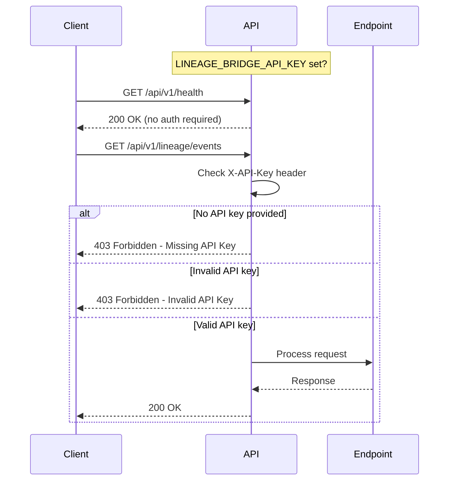

# Authentication

The LineageBridge API supports optional API key authentication via the `X-API-Key` header. This lets you protect your lineage data when running the API in production or exposing it to external systems.

## How It Works



## Configuration

Authentication is **disabled by default**. To enable it, set the `LINEAGE_BRIDGE_API_KEY` environment variable:

```bash
export LINEAGE_BRIDGE_API_KEY="your-secret-key-here"
```

When this variable is set, all endpoints except `/api/v1/health` require authentication.

**Why health is always open:** Monitoring tools and load balancers need to check if the API is running without worrying about credentials.

## Using API Keys

Pass your API key in the `X-API-Key` header with every request (except `/health`).

=== "cURL"
    ```bash
    curl -H "X-API-Key: your-secret-key-here" \
      http://localhost:8000/api/v1/lineage/events
    ```

=== "Python (httpx)"
    ```python
    import httpx
    
    # Set the key once when creating the client
    client = httpx.Client(
        base_url="http://localhost:8000/api/v1",
        headers={"X-API-Key": "your-secret-key-here"}
    )
    
    # All requests will include the key automatically
    response = client.get("/lineage/events")
    print(response.json())
    ```

=== "Python (requests)"
    ```python
    import requests
    
    headers = {"X-API-Key": "your-secret-key-here"}
    response = requests.get(
        "http://localhost:8000/api/v1/lineage/events",
        headers=headers
    )
    print(response.json())
    ```

=== "JavaScript (fetch)"
    ```javascript
    const response = await fetch('http://localhost:8000/api/v1/lineage/events', {
      headers: {
        'X-API-Key': 'your-secret-key-here'
      }
    });
    const data = await response.json();
    ```

**Tip:** Store your API key in an environment variable, not in your source code:

```bash
export LINEAGE_API_KEY="your-secret-key-here"
```

Then reference it:

=== "Python"
    ```python
    import os
    api_key = os.environ["LINEAGE_API_KEY"]
    ```

=== "JavaScript"
    ```javascript
    const apiKey = process.env.LINEAGE_API_KEY;
    ```

## Generating Secure Keys

Use a cryptographically secure random string for production. A good API key has at least 32 bytes (64 hex characters) of entropy.

=== "openssl (Linux/macOS)"
    ```bash
    openssl rand -hex 32
    # Example output: 8f4e3a2b1c9d7f6e5a4b3c2d1e0f9a8b7c6d5e4f3a2b1c0d9e8f7a6b5c4d3e2f
    ```

=== "Python"
    ```python
    import secrets
    print(secrets.token_hex(32))
    # Example output: 8f4e3a2b1c9d7f6e5a4b3c2d1e0f9a8b7c6d5e4f3a2b1c0d9e8f7a6b5c4d3e2f
    ```

=== "Node.js"
    ```javascript
    const crypto = require('crypto');
    console.log(crypto.randomBytes(32).toString('hex'));
    ```

**Don't use** simple passwords like "password123" or predictable strings. An attacker could guess them.

## Unauthenticated Endpoints

The following endpoint is always accessible without authentication:

- `GET /api/v1/health` - Health check for monitoring

## Error Responses

### Missing API Key

When authentication is enabled and no API key is provided:

```json
{
  "detail": "Missing API Key"
}
```

HTTP Status: `403 Forbidden`

### Invalid API Key

When an incorrect API key is provided:

```json
{
  "detail": "Invalid API Key"
}
```

HTTP Status: `403 Forbidden`

## Security Best Practices

1. **Use environment variables** - Never hardcode API keys in source code
2. **Use HTTPS in production** - Always run behind a reverse proxy (nginx, Caddy) with TLS
3. **Rotate keys regularly** - Update keys periodically and when team members leave
4. **Use strong keys** - Generate keys with at least 32 bytes of entropy
5. **Restrict network access** - Use firewall rules to limit API access to trusted networks

## Production Deployment

Example nginx reverse proxy configuration with TLS:

```nginx
server {
    listen 443 ssl http2;
    server_name lineage-api.example.com;

    ssl_certificate /etc/letsencrypt/live/lineage-api.example.com/fullchain.pem;
    ssl_certificate_key /etc/letsencrypt/live/lineage-api.example.com/privkey.pem;

    location / {
        proxy_pass http://localhost:8000;
        proxy_set_header Host $host;
        proxy_set_header X-Real-IP $remote_addr;
        proxy_set_header X-Forwarded-For $proxy_add_x_forwarded_for;
        proxy_set_header X-Forwarded-Proto $scheme;
    }
}
```

Example Caddy configuration:

```
lineage-api.example.com {
    reverse_proxy localhost:8000
}
```

## Docker Deployment

When running in Docker, pass the API key via environment variable:

```bash
docker run -d \
  -e LINEAGE_BRIDGE_API_KEY="your-secret-key-here" \
  -p 8000:8000 \
  lineage-bridge:latest
```

Or use Docker Compose:

```yaml
version: '3.8'
services:
  api:
    image: lineage-bridge:latest
    ports:
      - "8000:8000"
    environment:
      LINEAGE_BRIDGE_API_KEY: ${LINEAGE_BRIDGE_API_KEY}
```

Then start with:

```bash
LINEAGE_BRIDGE_API_KEY="your-secret-key-here" docker-compose up -d
```

## Testing Authentication

After enabling authentication, test that it works correctly:

=== "Test 1: Missing API Key (should fail)"
    ```bash
    curl http://localhost:8000/api/v1/lineage/events
    # Expected: {"detail": "Missing API Key"}
    # Status: 403 Forbidden
    ```

=== "Test 2: Health Check (should succeed)"
    ```bash
    curl http://localhost:8000/api/v1/health
    # Expected: {"status": "ok"}
    # Status: 200 OK
    # Health checks never require auth!
    ```

=== "Test 3: Valid API Key (should succeed)"
    ```bash
    curl -H "X-API-Key: your-secret-key-here" \
      http://localhost:8000/api/v1/lineage/events
    # Expected: [...]
    # Status: 200 OK
    ```

=== "Test 4: Invalid API Key (should fail)"
    ```bash
    curl -H "X-API-Key: wrong-key" \
      http://localhost:8000/api/v1/lineage/events
    # Expected: {"detail": "Invalid API Key"}
    # Status: 403 Forbidden
    ```

**What "should fail" means:** You get a `403 Forbidden` response. This is good! It means your API is protected.

## Future Enhancements

Planned authentication features:

- OAuth2/OIDC integration
- Role-based access control (RBAC)
- API key scopes (read-only, write, admin)
- Rate limiting per key
- Key expiration and rotation

See the [roadmap](../reference/roadmap.md) for more details.
