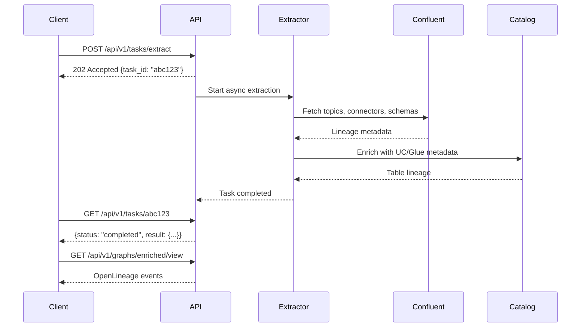

# API Reference

LineageBridge exposes an **OpenLineage-compatible REST API** that lets you extract lineage from Confluent Cloud and bridge it to external data catalogs like Databricks Unity Catalog, AWS Glue, and Google Data Lineage.

## Quick Start

Start the API server:

=== "uv"
    ```bash
    uv run lineage-bridge-api
    # API runs at http://localhost:8000
    ```

=== "Make"
    ```bash
    make api
    # API runs at http://localhost:8000
    ```

=== "Docker"
    ```bash
    docker run -p 8000:8000 lineage-bridge:latest
    # API runs at http://localhost:8000
    ```

**Explore the API interactively:**

- **Swagger UI**: http://localhost:8000/docs (recommended)
- **ReDoc**: http://localhost:8000/redoc
- **Scalar Explorer**: [Interactive API Reference →](openapi.md)

## Overview

The LineageBridge API lets you:

- **Query lineage** - Get OpenLineage events from Confluent Cloud
- **Import lineage** - Ingest lineage from external systems (Databricks, dbt, etc.)
- **Build graphs** - Create and manage lineage graphs
- **Run tasks** - Trigger async extraction and enrichment
- **Traverse relationships** - Follow upstream/downstream lineage paths

**Real-world use case:** Sarah's team uses the API to automatically export Kafka topic lineage to Unity Catalog every hour, so their data engineers can see the full data flow from Postgres → Kafka → Databricks tables in one place.

## Base URL & Versioning

**API Base URL**: `http://localhost:8000/api/v1/`

All API endpoints are prefixed with `/api/v1`:

```
GET  http://localhost:8000/api/v1/health
POST http://localhost:8000/api/v1/lineage/events
GET  http://localhost:8000/api/v1/graphs
```

**Interactive Documentation**:

- Swagger UI at `/docs` - Test endpoints in your browser
- ReDoc at `/redoc` - Clean API reference
- OpenAPI spec at `/openapi.json` - Machine-readable spec

**Configuration**:

```bash
export LINEAGE_BRIDGE_API_HOST="0.0.0.0"  # Default: 0.0.0.0
export LINEAGE_BRIDGE_API_PORT=8000        # Default: 8000
export LINEAGE_BRIDGE_API_KEY="your-key"  # Optional auth
```

**Versioning**: URL-based (`/api/v1`, `/api/v2`, etc.) for backward compatibility.

## API Request Flow

When you trigger a lineage extraction, here's what happens:



**Why async?** Extraction can take 30-60 seconds for large environments (100+ topics, dozens of connectors). The async pattern lets you start the job and poll for results instead of waiting for a long HTTP timeout.

## Quick Reference

Common operations you'll use most often:

| Task | Endpoint | Method | Example |
|------|----------|--------|---------|
| Check health | `/api/v1/health` | GET | `curl http://localhost:8000/api/v1/health` |
| Start extraction | `/api/v1/tasks/extract` | POST | `curl -X POST http://localhost:8000/api/v1/tasks/extract` |
| Check task status | `/api/v1/tasks/{task_id}` | GET | `curl http://localhost:8000/api/v1/tasks/abc-123` |
| List datasets | `/api/v1/lineage/datasets` | GET | `curl http://localhost:8000/api/v1/lineage/datasets` |
| Trace lineage | `/api/v1/lineage/datasets/lineage` | GET | `curl "http://localhost:8000/api/v1/lineage/datasets/lineage?namespace=...&name=...&direction=upstream"` |
| Export lineage | `/api/v1/graphs/enriched/view` | GET | `curl http://localhost:8000/api/v1/graphs/enriched/view > lineage.json` |
| Import events | `/api/v1/lineage/events` | POST | `curl -X POST http://localhost:8000/api/v1/lineage/events -d @events.json` |

**Typical workflow:**

1. **Extract** → POST `/tasks/extract`
2. **Wait** → Poll GET `/tasks/{task_id}` until `status == "completed"`
3. **Query** → GET `/lineage/datasets` or `/lineage/datasets/lineage`
4. **Export** → GET `/graphs/enriched/view`

## Endpoint Categories

The API is organized into 6 main routers:

### Meta

System-level endpoints for health checks and metadata.

| Endpoint | Description |
|----------|-------------|
| `GET /api/v1/health` | Health check (no auth required) |
| `GET /api/v1/version` | API version information |
| `GET /api/v1/catalogs` | List registered catalog providers |

### Lineage

OpenLineage event query and ingestion.

| Endpoint | Description |
|----------|-------------|
| `GET /api/v1/lineage/events` | Query OpenLineage events with filters |
| `POST /api/v1/lineage/events` | Ingest OpenLineage events from external systems |
| `GET /api/v1/lineage/events/{run_id}` | Get events for a specific run |

### Datasets

Dataset discovery and lineage traversal.

| Endpoint | Description |
|----------|-------------|
| `GET /api/v1/lineage/datasets` | List all datasets with optional filters |
| `GET /api/v1/lineage/datasets/detail` | Get a specific dataset by namespace and name |
| `GET /api/v1/lineage/datasets/lineage` | Traverse upstream/downstream lineage for a dataset |

### Jobs

Job discovery and relationship queries.

| Endpoint | Description |
|----------|-------------|
| `GET /api/v1/lineage/jobs` | List all jobs with optional filters |
| `GET /api/v1/lineage/jobs/detail` | Get a job with its inputs and outputs |

### Graphs

Graph management and views.

| Endpoint | Description |
|----------|-------------|
| `GET /api/v1/graphs` | List all in-memory graphs |
| `POST /api/v1/graphs` | Create a new empty graph |
| `GET /api/v1/graphs/{graph_id}` | Get a full graph with nodes and edges |
| `DELETE /api/v1/graphs/{graph_id}` | Delete a graph |
| `POST /api/v1/graphs/{graph_id}/import` | Import nodes and edges from JSON |
| `GET /api/v1/graphs/{graph_id}/export` | Export graph as LineageGraph JSON |
| `GET /api/v1/graphs/confluent/view` | Confluent-only lineage view |
| `GET /api/v1/graphs/enriched/view` | Full enriched cross-platform lineage view |
| `GET /api/v1/graphs/{graph_id}/nodes` | List nodes with filters |
| `POST /api/v1/graphs/{graph_id}/nodes` | Add a node |
| `GET /api/v1/graphs/{graph_id}/nodes/{node_id}` | Get a specific node |
| `POST /api/v1/graphs/{graph_id}/edges` | Add an edge |
| `GET /api/v1/graphs/{graph_id}/edges` | List all edges |
| `GET /api/v1/graphs/{graph_id}/query/upstream/{node_id}` | Query upstream lineage |
| `GET /api/v1/graphs/{graph_id}/query/downstream/{node_id}` | Query downstream lineage |

### Tasks

Async task management.

| Endpoint | Description |
|----------|-------------|
| `GET /api/v1/tasks` | List recent tasks with optional filters |
| `GET /api/v1/tasks/{task_id}` | Get task status and result |
| `POST /api/v1/tasks/extract` | Trigger async lineage extraction from Confluent Cloud |
| `POST /api/v1/tasks/enrich` | Trigger async catalog enrichment |

## Test the API

Verify the API is running:

=== "cURL"
    ```bash
    curl http://localhost:8000/api/v1/health
    # Response: {"status":"ok"}
    ```

=== "Python (httpx)"
    ```python
    import httpx
    response = httpx.get("http://localhost:8000/api/v1/health")
    print(response.json())
    # {'status': 'ok'}
    ```

=== "Python (requests)"
    ```python
    import requests
    response = requests.get("http://localhost:8000/api/v1/health")
    print(response.json())
    # {'status': 'ok'}
    ```

Check API version:

=== "cURL"
    ```bash
    curl http://localhost:8000/api/v1/version
    # Response: {"version":"0.4.0","name":"lineage-bridge"}
    ```

=== "Python (httpx)"
    ```python
    import httpx
    response = httpx.get("http://localhost:8000/api/v1/version")
    print(response.json())
    # {'version': '0.4.0', 'name': 'lineage-bridge'}
    ```

=== "Python (requests)"
    ```python
    import requests
    response = requests.get("http://localhost:8000/api/v1/version")
    print(response.json())
    ```

Open the interactive Swagger UI:

```
http://localhost:8000/docs
```

## OpenAPI Specification

The full OpenAPI 3.1 specification is available at:

- **Download**: `GET /api/v1/openapi.yaml`
- **Repository**: `/docs/openapi.yaml`
- **Interactive Explorer**: See [OpenAPI Explorer](openapi.md)

## Next Steps

- [Authentication Guide](authentication.md) - Set up API keys
- [OpenLineage Mapping](openlineage-mapping.md) - Understand the translation layer
- [Code Examples](examples.md) - cURL and Python examples
- [Interactive Explorer](openapi.md) - Try the API in your browser
