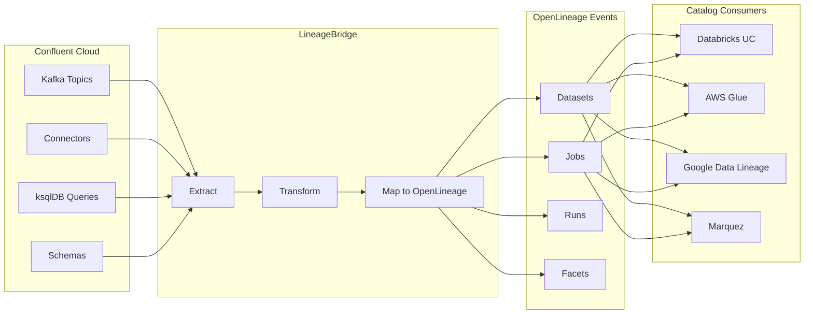

# OpenLineage Mapping

LineageBridge translates Confluent Cloud stream lineage into standard OpenLineage events, enabling integration with any OpenLineage-compatible data catalog.

## Why OpenLineage?

[OpenLineage](https://openlineage.io) is an open standard for data lineage metadata collection and analysis. It's like a common language that all data tools can speak.

**The problem without OpenLineage:** Every vendor has their own lineage format. Confluent uses one schema, Databricks uses another, AWS Glue uses yet another. If you want to combine lineage from all three, you need custom code for each integration.

**The solution with OpenLineage:** Everyone speaks the same language. LineageBridge translates Confluent lineage to OpenLineage, so any tool that understands OpenLineage can consume it.

Benefits:

- **Interoperability** - Works with any catalog that speaks OpenLineage (Databricks, AWS, Google, Marquez, etc.)
- **Standardization** - Uses industry-standard schemas instead of vendor-specific formats
- **Extensibility** - Easy to add new catalog integrations without changing core logic
- **Bidirectionality** - Both produce and consume lineage from external systems

**Real-world example:** Your team uses Confluent for streaming, Databricks for analytics, and dbt for transformations. With OpenLineage, all three systems can share lineage data, giving you end-to-end visibility from Kafka topics → Databricks tables → dbt models in a single graph.

## Translation Process

Here's how LineageBridge converts Confluent lineage to OpenLineage:



**Step 1: Extract** - Pull metadata from Confluent Cloud APIs (topics, connectors, schemas, etc.)  
**Step 2: Transform** - Build a lineage graph with nodes and edges  
**Step 3: Map** - Convert nodes/edges to OpenLineage datasets, jobs, and events  
**Step 4: Publish** - Send OpenLineage events to data catalogs or export as JSON

## Concept Mapping

### Confluent to OpenLineage

| Confluent Concept | OpenLineage Type | Namespace Format | Description |
|-------------------|------------------|------------------|-------------|
| Kafka Topic | Dataset | `confluent://{env_id}/{cluster_id}` | A stream of events |
| Connector | Job | `confluent://{env_id}/{cluster_id}` | Imports/exports data |
| ksqlDB Query | Job | `confluent://{env_id}/{cluster_id}` | Stream transformation |
| Flink Job | Job | `confluent://{env_id}/{cluster_id}` | Stream processing |
| Consumer Group | Job | `confluent://{env_id}/{cluster_id}` | Topic consumption |
| Tableflow Table | Dataset | `confluent://{env_id}/{cluster_id}` | Logical table view |
| Schema | SchemaDatasetFacet | - | Attached to parent Dataset |

### Catalog Integration

External catalog assets also map to OpenLineage types:

| Catalog Asset | OpenLineage Type | Namespace Format | Description |
|---------------|------------------|------------------|-------------|
| UC Table | Dataset | `databricks://{workspace}` | Unity Catalog table |
| Glue Table | Dataset | `aws://{region}/{database}` | AWS Glue table |
| Google BQ Table | Dataset | `google://{project}/{dataset}` | BigQuery table |

## Edge Type Mapping

Lineage edges map to OpenLineage input/output relationships:

| LineageBridge Edge | OpenLineage Representation | Example |
|--------------------|---------------------------|---------|
| PRODUCES | OutputDataset on a Job | Connector produces to Kafka topic |
| CONSUMES | InputDataset on a Job | Consumer group consumes from topic |
| TRANSFORMS | Job with inputs and outputs | ksqlDB query transforms topic A to topic B |
| MATERIALIZES | OutputDataset (catalog) | Tableflow materializes topic to UC table |
| HAS_SCHEMA | SchemaDatasetFacet | Topic has Avro schema |
| MEMBER_OF | Logical grouping | Consumer instance in consumer group |

## Node ID Format

LineageBridge uses a consistent node ID format:

```
{system}:{type}:{env_id}:{qualified_name}
```

Examples:

- `confluent:kafka_topic:env-abc:lkc-123/orders`
- `databricks:uc_table:workspace-1:main.sales.orders`
- `aws:glue_table:us-west-2:my-database/orders`

When translating to OpenLineage, the node ID is split into:

- **Namespace**: `{system}://{env_id}/{cluster_id}` (for datasets/jobs)
- **Name**: `{qualified_name}`

## OpenLineage Facets

LineageBridge enriches OpenLineage events with custom facets:

### Dataset Facets

**ConfluentKafkaDatasetFacet** - Kafka-specific metadata

```json
{
  "facets": {
    "confluent_kafka": {
      "cluster_id": "lkc-12345",
      "environment_id": "env-abc",
      "partitions": 6,
      "replication_factor": 3,
      "tags": ["pii", "production"]
    }
  }
}
```

**SchemaDatasetFacet** - Schema information

```json
{
  "facets": {
    "schema": {
      "fields": [
        {"name": "order_id", "type": "string"},
        {"name": "customer_id", "type": "string"},
        {"name": "amount", "type": "decimal"}
      ]
    }
  }
}
```

**DataSourceDatasetFacet** - External source metadata

```json
{
  "facets": {
    "dataSource": {
      "name": "PostgreSQL",
      "uri": "jdbc:postgresql://db.example.com:5432/orders"
    }
  }
}
```

### Job Facets

**ConfluentConnectorJobFacet** - Connector-specific metadata

```json
{
  "facets": {
    "confluent_connector": {
      "connector_class": "PostgresCdcSource",
      "connector_type": "source",
      "cluster_id": "lkc-12345",
      "environment_id": "env-abc"
    }
  }
}
```

**SqlJobFacet** - SQL query text

```json
{
  "facets": {
    "sql": {
      "query": "CREATE STREAM enriched_orders AS SELECT * FROM orders JOIN customers ON orders.customer_id = customers.id;"
    }
  }
}
```

## Translation Examples

### Kafka Topic to Dataset

LineageBridge node:

```json
{
  "node_id": "confluent:kafka_topic:env-abc:lkc-123/orders",
  "system": "confluent",
  "node_type": "kafka_topic",
  "qualified_name": "lkc-123/orders",
  "display_name": "orders",
  "attributes": {
    "partitions": 6,
    "replication_factor": 3
  }
}
```

OpenLineage Dataset:

```json
{
  "namespace": "confluent://env-abc/lkc-123",
  "name": "orders",
  "facets": {
    "confluent_kafka": {
      "cluster_id": "lkc-123",
      "environment_id": "env-abc",
      "partitions": 6,
      "replication_factor": 3
    }
  }
}
```

### Connector to Job

LineageBridge node:

```json
{
  "node_id": "confluent:connector:env-abc:lkc-123/postgres-cdc-source",
  "system": "confluent",
  "node_type": "connector",
  "qualified_name": "lkc-123/postgres-cdc-source",
  "display_name": "postgres-cdc-source",
  "attributes": {
    "connector_class": "PostgresCdcSource",
    "connector_type": "source"
  }
}
```

OpenLineage Job with RunEvent:

```json
{
  "eventTime": "2026-04-30T00:00:00Z",
  "eventType": "COMPLETE",
  "run": {
    "runId": "550e8400-e29b-41d4-a716-446655440000"
  },
  "job": {
    "namespace": "confluent://env-abc/lkc-123",
    "name": "postgres-cdc-source",
    "facets": {
      "confluent_connector": {
        "connector_class": "PostgresCdcSource",
        "connector_type": "source",
        "cluster_id": "lkc-123",
        "environment_id": "env-abc"
      }
    }
  },
  "inputs": [
    {
      "namespace": "jdbc://db.example.com:5432",
      "name": "orders",
      "facets": {
        "dataSource": {
          "name": "PostgreSQL",
          "uri": "jdbc:postgresql://db.example.com:5432/orders"
        }
      }
    }
  ],
  "outputs": [
    {
      "namespace": "confluent://env-abc/lkc-123",
      "name": "orders",
      "facets": {
        "confluent_kafka": {
          "cluster_id": "lkc-123",
          "environment_id": "env-abc"
        }
      }
    }
  ]
}
```

### ksqlDB Query to Job

LineageBridge edges:

```
orders (topic) --CONSUMES--> my-query (ksqldb_query)
my-query --PRODUCES--> enriched_orders (topic)
```

OpenLineage RunEvent:

```json
{
  "eventType": "COMPLETE",
  "job": {
    "namespace": "confluent://env-abc/lkc-123",
    "name": "my-query",
    "facets": {
      "sql": {
        "query": "CREATE STREAM enriched_orders AS SELECT * FROM orders WHERE amount > 100;"
      }
    }
  },
  "inputs": [
    {
      "namespace": "confluent://env-abc/lkc-123",
      "name": "orders"
    }
  ],
  "outputs": [
    {
      "namespace": "confluent://env-abc/lkc-123",
      "name": "enriched_orders"
    }
  ]
}
```

## Use Cases

### 1. Export Confluent Lineage to Unity Catalog

**Scenario:** Your data team uses Unity Catalog to track all tables, but they can't see what happens before data lands in Databricks. You want to show them the upstream Kafka topics and connectors.

**Solution:** Extract Confluent lineage and push it to Unity Catalog via OpenLineage.

=== "cURL"
    ```bash
    # Trigger extraction
    curl -X POST http://localhost:8000/api/v1/tasks/extract
    # Response: {"task_id":"abc-123"}
    
    # Wait for completion (or poll /tasks/abc-123)
    sleep 30
    
    # Query OpenLineage events
    curl http://localhost:8000/api/v1/lineage/events > confluent-lineage.json
    
    # UC can consume these events or use LineageBridge's push_lineage() provider method
    ```

=== "Python (httpx)"
    ```python
    import httpx
    import time
    import json
    
    client = httpx.Client(base_url="http://localhost:8000/api/v1")
    
    # Trigger extraction
    response = client.post("/tasks/extract")
    task_id = response.json()["task_id"]
    
    # Wait for completion
    while True:
        task = client.get(f"/tasks/{task_id}").json()
        if task["status"] == "completed":
            break
        time.sleep(2)
    
    # Get OpenLineage events
    events = client.get("/lineage/events").json()
    
    # Save to file
    with open("confluent-lineage.json", "w") as f:
        json.dump(events, f, indent=2)
    
    print(f"Exported {len(events)} events")
    ```

=== "Python (requests)"
    ```python
    import requests
    import time
    import json
    
    base_url = "http://localhost:8000/api/v1"
    
    # Trigger extraction
    response = requests.post(f"{base_url}/tasks/extract")
    task_id = response.json()["task_id"]
    
    # Wait for completion
    while True:
        response = requests.get(f"{base_url}/tasks/{task_id}")
        if response.json()["status"] == "completed":
            break
        time.sleep(2)
    
    # Get OpenLineage events
    response = requests.get(f"{base_url}/lineage/events")
    events = response.json()
    
    # Save to file
    with open("confluent-lineage.json", "w") as f:
        json.dump(events, f, indent=2)
    
    print(f"Exported {len(events)} events")
    ```

**What you get:** A JSON file with OpenLineage events that Unity Catalog can ingest. Now your data analysts can trace a UC table back to its source Kafka topic!

### 2. Import External Lineage into LineageBridge

**Scenario:** You have a Databricks notebook that reads from a Kafka topic and writes to a Unity Catalog table. LineageBridge knows about the Kafka topic (from Confluent extraction), but it doesn't know about the notebook job. You want to connect the dots.

**Solution:** Send an OpenLineage event from your Databricks job to the LineageBridge API.

=== "cURL"
    ```bash
    curl -X POST http://localhost:8000/api/v1/lineage/events \
      -H "Content-Type: application/json" \
      -d '[{
        "eventTime": "2026-04-30T00:00:00Z",
        "eventType": "COMPLETE",
        "run": {"runId": "external-run-1"},
        "job": {
          "namespace": "databricks://workspace-1",
          "name": "etl-pipeline"
        },
        "inputs": [
          {
            "namespace": "confluent://env-abc/lkc-123",
            "name": "orders"
          }
        ],
        "outputs": [
          {
            "namespace": "databricks://workspace-1",
            "name": "main.sales.orders"
          }
        ]
      }]'
    ```

=== "Python (httpx)"
    ```python
    import httpx
    from datetime import datetime
    import uuid
    
    client = httpx.Client(base_url="http://localhost:8000/api/v1")
    
    event = {
        "eventTime": datetime.utcnow().isoformat() + "Z",
        "eventType": "COMPLETE",
        "run": {"runId": str(uuid.uuid4())},
        "job": {
            "namespace": "databricks://workspace-1",
            "name": "etl-pipeline",
            "facets": {
                "documentation": {
                    "description": "Reads from Kafka and writes to UC"
                }
            }
        },
        "inputs": [
            {
                "namespace": "confluent://env-abc/lkc-123",
                "name": "orders"
            }
        ],
        "outputs": [
            {
                "namespace": "databricks://workspace-1",
                "name": "main.sales.orders"
            }
        ]
    }
    
    response = client.post("/lineage/events", json=[event])
    print(response.json())
    ```

=== "Python (requests)"
    ```python
    import requests
    from datetime import datetime
    import uuid
    
    event = {
        "eventTime": datetime.utcnow().isoformat() + "Z",
        "eventType": "COMPLETE",
        "run": {"runId": str(uuid.uuid4())},
        "job": {
            "namespace": "databricks://workspace-1",
            "name": "etl-pipeline"
        },
        "inputs": [
            {
                "namespace": "confluent://env-abc/lkc-123",
                "name": "orders"
            }
        ],
        "outputs": [
            {
                "namespace": "databricks://workspace-1",
                "name": "main.sales.orders"
            }
        ]
    }
    
    response = requests.post(
        "http://localhost:8000/api/v1/lineage/events",
        json=[event]
    )
    print(response.json())
    ```

**What you get:** LineageBridge now knows that `orders` (Kafka topic) flows through `etl-pipeline` (Databricks job) to `main.sales.orders` (UC table). The lineage graph is complete!

**Integration tip:** Add this code to the end of your Databricks notebook so lineage is sent automatically on every run.

### 3. Unified Lineage View

**Scenario:** Your data stack includes Confluent Cloud, Databricks, and AWS Glue. Data flows between all three platforms, but you can't see the full picture in any single tool.

**Solution:** Use the enriched view endpoint to get a unified lineage graph with all platforms combined.

=== "cURL"
    ```bash
    # Full enriched graph (Confluent + Databricks + AWS)
    curl "http://localhost:8000/api/v1/graphs/enriched/view" > unified-lineage.json
    
    # Filter by systems
    curl "http://localhost:8000/api/v1/graphs/enriched/view?systems=confluent,databricks" > kafka-to-databricks.json
    ```

=== "Python (httpx)"
    ```python
    import httpx
    import json
    
    client = httpx.Client(base_url="http://localhost:8000/api/v1")
    
    # Full enriched graph
    all_lineage = client.get("/graphs/enriched/view").json()
    
    print(f"Total events: {len(all_lineage.get('events', []))}")
    
    # Filter by systems (Confluent + Databricks only)
    filtered_lineage = client.get(
        "/graphs/enriched/view",
        params={"systems": "confluent,databricks"}
    ).json()
    
    print(f"Confluent + Databricks events: {len(filtered_lineage.get('events', []))}")
    
    # Save to file
    with open("unified-lineage.json", "w") as f:
        json.dump(all_lineage, f, indent=2)
    ```

=== "Python (requests)"
    ```python
    import requests
    import json
    
    base_url = "http://localhost:8000/api/v1"
    
    # Full enriched graph
    response = requests.get(f"{base_url}/graphs/enriched/view")
    all_lineage = response.json()
    
    print(f"Total events: {len(all_lineage.get('events', []))}")
    
    # Filter by systems
    response = requests.get(
        f"{base_url}/graphs/enriched/view",
        params={"systems": "confluent,databricks"}
    )
    filtered_lineage = response.json()
    
    print(f"Confluent + Databricks events: {len(filtered_lineage.get('events', []))}")
    
    # Save to file
    with open("unified-lineage.json", "w") as f:
        json.dump(all_lineage, f, indent=2)
    ```

**What you get:** A single OpenLineage JSON file with events from all platforms. Import it into Marquez, your data catalog, or a custom visualization tool to see the full end-to-end data flow.

**Example flow you can now trace:**  
Postgres table → Kafka topic (via connector) → ksqlDB transformation → Databricks Delta table → AWS Glue table (via Glue crawler)

### 4. Push to Google Data Lineage

**Scenario:** Your team uses Google Cloud Platform, and you want to see Kafka topic lineage in Google's Data Lineage UI alongside your BigQuery tables.

**Solution:** Export Confluent lineage from LineageBridge and push it to Google Data Lineage, which natively accepts OpenLineage events.

=== "cURL"
    ```bash
    # Export from LineageBridge
    curl http://localhost:8000/api/v1/graphs/confluent/view > lineage.json
    
    # Push to Google Data Lineage
    curl -X POST \
      "https://datalineage.googleapis.com/v1/projects/my-project/locations/us:processOpenLineageRunEvent" \
      -H "Authorization: Bearer $(gcloud auth print-access-token)" \
      -H "Content-Type: application/json" \
      -d @lineage.json
    ```

=== "Python (httpx)"
    ```python
    import httpx
    import subprocess
    
    # Export from LineageBridge
    client = httpx.Client(base_url="http://localhost:8000/api/v1")
    lineage = client.get("/graphs/confluent/view").json()
    
    # Get Google Cloud access token
    token = subprocess.check_output(
        ["gcloud", "auth", "print-access-token"]
    ).decode().strip()
    
    # Push to Google Data Lineage
    google_client = httpx.Client()
    response = google_client.post(
        "https://datalineage.googleapis.com/v1/projects/my-project/locations/us:processOpenLineageRunEvent",
        headers={
            "Authorization": f"Bearer {token}",
            "Content-Type": "application/json"
        },
        json=lineage
    )
    
    print(f"Pushed to Google: {response.status_code}")
    ```

=== "Python (requests)"
    ```python
    import requests
    import subprocess
    
    # Export from LineageBridge
    response = requests.get("http://localhost:8000/api/v1/graphs/confluent/view")
    lineage = response.json()
    
    # Get Google Cloud access token
    token = subprocess.check_output(
        ["gcloud", "auth", "print-access-token"]
    ).decode().strip()
    
    # Push to Google Data Lineage
    response = requests.post(
        "https://datalineage.googleapis.com/v1/projects/my-project/locations/us:processOpenLineageRunEvent",
        headers={
            "Authorization": f"Bearer {token}",
            "Content-Type": "application/json"
        },
        json=lineage
    )
    
    print(f"Pushed to Google: {response.status_code}")
    ```

**What you get:** Your Kafka topics and connectors now appear in Google's Data Lineage UI. Click on a BigQuery table, and you can trace it back to the source Kafka topic.

**Automation tip:** Run this script hourly via Cloud Scheduler to keep Google Data Lineage in sync with your Confluent Cloud environment.

## OpenLineage Spec Compliance

LineageBridge implements **OpenLineage 1.0** with the following:

- **Core Types**: RunEvent, Dataset, Job, Run
- **Standard Facets**: schema, dataSource, documentation, sql
- **Custom Facets**: confluent_kafka, confluent_connector (vendor extensions)
- **Event Types**: START, RUNNING, COMPLETE, FAIL, ABORT

Full spec: https://openlineage.io/spec/2-0-2/OpenLineage.json

## Dataset Lineage API

The `/api/v1/lineage/datasets/lineage` endpoint provides OpenLineage-based lineage traversal for datasets. This endpoint queries the EventStore to find all upstream and/or downstream dependencies of a dataset.

### Parameters

```
GET /api/v1/lineage/datasets/lineage
```

**Query Parameters:**

| Parameter | Type | Required | Default | Description |
|-----------|------|----------|---------|-------------|
| `namespace` | string | ✅ Yes | - | OpenLineage namespace of the dataset |
| `name` | string | ✅ Yes | - | Dataset name (qualified name) |
| `direction` | string | No | `"upstream"` | Traversal direction: `upstream`, `downstream`, or `both` |
| `depth` | integer | No | `5` | Number of hops to traverse (1-50) |

### Namespace Formats

Different systems use different namespace patterns:

| System | Format | Example |
|--------|--------|---------|
| **Confluent** | `confluent://{environment_id}/{cluster_id}` | `confluent://env-26wn6m/lkc-mjnq51` |
| **Databricks** | `databricks://{workspace_url}` | `databricks://https://dbc-7c6e0c41-4172.cloud.databricks.com` |
| **AWS Glue** | `aws://{region}/{database}` | `aws://us-east-1/lineage_bridge` |
| **Google BigQuery** | `google://{project_id}/{dataset_id}` | `google://my-project/analytics` |

### Prerequisites

**Important:** This endpoint queries the **EventStore**, which must be populated with OpenLineage events first.

#### Option A: Export Graph to Events (Recommended)

After extracting lineage, convert it to OpenLineage events:

=== "Step 1: Extract Lineage"
    ```bash
    # Trigger extraction from Confluent Cloud
    curl -X POST "http://localhost:8000/api/v1/tasks/extract?environment_ids=env-26wn6m"
    
    # Response
    {
      "task_id": "abc-123",
      "status": "pending"
    }
    ```

=== "Step 2: Poll for Completion"
    ```bash
    # Check task status
    curl "http://localhost:8000/api/v1/tasks/abc-123"
    
    # Response when complete
    {
      "status": "completed",
      "result": {
        "graph_id": "9a52160e-cac8-43eb-aad8-155bda535639",
        "node_count": 168,
        "edge_count": 49
      }
    }
    ```

=== "Step 3: Convert to Events"
    ```bash
    # Get OpenLineage view (this populates EventStore)
    curl "http://localhost:8000/api/v1/graphs/enriched/view" | jq .
    
    # Or Confluent-only view
    curl "http://localhost:8000/api/v1/graphs/confluent/view" | jq .
    ```

=== "Step 4: Query Lineage"
    ```bash
    # Now you can query dataset lineage
    curl "http://localhost:8000/api/v1/lineage/datasets/lineage?\
    namespace=confluent://env-26wn6m/lkc-mjnq51&\
    name=lineage_bridge.orders_v2&\
    direction=both&\
    depth=5"
    ```

#### Option B: Push External Events

Push OpenLineage events from external systems:

```bash
curl -X POST "http://localhost:8000/api/v1/lineage/events" \
  -H "Content-Type: application/json" \
  -d '[{
    "eventTime": "2026-05-01T00:00:00Z",
    "eventType": "COMPLETE",
    "run": {"runId": "abc-123"},
    "job": {
      "namespace": "confluent://env-abc/lkc-123",
      "name": "my-connector"
    },
    "inputs": [],
    "outputs": [{
      "namespace": "confluent://env-abc/lkc-123",
      "name": "my-topic"
    }]
  }]'
```

### Usage Examples

#### Example 1: Upstream Lineage for Kafka Topic

Find what produces data to the `lineage_bridge.orders_v2` topic:

=== "cURL"
    ```bash
    curl "http://localhost:8000/api/v1/lineage/datasets/lineage?\
    namespace=confluent://env-26wn6m/lkc-mjnq51&\
    name=lineage_bridge.orders_v2&\
    direction=upstream&\
    depth=3"
    ```

=== "Python (httpx)"
    ```python
    import httpx
    
    client = httpx.Client(base_url="http://localhost:8000/api/v1")
    
    response = client.get("/lineage/datasets/lineage", params={
        "namespace": "confluent://env-26wn6m/lkc-mjnq51",
        "name": "lineage_bridge.orders_v2",
        "direction": "upstream",
        "depth": 3
    })
    
    lineage = response.json()
    print(f"Visited {lineage['datasets_visited']} datasets")
    print(f"Visited {lineage['jobs_visited']} jobs")
    ```

=== "Python (requests)"
    ```python
    import requests
    
    response = requests.get(
        "http://localhost:8000/api/v1/lineage/datasets/lineage",
        params={
            "namespace": "confluent://env-26wn6m/lkc-mjnq51",
            "name": "lineage_bridge.orders_v2",
            "direction": "upstream",
            "depth": 3
        }
    )
    
    lineage = response.json()
    print(f"Visited {lineage['datasets_visited']} datasets")
    print(f"Visited {lineage['jobs_visited']} jobs")
    ```

**Response:**

```json
{
  "origin": {
    "namespace": "confluent://env-26wn6m/lkc-mjnq51",
    "name": "lineage_bridge.orders_v2"
  },
  "direction": "upstream",
  "depth": 3,
  "events": [
    {
      "eventTime": "2026-05-01T04:00:00Z",
      "eventType": "COMPLETE",
      "job": {
        "namespace": "confluent://env-26wn6m/lkc-mjnq51",
        "name": "lb-uc-75083e95-datagen-orders"
      },
      "inputs": [{
        "namespace": "confluent://env-26wn6m/lkc-mjnq51",
        "name": "DatagenSource"
      }],
      "outputs": [{
        "namespace": "confluent://env-26wn6m/lkc-mjnq51",
        "name": "lineage_bridge.orders_v2"
      }]
    }
  ],
  "datasets_visited": 2,
  "jobs_visited": 1
}
```

#### Example 2: Downstream Lineage for Unity Catalog Table

Find what consumes data from a Unity Catalog table:

=== "cURL"
    ```bash
    curl "http://localhost:8000/api/v1/lineage/datasets/lineage?\
    namespace=databricks://https://dbc-7c6e0c41-4172.cloud.databricks.com&\
    name=lb_uc_75083e95.lkc-mjnq51.lineage_bridge_orders_v2&\
    direction=downstream&\
    depth=5"
    ```

=== "Python (httpx)"
    ```python
    import httpx
    from urllib.parse import quote
    
    client = httpx.Client(base_url="http://localhost:8000/api/v1")
    
    namespace = "databricks://https://dbc-7c6e0c41-4172.cloud.databricks.com"
    name = "lb_uc_75083e95.lkc-mjnq51.lineage_bridge_orders_v2"
    
    response = client.get("/lineage/datasets/lineage", params={
        "namespace": namespace,
        "name": name,
        "direction": "downstream",
        "depth": 5
    })
    
    lineage = response.json()
    for event in lineage['events']:
        job = event['job']['name']
        outputs = [o['name'] for o in event['outputs']]
        print(f"{job} → {', '.join(outputs)}")
    ```

=== "Python (requests)"
    ```python
    import requests
    
    namespace = "databricks://https://dbc-7c6e0c41-4172.cloud.databricks.com"
    name = "lb_uc_75083e95.lkc-mjnq51.lineage_bridge_orders_v2"
    
    response = requests.get(
        "http://localhost:8000/api/v1/lineage/datasets/lineage",
        params={
            "namespace": namespace,
            "name": name,
            "direction": "downstream",
            "depth": 5
        }
    )
    
    lineage = response.json()
    for event in lineage['events']:
        job = event['job']['name']
        outputs = [o['name'] for o in event['outputs']]
        print(f"{job} → {', '.join(outputs)}")
    ```

#### Example 3: Full Lineage (Both Directions)

Trace all upstream and downstream dependencies:

=== "cURL"
    ```bash
    curl "http://localhost:8000/api/v1/lineage/datasets/lineage?\
    namespace=confluent://env-26wn6m/lkc-mjnq51&\
    name=lineage_bridge.enriched_orders&\
    direction=both&\
    depth=10"
    ```

=== "Python (httpx)"
    ```python
    import httpx
    import json
    
    client = httpx.Client(base_url="http://localhost:8000/api/v1")
    
    response = client.get("/lineage/datasets/lineage", params={
        "namespace": "confluent://env-26wn6m/lkc-mjnq51",
        "name": "lineage_bridge.enriched_orders",
        "direction": "both",
        "depth": 10
    })
    
    lineage = response.json()
    
    # Visualize the lineage
    print(f"Lineage for: {lineage['origin']['name']}")
    print(f"Direction: {lineage['direction']}")
    print(f"Datasets visited: {lineage['datasets_visited']}")
    print(f"Jobs visited: {lineage['jobs_visited']}")
    print(f"\nEvents:")
    for event in lineage['events']:
        job = event['job']['name']
        inputs = [i['name'] for i in event['inputs']]
        outputs = [o['name'] for o in event['outputs']]
        print(f"  {', '.join(inputs)} → [{job}] → {', '.join(outputs)}")
    ```

=== "Python (requests)"
    ```python
    import requests
    import json
    
    response = requests.get(
        "http://localhost:8000/api/v1/lineage/datasets/lineage",
        params={
            "namespace": "confluent://env-26wn6m/lkc-mjnq51",
            "name": "lineage_bridge.enriched_orders",
            "direction": "both",
            "depth": 10
        }
    )
    
    lineage = response.json()
    
    # Visualize the lineage
    print(f"Lineage for: {lineage['origin']['name']}")
    print(f"Direction: {lineage['direction']}")
    print(f"Datasets visited: {lineage['datasets_visited']}")
    print(f"Jobs visited: {lineage['jobs_visited']}")
    print(f"\nEvents:")
    for event in lineage['events']:
        job = event['job']['name']
        inputs = [i['name'] for i in event['inputs']]
        outputs = [o['name'] for o in event['outputs']]
        print(f"  {', '.join(inputs)} → [{job}] → {', '.join(outputs)}")
    ```

### Alternative: Graph-Based Traversal

If you prefer not to use OpenLineage events, use the **graph traversal endpoints** instead:

**Upstream:**
```bash
GET /api/v1/graphs/{graph_id}/query/upstream/{node_id}?hops=5
```

**Downstream:**
```bash
GET /api/v1/graphs/{graph_id}/query/downstream/{node_id}?hops=5
```

Where `node_id` is the full node ID:
- `confluent:kafka_topic:env-26wn6m:lineage_bridge.orders_v2`
- `databricks:uc_table:env-26wn6m:lb_uc_75083e95.lkc-mjnq51.lineage_bridge_orders_v2`

**Example:**

=== "cURL"
    ```bash
    # Get graph_id from extraction task
    graph_id="9a52160e-cac8-43eb-aad8-155bda535639"
    
    # Upstream traversal
    curl "http://localhost:8000/api/v1/graphs/${graph_id}/query/upstream/\
    confluent:kafka_topic:env-26wn6m:lineage_bridge.orders_v2?hops=3"
    ```

=== "Python (httpx)"
    ```python
    import httpx
    from urllib.parse import quote
    
    client = httpx.Client(base_url="http://localhost:8000/api/v1")
    
    graph_id = "9a52160e-cac8-43eb-aad8-155bda535639"
    node_id = "confluent:kafka_topic:env-26wn6m:lineage_bridge.orders_v2"
    
    # URL-encode the node_id
    encoded_node = quote(node_id, safe='')
    
    response = client.get(
        f"/graphs/{graph_id}/query/upstream/{encoded_node}",
        params={"hops": 3}
    )
    
    lineage = response.json()
    print(f"Nodes: {lineage['node_count']}")
    print(f"Edges: {lineage['edge_count']}")
    ```

=== "Python (requests)"
    ```python
    import requests
    from urllib.parse import quote
    
    graph_id = "9a52160e-cac8-43eb-aad8-155bda535639"
    node_id = "confluent:kafka_topic:env-26wn6m:lineage_bridge.orders_v2"
    
    # URL-encode the node_id
    encoded_node = quote(node_id, safe='')
    
    response = requests.get(
        f"http://localhost:8000/api/v1/graphs/{graph_id}/query/upstream/{encoded_node}",
        params={"hops": 3}
    )
    
    lineage = response.json()
    print(f"Nodes: {lineage['node_count']}")
    print(f"Edges: {lineage['edge_count']}")
    ```

### Complete End-to-End Example

Here's a complete workflow from extraction to lineage query:

```python
import httpx
import time

client = httpx.Client(base_url="http://localhost:8000/api/v1")

# 1. Extract lineage from Confluent Cloud
print("1. Triggering extraction...")
task = client.post("/tasks/extract", params={
    "environment_ids": "env-26wn6m"
}).json()
task_id = task["task_id"]

# 2. Poll for completion
print(f"2. Waiting for task {task_id}...")
while True:
    status = client.get(f"/tasks/{task_id}").json()
    if status["status"] == "completed":
        graph_id = status["result"]["graph_id"]
        print(f"   ✓ Extraction complete: {graph_id}")
        break
    elif status["status"] == "failed":
        print(f"   ✗ Extraction failed: {status['error']}")
        exit(1)
    time.sleep(5)

# 3. Get OpenLineage events (populates EventStore)
print("3. Converting graph to OpenLineage events...")
events = client.get("/graphs/enriched/view").json()
print(f"   ✓ Generated {len(events.get('events', []))} events")

# 4. Query dataset lineage
print("4. Querying dataset lineage...")
lineage = client.get("/lineage/datasets/lineage", params={
    "namespace": "confluent://env-26wn6m/lkc-mjnq51",
    "name": "lineage_bridge.orders_v2",
    "direction": "both",
    "depth": 5
}).json()

# 5. Display results
print(f"\n✓ Lineage for: {lineage['origin']['name']}")
print(f"  Direction: {lineage['direction']}")
print(f"  Datasets visited: {lineage['datasets_visited']}")
print(f"  Jobs visited: {lineage['jobs_visited']}")
print(f"\n  Lineage chain:")
for event in lineage['events']:
    job = event['job']['name']
    inputs = [i['name'] for i in event['inputs']]
    outputs = [o['name'] for o in event['outputs']]
    if inputs:
        print(f"    {', '.join(inputs)} → [{job}] → {', '.join(outputs)}")
    else:
        print(f"    [{job}] → {', '.join(outputs)}")
```

### Common Issues

**Issue:** `No events found` when querying dataset lineage

**Solution:** Make sure you've populated the EventStore first by calling one of the view endpoints:
- `/api/v1/graphs/enriched/view` (all systems)
- `/api/v1/graphs/confluent/view` (Confluent only)

---

**Issue:** `Dataset not found` error

**Solution:** Check that the namespace and name match exactly. Use the `/api/v1/lineage/datasets` endpoint to list available datasets:

```bash
curl "http://localhost:8000/api/v1/lineage/datasets?namespace=confluent://env-26wn6m/lkc-mjnq51"
```

---

**Issue:** Empty `events` array in response

**Solution:** The dataset may not have any lineage connections, or the depth is too small. Try:
1. Increase `depth` to 10 or higher
2. Try `direction=both` instead of just upstream/downstream
3. Check if the dataset exists in the graph: `GET /api/v1/graphs/{graph_id}`

## Further Reading

- [OpenLineage Documentation](https://openlineage.io)
- [OpenLineage GitHub](https://github.com/OpenLineage/OpenLineage)
- [Marquez (OpenLineage Reference Implementation)](https://marquezproject.github.io/marquez/)
- [Great Expectations + OpenLineage](https://docs.greatexpectations.io/docs/integrations/lineage/openlineage/)
