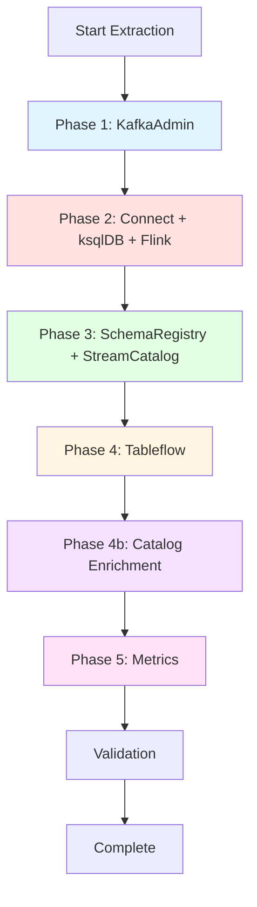
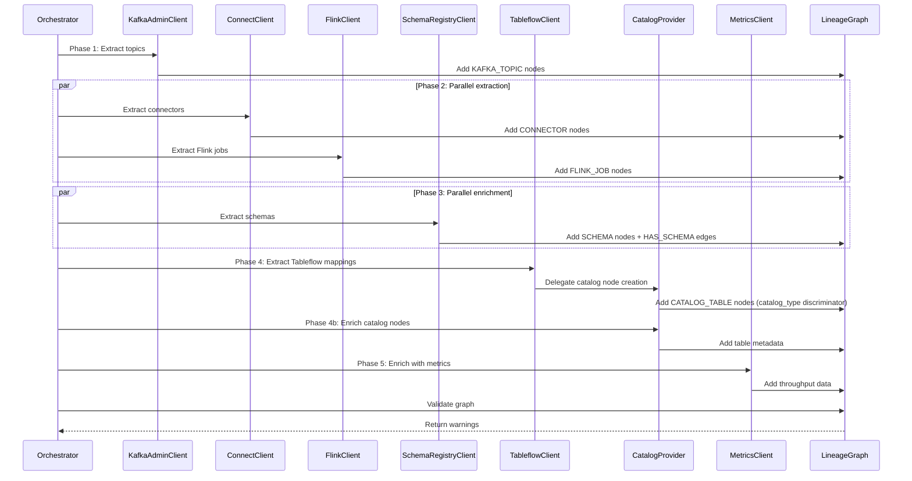

# Extraction Pipeline

The extraction pipeline is a 5-phase orchestration process that builds a unified lineage graph from Confluent Cloud APIs and enriches it with catalog metadata.

## Pipeline Overview



## Phase 1: KafkaAdmin

**Goal**: Establish the topic inventory and consumer group membership.

**Execution**: Sequential per cluster (one cluster at a time)

**Clients**: `KafkaAdminClient`

**Nodes Created**:
- `KAFKA_TOPIC` - Topics in each cluster
- `CONSUMER_GROUP` - Consumer groups

**Edges Created**:
- `MEMBER_OF` - Consumer group to topics

**API Endpoints**:
- `/kafka/v3/clusters/{cluster_id}/topics`
- `/kafka/v3/clusters/{cluster_id}/consumer-groups`
- `/kafka/v3/clusters/{cluster_id}/consumer-groups/{group_id}/consumers`

**Why Sequential**: Topics are the foundation for all downstream phases. Each cluster is processed sequentially to establish baseline inventory before parallel extraction.

**Error Handling**: 401/403 errors suggest cluster-scoped API keys are required. The extractor returns empty lists and logs a warning.

```python
# Example: Phase 1 extraction
kafka_client = KafkaAdminClient(
    base_url=rest_endpoint,
    api_key=kafka_key,
    api_secret=kafka_secret,
    cluster_id=cluster_id,
    environment_id=env_id,
    bootstrap_servers=bootstrap,
)
async with kafka_client:
    nodes, edges = await kafka_client.extract()
```

## Phase 2: Connect + ksqlDB + Flink

**Goal**: Extract transformation and processing edges.

**Execution**: Parallel (all extractors run concurrently)

**Clients**:
- `ConnectClient` - Kafka Connect connectors
- `KsqlDBClient` - ksqlDB queries
- `FlinkClient` - Flink SQL jobs

**Nodes Created**:
- `CONNECTOR` - Source and sink connectors
- `KSQLDB_QUERY` - Persistent queries, streams, tables
- `FLINK_JOB` - Flink SQL statements
- `EXTERNAL_DATASET` - External systems (databases, S3, etc.)

**Edges Created**:
- `PRODUCES` - Source connector/query -> topic
- `CONSUMES` - Topic -> sink connector/query
- `TRANSFORMS` - Query -> query (ksqlDB CTAS)

**API Endpoints**:

**Connect**:
- `/connect/v1/environments/{env_id}/clusters`
- `/connect/v1/environments/{env_id}/clusters/{cluster_id}/connectors`
- `/connect/v1/environments/{env_id}/clusters/{cluster_id}/connectors/{name}`

**ksqlDB**:
- `/ksqldb/v1/organizations/{org_id}/environments/{env_id}/clusters`
- `/ksqldb/v2/clusters/{cluster_id}/ksql` (query introspection)

**Flink**:
- `/sql/v1/organizations/{org_id}/environments/{env_id}/statements`
- `/sql/v1/organizations/{org_id}/environments/{env_id}/statements/{name}`

**Why Parallel**: These extractors query independent APIs with no dependencies on each other. Running in parallel reduces total extraction time.

**Error Handling**: Each extractor runs in `_safe_extract()` with a 120s timeout. Failures return empty lists.

```python
# Example: Phase 2 parallel execution
phase2_tasks = []

if enable_connect:
    connect_client = ConnectClient(...)
    phase2_tasks.append(_run_connect())

if enable_ksqldb:
    ksql_client = KsqlDBClient(...)
    phase2_tasks.append(_run_ksqldb())

if enable_flink:
    flink_client = FlinkClient(...)
    phase2_tasks.append(_run_flink())

phase2_results = await asyncio.gather(*phase2_tasks)
```

## Phase 3: SchemaRegistry + StreamCatalog

**Goal**: Enrich topic nodes with schema metadata and business tags.

**Execution**: Parallel

**Clients**:
- `SchemaRegistryClient` - Schema enrichment
- `StreamCatalogClient` - Business metadata and tags

**Nodes Created**:
- `SCHEMA` - Schema versions (key + value schemas)

**Edges Created**:
- `HAS_SCHEMA` - Topic -> schema

**Enrichment**: Adds tags, business metadata, descriptions to existing topic nodes.

**API Endpoints**:

**Schema Registry**:
- `/subjects`
- `/subjects/{subject}/versions/latest`

**Stream Catalog**:
- `/catalog/v1/entity/type/kafka_topic`
- `/catalog/v1/entity/type/sr_schema`

**Why Parallel**: Both enrichment processes are independent and can run concurrently.

**Error Handling**: Missing Schema Registry endpoint skips both extractors. Catalog enrichment failures are logged but don't fail the pipeline.

```python
# Example: Phase 3 parallel execution
phase3_tasks = []

if enable_schema_registry and sr_endpoint:
    sr_client = SchemaRegistryClient(...)
    phase3_tasks.append(_run_sr())

if enable_stream_catalog and sr_endpoint:
    catalog_client = StreamCatalogClient(...)
    phase3_tasks.append(_run_catalog())

phase3_results = await asyncio.gather(*phase3_tasks)
```

## Phase 4: Tableflow

**Goal**: Map Kafka topics to data catalog tables (UC, Glue, BigQuery).

**Execution**: Sequential (after Phase 3 completes)

**Clients**: `TableflowClient`

**Nodes Created**:
- `TABLEFLOW_TABLE` - Intermediate mapping node
- `CATALOG_TABLE` - Data catalog tables (discriminated by `catalog_type`):
  - `catalog_type="UNITY_CATALOG"` - Databricks Unity Catalog
  - `catalog_type="AWS_GLUE"` - AWS Glue Data Catalog
  - `catalog_type="GOOGLE_DATA_LINEAGE"` - Google BigQuery
  - `catalog_type="AWS_DATAZONE"` - AWS DataZone

**Edges Created**:
- `MATERIALIZES` - Topic -> catalog table (via Tableflow table)

**API Endpoints**:
- `/tableflow/v1/environments/{env_id}/integrations`
- `/tableflow/v1/environments/{env_id}/topic-table-mappings`

**Provider Delegation**: When Tableflow returns a catalog type (e.g., `UNITY_CATALOG`, `AWS_GLUE`), the orchestrator looks up the registered provider and calls `build_node()` to create the catalog node.

**Why Sequential**: Depends on topic nodes from Phase 1.

**Error Handling**: Missing credentials or disabled Tableflow skips this phase.

```python
# Example: Phase 4 extraction
tf_client = TableflowClient(
    api_key=tf_key,
    api_secret=tf_secret,
    environment_id=env_id,
    cluster_ids=tf_cluster_ids,
)
async with tf_client:
    nodes, edges = await tf_client.extract()
    _merge_into(graph, nodes, edges)
```

## Phase 4b: Catalog Enrichment

**Goal**: Backfill metadata from catalog APIs (UC, Glue, BigQuery).

**Execution**: Parallel (per provider)

**Providers**:
- `DatabricksUCProvider` - Fetches table metadata from UC REST API
- `GlueCatalogProvider` - Fetches table metadata from Glue API
- `GoogleLineageProvider` - Fetches table metadata from BigQuery API

**Enrichment**: Adds metadata like:
- Table location (S3 path, DBFS path)
- Input/output format
- SerDe information
- Table parameters
- Column schemas

**Why Separate Phase**: Tableflow is a Confluent API client and doesn't need external catalog credentials. Enrichment requires UC/Glue/BigQuery credentials, so it runs separately after nodes are created.

**Credential Resolution**: Orchestrator creates fresh provider instances with credentials from Settings:
- **UC**: `workspace_url`, `token`
- **Glue**: `aws_region` (boto3 auto-discovers credentials)
- **Google**: `project_id`, `location` (Application Default Credentials)

**Error Handling**: Enrichment failures are logged but don't fail the pipeline.

```python
# Example: Phase 4b enrichment
active_providers = get_active_providers(graph)
for provider in active_providers:
    if provider.catalog_type == "UNITY_CATALOG":
        provider = DatabricksUCProvider(
            workspace_url=settings.databricks_workspace_url,
            token=settings.databricks_token,
        )
    await provider.enrich(graph)
```

## Phase 5: Metrics

**Goal**: Enrich topic nodes with real-time throughput metrics.

**Execution**: Parallel (per cluster)

**Clients**: `MetricsClient`

**Enrichment**: Adds attributes to existing topic nodes:
- `bytes_in_rate` - Bytes received per second
- `bytes_out_rate` - Bytes sent per second
- `record_in_rate` - Records received per second
- `record_out_rate` - Records sent per second

**API Endpoints**:
- `/v2/metrics/cloud/query` (Confluent Metrics API)

**Lookback Window**: Configurable (default: 1 hour)

**Why Parallel**: Each cluster's metrics are fetched independently.

**Error Handling**: Metrics failures are logged but don't fail the pipeline. This phase is optional and disabled by default.

```python
# Example: Phase 5 enrichment
metrics_client = MetricsClient(
    api_key=settings.confluent_cloud_api_key,
    api_secret=settings.confluent_cloud_api_secret,
    lookback_hours=1,
)
cluster_ids = {n.cluster_id for n in graph.nodes if n.cluster_id}
async with metrics_client:
    for cluster_id in cluster_ids:
        enriched = await metrics_client.enrich(graph, cluster_id)
```

## Validation

**Goal**: Detect and warn about graph integrity issues.

**Checks**:
- **Orphan nodes** - Nodes with no incoming or outgoing edges (excluding schemas)
- **Dangling edges** - Edges referencing missing nodes

**Behavior**: Returns a list of warning strings. Warnings are logged but don't fail the extraction.

**Why Warnings Not Errors**: Orphan nodes are common in partial extractions (e.g., when some extractors are disabled). Failing would block the user from seeing any graph.

```python
# Example: Validation
warnings = graph.validate()
for w in warnings:
    logger.warning("Graph validation: %s", w)
```

## Data Flow Diagram



## Execution Modes

### Full Extraction

```bash
lineage-bridge-extract --env env-abc123
```

Runs all 5 phases with catalog enrichment enabled.

### Extraction Only (No Enrichment)

```bash
lineage-bridge-extract --env env-abc123 --no-enrich
```

Runs phases 1-4, skips catalog enrichment (4b) and metrics (5).

### Enrichment Only

```bash
lineage-bridge-extract --enrich-only --output lineage_graph.json
```

Loads an existing graph from disk and runs phases 4b-5 (catalog + metrics enrichment).

### Selective Extractors

The UI and orchestrator allow toggling individual extractors:
- Connect
- ksqlDB
- Flink
- Schema Registry
- Stream Catalog
- Tableflow
- Metrics

## Performance Characteristics

- **Sequential phases**: 1, 4
- **Parallel phases**: 2, 3, 4b, 5
- **Timeout**: 120s per extractor
- **Retry policy**: 3 retries with exponential backoff (1s, 2s, 4s)
- **Retryable status codes**: 429, 500, 502, 503, 504

**Typical extraction time**:
- Small environment (1 cluster, 10 topics): ~10s
- Medium environment (3 clusters, 100 topics): ~30s
- Large environment (10 clusters, 1000 topics): ~2-3 min

## Error Recovery

All extractors run in `_safe_extract()` wrapper:
1. Wraps coroutine in `asyncio.wait_for(coro, timeout=120)`
2. Catches `TimeoutError`, `Exception`
3. Logs warning with helpful error messages for 401/403/400
4. Returns empty `([], [])` on failure
5. Extraction continues with remaining extractors

**This ensures partial extraction succeeds even if some APIs are unavailable.**

## Next Steps

- [Graph Model](graph-model.md) - Node/edge types and ID format
- [Clients](clients.md) - Client protocols and retry behavior
- [Troubleshooting: Extraction Failures](../troubleshooting/extraction-failures.md)
