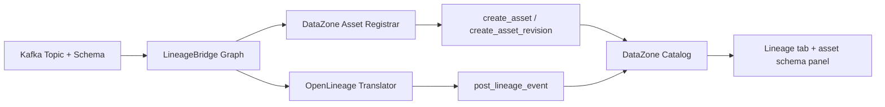

# AWS DataZone Integration

**What you'll build**: Confluent stream lineage visible in the AWS DataZone Catalog and lineage UI, with Kafka topics registered as native DataZone assets carrying their Confluent Schema Registry schema.

**Why this matters**: DataZone is AWS's data mesh service — domain-scoped catalogs, project-based ownership, lineage as a first-class feature. Unlike Glue (which has no native lineage UI), DataZone speaks OpenLineage natively via `post_lineage_event` and renders both the lineage graph and per-asset schema. This integration mirrors the Google Dataplex / Data Lineage pair.

## How it works



Two write paths run in sequence:

1. **Asset registration** — for each `KAFKA_TOPIC` node in the extracted graph:
   - Bootstrap a custom asset type `LineageBridgeKafkaTopic` with a Smithy form (`KafkaSchemaForm`) carrying `fieldsJson`, `clusterId`, `environmentId`. Idempotent — `get_asset_type` first, `create_asset_type` only on `ResourceNotFoundException`.
   - Upsert one DataZone asset per topic with `externalIdentifier` set to the same FQN that the lineage event references (e.g. `kafka:lkc-yr5dok.\`lineage_bridge.enriched_orders\``). On `ConflictException`, fall back to `create_asset_revision`.
2. **Lineage event push** — call `graph_to_events()` on the same graph, normalize namespaces (`confluent://` → `kafka://`, `google://` → `bigquery`, `aws://` retained), drop unrecognized datasets, then post each event via `post_lineage_event`.

The asset's `externalIdentifier` matches the lineage event FQN exactly, so the DataZone Catalog UI joins them automatically — clicking an upstream Kafka node in the lineage tab opens the asset detail page with its registered schema.

## Prerequisites

1. **AWS DataZone domain** — create one in the AWS console (`Amazon DataZone → Create domain`). Note the domain ID (`dzd_xxxxxx`).
2. **DataZone project** — within the domain, create or pick a project that will own the registered assets. Note the project ID (`prj_xxxxxx`).
3. **AWS credentials** — standard boto3 chain (env vars, `~/.aws/credentials`, IAM role, IRSA).
4. **IAM permissions** — first push needs full create access; subsequent pushes only need create + revise. Recommended: attach `AmazonDataZoneFullAccess` for the bootstrap, then narrow to a custom policy with:
   ```
   datazone:GetAssetType
   datazone:CreateAssetType
   datazone:CreateAsset
   datazone:CreateAssetRevision
   datazone:Search
   datazone:PostLineageEvent
   ```
5. **Confluent Schema Registry extraction enabled** — schema fields surface from `HAS_SCHEMA` edges; without this only the FQN gets registered (no column list).

## Configuration

### Auto-wired by the Glue demo

If you use `make demo-glue-up`, the `setup-tfvars.sh` step auto-detects DataZone for you: when the configured `aws_region` has a single DataZone domain it's picked automatically; multiple domains prompt for a choice; zero domains silently skips DataZone (the rest of the demo still works). Same logic for project selection inside the chosen domain. The IDs land in `infra/demos/glue/terraform.tfvars`:

```hcl
aws_datazone_domain_id  = "dzd-xxxxxx"
aws_datazone_project_id = "prj-xxxxxx"
```

…and Terraform threads them into the `.env` output and into the local encrypted cache (so the "Push to DataZone" button stays available even after another demo overwrites `.env`). To override or skip: edit `terraform.tfvars` and set both to `""`, then re-run `make demo-glue-up`.

### Manual configuration

```bash
# Required
export LINEAGE_BRIDGE_AWS_DATAZONE_DOMAIN_ID=dzd_xxxxxx
export LINEAGE_BRIDGE_AWS_DATAZONE_PROJECT_ID=prj_xxxxxx

# Region (optional — defaults to LINEAGE_BRIDGE_AWS_REGION, then us-east-1)
export LINEAGE_BRIDGE_AWS_REGION=us-east-1
```

Or via `.env`:

```
LINEAGE_BRIDGE_AWS_DATAZONE_DOMAIN_ID=dzd_xxxxxx
LINEAGE_BRIDGE_AWS_DATAZONE_PROJECT_ID=prj_xxxxxx
LINEAGE_BRIDGE_AWS_REGION=us-east-1
```

When both `LINEAGE_BRIDGE_AWS_DATAZONE_DOMAIN_ID` and `LINEAGE_BRIDGE_AWS_DATAZONE_PROJECT_ID` are set and the graph has at least one Kafka topic, a **Push to DataZone** button appears in the Streamlit publish panel.

## Usage

### From the UI

1. Run extraction so the graph has Kafka topics, schemas, Flink jobs, etc.
2. Click **Push to DataZone** under "Publish".
3. Open the DataZone domain in the AWS console → **Catalog** → search for one of your topics. The asset detail shows the schema fields, cluster ID, and environment ID under the `KafkaSchemaForm` tab.
4. Open **Lineage** on a downstream Glue table or asset — upstream nodes link back to your registered Kafka assets.

### From Python

```python
import asyncio
from lineage_bridge.config.settings import Settings
from lineage_bridge.extractors.orchestrator import run_datazone_push

settings = Settings()  # reads env / .env
result = asyncio.run(run_datazone_push(settings, graph))
print(f"Posted {result.tables_updated} events; errors: {len(result.errors)}")
```

### From the CLI / scripts

A direct CLI entry point isn't shipped — call `run_datazone_push` from your own script, or use the Streamlit UI button.

## Troubleshooting

- **"DataZone domain_id / project_id not configured"** — both env vars must be set; the push gates on their presence.
- **`AccessDeniedException` on `CreateAssetType`** — first push needs `datazone:CreateAssetType`. After bootstrap, this permission is no longer required.
- **`ValidationException: invalid externalIdentifier`** — DataZone restricts characters in external IDs. The registrar uses backtick-escaped FQNs (`kafka:lkc-1.\`my.topic\``); if a topic name contains characters DataZone rejects, the per-topic upsert fails but other topics still proceed.
- **Asset registered but lineage tab shows nothing** — DataZone indexes lineage events asynchronously. Wait 1–5 minutes. The event was accepted if `tables_updated > 0` in the push result.

## Verification

Two integration paths verify the wiring end to end:

```bash
# Unit tests (mocked boto3) — runs in CI without AWS creds
uv run pytest tests/unit/test_aws_datazone.py -v

# Live integration tests — requires AWS creds + DataZone domain
make test-integration-datazone \
  LINEAGE_BRIDGE_AWS_DATAZONE_DOMAIN_ID=dzd_xxxxxx \
  LINEAGE_BRIDGE_AWS_DATAZONE_PROJECT_ID=prj_xxxxxx
```

The live integration tests register a uniquely-named asset per run (UUID suffix), exercise the create-then-revision idempotency path, and post a real OpenLineage event. They do not delete created assets — DataZone CRUD is async and re-runs are safe (the second run hits the `create_asset_revision` path).

## Related

- [Google Data Lineage Integration](google-data-lineage.md) — sister integration for GCP. Same architecture (asset registrar + OpenLineage push), different APIs.
- [AWS Glue Integration](aws-glue.md) — separate integration for the Glue catalog. DataZone and Glue are independent — enable both, either, or neither.
