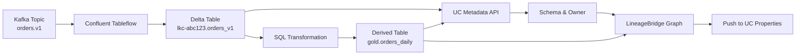

# Databricks Unity Catalog Integration

**What you'll build**: A complete view of how Kafka topics flow into Unity Catalog tables and downstream Delta transformations, visible in both LineageBridge and the Databricks workspace.

**Why this matters**: Your data team works in Databricks SQL and notebooks. They need to know which Kafka topics feed their tables, who owns the source connectors, and how data flows through transformations. LineageBridge makes this visible without leaving the workspace.

## Data Flow

Here's how your data travels from Confluent to Databricks:



**LineageBridge role**:
1. Discovers the Tableflow-created table via API
2. Enriches it with schema, owner, and storage metadata from UC
3. Walks the UC lineage API to find derived tables
4. Pushes Kafka source metadata back to UC as queryable properties

## Capabilities

The `DatabricksUCProvider` offers the most comprehensive catalog integration:

- **Build Nodes**: Creates `UC_TABLE` nodes from Tableflow catalog integrations
- **Enrich Metadata**: Fetches table schema, owner, storage location, and update timestamps via the Unity Catalog REST API
- **Discover Lineage**: Walks downstream UC tables to discover derived tables created via Databricks SQL/Spark
- **Push Lineage**: Writes Confluent lineage metadata as table properties, comments, and optionally a bridge table for querying

## Prerequisites

1. **Databricks Workspace**: Access to a Databricks workspace with Unity Catalog enabled
2. **Personal Access Token**: Generate a token with workspace access permissions
3. **SQL Warehouse** (for lineage push): A running SQL warehouse for executing SQL statements
4. **Tableflow Integration**: Configure Tableflow in Confluent Cloud to sync topics to UC tables

### Generate a Databricks Token

1. Navigate to **User Settings** > **Developer** > **Access Tokens**
2. Click **Generate New Token**
3. Set a descriptive name (e.g., `lineage-bridge`) and optional expiration
4. Copy the token (it will not be shown again)

### Find Your SQL Warehouse ID

1. Navigate to **SQL** > **SQL Warehouses**
2. Click on the warehouse you want to use
3. Copy the **ID** from the URL: `https://<workspace>.cloud.databricks.com/sql/warehouses/<warehouse_id>`

## Configuration

=== "Environment Variables"

    ```bash
    # Required for enrichment
    export LINEAGE_BRIDGE_DATABRICKS_WORKSPACE_URL=https://myworkspace.cloud.databricks.com
    export LINEAGE_BRIDGE_DATABRICKS_TOKEN=dapi1234567890abcdef1234567890ab
    
    # Required for lineage push (SQL writes)
    export LINEAGE_BRIDGE_DATABRICKS_WAREHOUSE_ID=abc123def456
    ```

=== ".env File"

    ```bash
    # Add to .env in your project root
    
    # Required for enrichment
    LINEAGE_BRIDGE_DATABRICKS_WORKSPACE_URL=https://myworkspace.cloud.databricks.com
    LINEAGE_BRIDGE_DATABRICKS_TOKEN=dapi1234567890abcdef1234567890ab
    
    # Required for lineage push (SQL writes)
    LINEAGE_BRIDGE_DATABRICKS_WAREHOUSE_ID=abc123def456
    ```

=== "UI Configuration"

    1. Launch the UI: `uv run streamlit run lineage_bridge/ui/app.py`
    2. Sidebar → **Connection Settings**
    3. Enter:
       - Workspace URL (no trailing slash)
       - Personal Access Token
       - SQL Warehouse ID (for lineage push)
    4. Click **Save**

**Important**: The workspace URL must NOT include a trailing slash.

## Features

### 1. Node Creation (build_node)

When Tableflow reports a Unity Catalog integration, the provider creates a `UC_TABLE` node:

```python
# Node ID format
node_id = f"databricks:uc_table:{environment_id}:{catalog}.{schema}.{table}"

# Qualified name format
qualified_name = f"{catalog_name}.{cluster_id}.{topic_name_normalized}"
```

**Naming Convention**:
- Catalog name: From Tableflow config or defaults to `confluent_tableflow`
- Schema name: Raw cluster ID (e.g., `lkc-abc123`)
- Table name: Topic name with dots normalized to underscores (e.g., `orders.v1` becomes `orders_v1`)

**Example**:
```
Topic: "orders.v1"
Cluster: lkc-abc123
UC Table: confluent_tableflow.lkc-abc123.orders_v1
```

### 2. Metadata Enrichment (enrich)

The provider fetches metadata for each UC table via the REST API:

**Endpoint**: `GET /api/2.1/unity-catalog/tables/{catalog}.{schema}.{table}`

**Enriched Attributes**:
- `owner`: Table owner
- `table_type`: MANAGED, EXTERNAL, VIEW, etc.
- `columns`: Array of column definitions with name, type, and comment
- `storage_location`: S3/ADLS/GCS path
- `updated_at`: Last modification timestamp

**Retry Logic**: Exponential backoff on 429/500/502/503/504 errors (max 3 retries)

### 3. Downstream Lineage Discovery

The provider walks the Unity Catalog lineage API to discover derived tables:

**Endpoint**: `GET /api/2.0/lineage-tracking/table-lineage?table_name={table}`

For each discovered downstream table:
1. Create a new `UC_TABLE` node with `derived: true`
2. Add a `TRANSFORMS` edge from the upstream table
3. Enrich the new node with metadata
4. Continue walking downstream recursively

**Example**:
```
orders.v1 (topic)
  -> confluent_tableflow.lkc-abc123.orders_v1 (UC table)
    -> sales_analytics.gold.orders_daily (derived UC table, discovered via lineage)
```

This allows LineageBridge to trace how Confluent topics flow through Databricks transformations.

**What happens under the hood**:
```python
# 1. Query UC lineage API for downstream tables
response = await client.get(
    f"/api/2.0/lineage-tracking/table-lineage",
    params={"table_name": "confluent_tableflow.lkc-abc123.orders_v1"}
)

# 2. For each downstream table found
for downstream in response.get("downstreams", []):
    # Create UC_TABLE node
    derived_node = LineageNode(
        node_id=f"databricks:uc_table:{env_id}:{downstream['table_name']}",
        node_type=NodeType.UC_TABLE,
        qualified_name=downstream["table_name"],
        attributes={"derived": True}  # Flag as discovered
    )
    
    # Create TRANSFORMS edge
    edge = LineageEdge(
        src_id=source_table_node_id,
        dst_id=derived_node.node_id,
        edge_type=EdgeType.TRANSFORMS
    )
    
    # Enrich with metadata from UC Tables API
    await enrich_node(derived_node)
    
    # Recurse to find further downstream tables
    await discover_downstream(derived_node)
```

**Why this is powerful**: You automatically see the full lakehouse flow without manually mapping transformations.

### 4. Lineage Push (push_lineage)

Push Confluent lineage metadata back to UC via the Databricks Statement Execution API:

**Options**:
- `set_properties`: Write `lineage_bridge.*` table properties
- `set_comments`: Write a human-readable lineage comment
- `create_bridge_table`: Create a queryable lineage table

**Table Properties** (set via `ALTER TABLE ... SET TBLPROPERTIES`):

```sql
ALTER TABLE confluent_tableflow.lkc-abc123.orders_v1 SET TBLPROPERTIES (
  'lineage_bridge.source_topics' = 'orders.v1',
  'lineage_bridge.source_connectors' = 'MySqlSourceConnector',
  'lineage_bridge.pipeline_type' = 'tableflow',
  'lineage_bridge.last_synced' = '2026-04-30T12:34:56.789Z',
  'lineage_bridge.environment_id' = 'env-abc123',
  'lineage_bridge.cluster_id' = 'lkc-abc123'
)
```

**Table Comment** (set via `COMMENT ON TABLE`):

```sql
COMMENT ON TABLE confluent_tableflow.lkc-abc123.orders_v1 IS 
'Materialized from Kafka topic "orders.v1" via Confluent Tableflow.
Sources: MySqlSourceConnector
Environment: env-abc123
Last synced: 2026-04-30T12:34:56.789Z
Managed by LineageBridge'
```

**Bridge Table** (optional, for querying lineage):

Creates `{catalog}.default.confluent_lineage` with upstream lineage records:

```sql
CREATE TABLE IF NOT EXISTS confluent_tableflow.default.confluent_lineage (
  uc_table STRING,
  source_type STRING,
  source_name STRING,
  source_system STRING,
  edge_type STRING,
  environment_id STRING,
  cluster_id STRING,
  hop_distance INT,
  full_path STRING,
  synced_at TIMESTAMP
)
```

Each UC table gets one row per upstream node (topic, connector, etc.).

**Usage Example** (UI):

1. Extract lineage with Tableflow enabled
2. Click **Push Lineage** in the sidebar
3. Select options:
   - Set table properties
   - Set table comments
   - Create bridge table (optional)
4. Click **Push**

**Usage Example** (API):

```bash
curl -X POST http://localhost:8000/api/v1/lineage/push \
  -H "Content-Type: application/json" \
  -d '{
    "catalog_type": "UNITY_CATALOG",
    "set_properties": true,
    "set_comments": true,
    "create_bridge_table": true
  }'
```

## Testing

### Quick Test with Demo Data

Want to test without setting up your own Tableflow? Use the built-in UC demo:

```bash
# Navigate to UC demo
cd infra/demos/uc

# Provision demo infrastructure (Confluent + Databricks + Tableflow)
make demo-up

# Get .env file for LineageBridge
make env > ../../../.env.uc-demo

# Return to project root and use demo config
cd ../../..
cp .env .env.backup
cp .env.uc-demo .env

# Extract lineage
uv run lineage-bridge-extract

# View in UI
uv run streamlit run lineage_bridge/ui/app.py

# Clean up when done
cd infra/demos/uc
make demo-down
```

**What this creates**:
- Confluent environment with topics and connectors
- Databricks workspace with Unity Catalog
- Tableflow integration syncing topics to UC tables
- Sample derived tables for lineage discovery testing

### 1. Test Enrichment

Extract lineage with UC credentials configured:

```bash
export LINEAGE_BRIDGE_DATABRICKS_WORKSPACE_URL=https://myworkspace.cloud.databricks.com
export LINEAGE_BRIDGE_DATABRICKS_TOKEN=dapi...
uv run lineage-bridge-extract
```

Check the extracted graph for UC table nodes with enriched metadata:

```bash
cat lineage_graph.json | jq '.nodes[] | select(.node_type == "UC_TABLE")'
```

Expected attributes: `owner`, `table_type`, `columns`, `storage_location`, `updated_at`

### 2. Test Lineage Push

In the UI:
1. Extract lineage
2. Click **Push Lineage** > **Unity Catalog**
3. Enable all options
4. Click **Push**
5. Check results panel for success/error counts

Verify in Databricks SQL:

```sql
-- Check table properties
SHOW TBLPROPERTIES confluent_tableflow.lkc_abc123.orders_v1;

-- Check table comment
DESCRIBE TABLE EXTENDED confluent_tableflow.lkc_abc123.orders_v1;

-- Query bridge table
SELECT * FROM confluent_tableflow.default.confluent_lineage
WHERE uc_table = 'confluent_tableflow.lkc_abc123.orders_v1';
```

### 3. Test Downstream Discovery

If you have derived UC tables created via SQL:

```sql
CREATE TABLE sales_analytics.gold.orders_daily AS
SELECT date_trunc('day', order_time) AS day, count(*) AS count
FROM confluent_tableflow.lkc_abc123.orders_v1
GROUP BY day;
```

After extraction, search the graph for `orders_daily` — it should appear as a derived `UC_TABLE` node connected to the source table.

## Troubleshooting

### Error: "Databricks UC API returned 401"

**What it means**: Your token is invalid or expired.

**How to fix**:
1. Generate a new token in Databricks: **User Settings** → **Developer** → **Access Tokens**
2. Update your `.env`:
   ```bash
   LINEAGE_BRIDGE_DATABRICKS_TOKEN=dapi_your_new_token_here
   ```
3. Restart the extraction

**Common cause**: Personal access tokens expire. Use service principals for production.

### Error: "Databricks UC API returned 404"

**What it means**: The table doesn't exist in Unity Catalog yet.

**How to fix**:
1. Verify Tableflow is running:
   ```bash
   confluent tableflow connection list
   ```
2. Check the table exists in UC:
   ```sql
   SHOW TABLES IN confluent_tableflow.lkc_abc123;
   ```
3. Check Tableflow config matches UC naming:
   - Catalog name (default: `confluent_tableflow`)
   - Schema name (default: cluster ID like `lkc-abc123`)
   - Table name (topic name with dots → underscores)

**Common cause**: Tableflow sync hasn't completed yet. Wait a few minutes after creating the integration.

### Error: "Bridge table creation failed: permission denied"

**What it means**: Your token can't create tables in the default schema.

**How to fix**:
1. Grant `CREATE` permission on `{catalog}.default`:
   ```sql
   GRANT CREATE ON SCHEMA confluent_tableflow.default TO `your_user@example.com`;
   ```
2. Or use a service principal with broader permissions
3. Or skip bridge table creation (properties and comments still work)

**Common cause**: Personal tokens inherit your user permissions. Service principals need explicit grants.

### Lineage push succeeds but properties don't appear

**What it means**: Metadata sync is delayed (serverless warehouses can take 30-60 seconds).

**How to fix**:
1. Wait 60 seconds and re-query:
   ```sql
   SHOW TBLPROPERTIES confluent_tableflow.lkc_abc123.orders_v1;
   ```
2. Or switch to a classic SQL warehouse (faster metadata sync)

**Common cause**: Serverless warehouses have asynchronous metadata updates.

### Tables appear but lineage discovery is empty

**What it means**: UC lineage tracking isn't enabled or has no downstream tables.

**How to fix**:
1. Check workspace settings: **Admin Console** → **Workspace Settings** → **Lineage Tracking** (must be ON)
2. Verify you have downstream tables:
   ```sql
   SELECT * FROM system.access.table_lineage
   WHERE source_table_full_name = 'confluent_tableflow.lkc_abc123.orders_v1';
   ```
3. If empty, create a derived table:
   ```sql
   CREATE TABLE gold.orders_summary AS
   SELECT order_date, COUNT(*) as count
   FROM confluent_tableflow.lkc_abc123.orders_v1
   GROUP BY order_date;
   ```

**Common cause**: UC lineage requires explicitly enabled tracking and actual downstream transformations.

## Common Pitfalls

### Pitfall 1: Trailing Slash in Workspace URL

**Problem**: Configuration uses `https://myworkspace.cloud.databricks.com/`

**Symptom**: API calls fail with 404 or redirect errors

**Fix**: Remove the trailing slash
```bash
# Wrong
LINEAGE_BRIDGE_DATABRICKS_WORKSPACE_URL=https://myworkspace.cloud.databricks.com/

# Right
LINEAGE_BRIDGE_DATABRICKS_WORKSPACE_URL=https://myworkspace.cloud.databricks.com
```

### Pitfall 2: Personal Token in Production

**Problem**: Using a personal access token that expires or is tied to your user account

**Symptom**: Lineage breaks when you leave the team or token expires

**Fix**: Use a service principal
```bash
# Create service principal in Databricks admin console
# Generate token for the service principal (never expires unless revoked)
LINEAGE_BRIDGE_DATABRICKS_TOKEN=dapi_service_principal_token_here
```

### Pitfall 3: Missing Lineage Tracking

**Problem**: Downstream discovery finds no derived tables even though they exist

**Symptom**: Graph only shows Tableflow tables, no transformations

**Fix**: Enable UC lineage tracking
1. Admin Console → Workspace Settings → Lineage Tracking → ON
2. Wait 24 hours for historical lineage to populate (or create new transformations)

### Pitfall 4: Wrong Warehouse ID

**Problem**: Lineage push fails with "warehouse not found"

**Symptom**: Table properties and comments don't update

**Fix**: Get the correct warehouse ID from the URL
```bash
# Open SQL Warehouse in Databricks UI
# URL looks like: https://myworkspace.cloud.databricks.com/sql/warehouses/abc123def456
# Use just the ID part: abc123def456
LINEAGE_BRIDGE_DATABRICKS_WAREHOUSE_ID=abc123def456
```

## Best Practices

1. **Use Service Principals**: For production deployments, use a service principal token instead of personal access tokens
2. **Limit Warehouse Size**: Lineage push uses lightweight SQL — a Small warehouse is sufficient
3. **Monitor Bridge Table Growth**: If using the bridge table, monitor row counts and set a retention policy
4. **Enable Downstream Discovery**: To capture full lakehouse lineage, ensure UC lineage tracking is enabled in workspace settings
5. **Quote Special Characters**: Tableflow table names are auto-quoted if they contain non-alphanumeric characters

## Deep Links

The provider generates deep links to the Unity Catalog UI:

```
https://<workspace>.cloud.databricks.com/explore/data/<catalog>/<schema>/<table>
```

Click any UC table node in the LineageBridge UI to open it in the Databricks workspace.

## Next Steps

- [AWS Glue Integration](aws-glue.md) - Integrate with AWS Glue Data Catalog
- [Google Data Lineage Integration](google-data-lineage.md) - Integrate with Google Data Lineage
- [Adding New Catalogs](adding-new-catalogs.md) - Build a custom catalog provider
