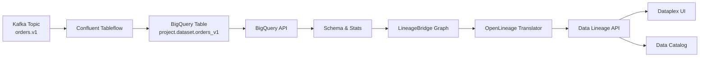

# Google Data Lineage Integration

**What you'll build**: Kafka lineage visible in Google Cloud's Data Lineage UI and BigQuery, using the vendor-neutral OpenLineage standard.

**Why this matters**: Your data platform runs on Google Cloud. Analysts query BigQuery, governance uses Dataplex, and compliance needs to trace data from Kafka to warehouse. Google Data Lineage natively understands OpenLineage, making this a first-class integration.

## Data Flow

Here's how Kafka topics become BigQuery tables with lineage:



**LineageBridge role**:
1. Discovers the Tableflow-created BigQuery table
2. Enriches it with schema, size, and metadata from BigQuery API
3. Translates the graph to OpenLineage events (vendor-neutral format)
4. Pushes events to Google Data Lineage API for indexing
5. Makes lineage queryable in Dataplex and Data Catalog

**What makes this unique**: No custom metadata format — LineageBridge speaks OpenLineage, which Google natively understands.

## Capabilities

The `GoogleLineageProvider` offers native OpenLineage integration:

- **Build Nodes**: Creates `GOOGLE_TABLE` nodes from Tableflow catalog integrations
- **Enrich Metadata**: Fetches table schema, size, and metadata via the BigQuery API
- **Push Lineage**: Sends OpenLineage events to the Data Lineage API (no custom metadata format needed)

## Prerequisites

1. **Google Cloud Project**: Access to a GCP project with BigQuery and Data Lineage API enabled
2. **Application Default Credentials**: Configured via `gcloud auth application-default login`
3. **IAM Permissions**: Service account or user with BigQuery and Data Lineage permissions
4. **Tableflow Integration**: Configure Tableflow in Confluent Cloud to sync topics to BigQuery tables

### Enable Required APIs

```bash
gcloud services enable bigquery.googleapis.com
gcloud services enable datalineage.googleapis.com
```

### Required IAM Permissions

Create a custom role or use predefined roles with the following permissions:

```yaml
# BigQuery permissions (for enrichment)
bigquery.tables.get
bigquery.tables.getData

# Data Lineage permissions (for lineage push)
datalineage.locations.searchLinks
datalineage.operations.get
datalineage.processes.create
datalineage.runs.create
```

**Predefined Roles**:
- `roles/bigquery.dataViewer` - BigQuery metadata read
- `roles/datalineage.admin` - Data Lineage write

### Configure Application Default Credentials

```bash
# For local development
gcloud auth application-default login

# For production (service account)
export GOOGLE_APPLICATION_CREDENTIALS=/path/to/service-account-key.json
```

## Configuration

=== "Environment Variables"

    ```bash
    # Required: GCP project and location
    export LINEAGE_BRIDGE_GCP_PROJECT_ID=my-project
    export LINEAGE_BRIDGE_GCP_LOCATION=us  # or us-central1, europe-west1
    
    # Option 1: Use Application Default Credentials (local dev)
    gcloud auth application-default login
    
    # Option 2: Use service account key
    export GOOGLE_APPLICATION_CREDENTIALS=/path/to/service-account-key.json
    ```

=== ".env File"

    ```bash
    # Add to .env in your project root
    
    # Required
    LINEAGE_BRIDGE_GCP_PROJECT_ID=my-project
    LINEAGE_BRIDGE_GCP_LOCATION=us
    
    # Optional: Service account key path
    GOOGLE_APPLICATION_CREDENTIALS=/path/to/service-account-key.json
    ```

=== "Service Account (Production)"

    ```bash
    # 1. Create service account
    gcloud iam service-accounts create lineage-bridge \
      --display-name="LineageBridge Service Account"
    
    # 2. Grant permissions
    gcloud projects add-iam-policy-binding my-project \
      --member="serviceAccount:lineage-bridge@my-project.iam.gserviceaccount.com" \
      --role="roles/bigquery.dataViewer"
    
    gcloud projects add-iam-policy-binding my-project \
      --member="serviceAccount:lineage-bridge@my-project.iam.gserviceaccount.com" \
      --role="roles/datalineage.admin"
    
    # 3. Create key
    gcloud iam service-accounts keys create lineage-bridge-key.json \
      --iam-account=lineage-bridge@my-project.iam.gserviceaccount.com
    
    # 4. Set credentials
    export GOOGLE_APPLICATION_CREDENTIALS=/path/to/lineage-bridge-key.json
    export LINEAGE_BRIDGE_GCP_PROJECT_ID=my-project
    export LINEAGE_BRIDGE_GCP_LOCATION=us
    ```

=== "GKE/Cloud Run (Production)"

    ```bash
    # Use Workload Identity (no key file needed)
    # Just set project and location
    export LINEAGE_BRIDGE_GCP_PROJECT_ID=my-project
    export LINEAGE_BRIDGE_GCP_LOCATION=us
    
    # Bind Kubernetes service account to GCP service account
    gcloud iam service-accounts add-iam-policy-binding \
      lineage-bridge@my-project.iam.gserviceaccount.com \
      --role roles/iam.workloadIdentityUser \
      --member "serviceAccount:my-project.svc.id.goog[namespace/ksa-name]"
    ```

**Credential Resolution Order** (google-auth standard):
1. `GOOGLE_APPLICATION_CREDENTIALS` environment variable (service account key)
2. Application Default Credentials (via `gcloud auth application-default login`)
3. Compute Engine metadata service (GCE, GKE, Cloud Run)
4. Workload Identity (GKE only)

## Features

### 1. Node Creation (build_node)

When Tableflow reports a Google BigQuery integration, the provider creates a `GOOGLE_TABLE` node:

```python
# Node ID format
node_id = f"google:google_table:{environment_id}:{project}.{dataset}.{table}"

# Qualified name format
qualified_name = f"{project_id}.{dataset_id}.{table_name}"
```

**Naming Convention**:
- Project ID: From Tableflow config or `LINEAGE_BRIDGE_GCP_PROJECT_ID`
- Dataset ID: From Tableflow config or defaults to cluster ID
- Table name: Topic name with dots and hyphens normalized to underscores (e.g., `orders.v1` becomes `orders_v1`)

**Example**:
```
Topic: "orders.v1"
Cluster: lkc-abc123
BigQuery Table: my-project.lkc_abc123.orders_v1
```

### 2. Metadata Enrichment (enrich)

The provider fetches metadata for each BigQuery table via the BigQuery API:

**Endpoint**: `GET https://bigquery.googleapis.com/bigquery/v2/projects/{project}/datasets/{dataset}/tables/{table}`

**Enriched Attributes**:
- `table_type`: TABLE, VIEW, EXTERNAL, MATERIALIZED_VIEW
- `columns`: Array of column definitions with name, type, and description
- `num_rows`: Row count (null for views)
- `num_bytes`: Storage size in bytes
- `creation_time`: Table creation timestamp (milliseconds since epoch)
- `last_modified_time`: Last modification timestamp
- `description`: User-provided table description
- `labels`: User-defined key-value labels

**Retry Logic**: Exponential backoff on 429/500/502/503/504 errors (max 3 retries)

**Error Handling**:
- `404 Not Found`: Table does not exist (skipped with warning)
- `401/403 Forbidden`: Insufficient permissions (skipped with warning)

### 3. Lineage Push (push_lineage)

Push Confluent lineage as OpenLineage events to the Data Lineage API:

**Endpoint**: `POST https://datalineage.googleapis.com/v1/projects/{project}/locations/{location}:processOpenLineageRunEvent`

**How It Works**:
1. Convert the LineageBridge graph to OpenLineage events using `graph_to_events()` translator
2. For each event, POST to the Data Lineage API
3. Google indexes the events and makes them queryable via the Data Lineage UI

**OpenLineage Format**:

```json
{
  "eventType": "COMPLETE",
  "eventTime": "2026-04-30T12:34:56.789Z",
  "run": {
    "runId": "abc123-def456-...",
    "facets": {}
  },
  "job": {
    "namespace": "confluent://env-abc123",
    "name": "tableflow-orders.v1",
    "facets": {}
  },
  "inputs": [
    {
      "namespace": "kafka://lkc-abc123",
      "name": "orders.v1",
      "facets": {}
    }
  ],
  "outputs": [
    {
      "namespace": "bigquery://my-project",
      "name": "lkc_abc123.orders_v1",
      "facets": {
        "schema": {...},
        "dataSource": {...}
      }
    }
  ]
}
```

**Usage Example** (UI):

1. Extract lineage with Tableflow enabled
2. Click **Push Lineage** in the sidebar
3. Select **Google Data Lineage**
4. Click **Push**

**Usage Example** (API):

```bash
curl -X POST http://localhost:8000/api/v1/lineage/push \
  -H "Content-Type: application/json" \
  -d '{
    "catalog_type": "GOOGLE_DATA_LINEAGE"
  }'
```

## Testing

### 1. Test Enrichment

Extract lineage with GCP credentials configured:

```bash
export LINEAGE_BRIDGE_GCP_PROJECT_ID=my-project
export GOOGLE_APPLICATION_CREDENTIALS=/path/to/service-account-key.json
uv run lineage-bridge-extract
```

Check the extracted graph for Google table nodes with enriched metadata:

```bash
cat lineage_graph.json | jq '.nodes[] | select(.node_type == "GOOGLE_TABLE")'
```

Expected attributes: `table_type`, `columns`, `num_rows`, `num_bytes`, `description`, `labels`

### 2. Test Lineage Push

In the UI:
1. Extract lineage
2. Click **Push Lineage** > **Google Data Lineage**
3. Click **Push**
4. Check results panel for success/error counts

Verify in Google Cloud Console:

1. Navigate to **Dataplex** > **Data Lineage**
2. Search for your BigQuery table: `my-project.lkc_abc123.orders_v1`
3. View the lineage graph — you should see upstream Kafka topics and connectors

Or use the `gcloud` CLI:

```bash
# List lineage events
gcloud dataplex data-lineage search-links \
  --location=us \
  --project=my-project \
  --target="bigquery:my-project.lkc_abc123.orders_v1"
```

### 3. Query via BigQuery

BigQuery table metadata is separate from lineage. Query table details:

```sql
SELECT * FROM `my-project.lkc_abc123.INFORMATION_SCHEMA.TABLES`
WHERE table_name = 'orders_v1';
```

## Troubleshooting

### Error: "BigQuery API returned 404"

**What it means**: The BigQuery table doesn't exist yet.

**How to fix**:
1. Verify Tableflow is running:
   ```bash
   confluent tableflow connection list
   ```
2. Check the table exists in BigQuery:
   ```bash
   bq show my-project:lkc_abc123.orders_v1
   ```
3. Check Tableflow config matches BigQuery naming:
   - Project ID (from Tableflow config or `LINEAGE_BRIDGE_GCP_PROJECT_ID`)
   - Dataset ID (default: cluster ID normalized as `lkc_abc123`)
   - Table name (topic name with dots → underscores)

**Common cause**: Tableflow sync hasn't completed. Wait a few minutes after creating the integration.

### Error: "BigQuery API returned 403"

**What it means**: Your credentials lack BigQuery read permissions.

**How to fix**:
1. Grant `roles/bigquery.dataViewer`:
   ```bash
   gcloud projects add-iam-policy-binding my-project \
     --member="serviceAccount:lineage-bridge@my-project.iam.gserviceaccount.com" \
     --role="roles/bigquery.dataViewer"
   ```
2. Or create a custom role with `bigquery.tables.get` permission
3. Test authentication:
   ```bash
   gcloud auth application-default print-access-token
   ```

**Common cause**: Service account exists but lacks permissions.

### Error: "Data Lineage API returned 403"

**What it means**: Your credentials lack Data Lineage write permissions.

**How to fix**:
1. Enable Data Lineage API:
   ```bash
   gcloud services enable datalineage.googleapis.com --project=my-project
   ```
2. Grant `roles/datalineage.admin`:
   ```bash
   gcloud projects add-iam-policy-binding my-project \
     --member="serviceAccount:lineage-bridge@my-project.iam.gserviceaccount.com" \
     --role="roles/datalineage.admin"
   ```
3. Check API is enabled:
   ```bash
   gcloud services list --enabled --project=my-project | grep datalineage
   ```

**Common cause**: Data Lineage API not enabled or service account lacks permission.

### Error: "google-auth not available or no ADC configured"

**What it means**: The `google-auth` library isn't installed or you haven't authenticated.

**How to fix**:
1. Ensure `google-auth` is installed (should be automatic):
   ```bash
   uv pip install google-auth google-auth-httplib2 google-auth-oauthlib
   ```
2. Configure Application Default Credentials:
   ```bash
   gcloud auth application-default login
   ```
3. Or set service account key:
   ```bash
   export GOOGLE_APPLICATION_CREDENTIALS=/path/to/key.json
   ```

**Common cause**: Fresh install without authentication.

### Lineage events pushed but not visible in Data Lineage UI

**What it means**: Events are indexed asynchronously (can take 5-15 minutes).

**How to fix**:
1. Wait 15 minutes and refresh the Data Lineage UI
2. Search for your table:
   - Navigate to **Dataplex** → **Data Lineage**
   - Search: `my-project.lkc_abc123.orders_v1`
3. Or query via gcloud:
   ```bash
   gcloud dataplex data-lineage search-links \
     --location=us \
     --project=my-project \
     --target="bigquery:my-project.lkc_abc123.orders_v1"
   ```

**Common cause**: Google indexes lineage asynchronously — this is normal behavior.

### Table exists in BigQuery but enrichment returns empty metadata

**What it means**: Possible permissions issue or table type mismatch.

**How to fix**:
1. Check table type (views behave differently):
   ```sql
   SELECT table_type FROM `my-project.lkc_abc123.INFORMATION_SCHEMA.TABLES`
   WHERE table_name = 'orders_v1';
   ```
2. Verify permissions include `bigquery.tables.getData`:
   ```bash
   gcloud projects get-iam-policy my-project \
     --flatten="bindings[].members" \
     --filter="bindings.members:serviceAccount:lineage-bridge@my-project.iam.gserviceaccount.com"
   ```

**Common cause**: Table is a view or external table with limited metadata.

## Integration with Google Services

Google Data Lineage integrates with:

- **BigQuery**: Query lineage for tables, views, and materialized views
- **Google Data Catalog**: View lineage in the Data Catalog UI
- **Dataplex**: Unified data governance and lineage
- **Cloud Composer (Airflow)**: Airflow DAGs can emit OpenLineage events
- **Dataflow**: Dataflow jobs emit lineage automatically

## Common Pitfalls

### Pitfall 1: Wrong Location (Multi-Region vs Region)

**Problem**: Using `us-central1` when BigQuery dataset is in `US` (multi-region)

**Symptom**: Lineage push succeeds but events don't appear in UI

**Fix**: Match BigQuery dataset location
```bash
# Check dataset location
bq show --format=prettyjson my-project:lkc_abc123 | grep location

# If output is "US" (multi-region)
LINEAGE_BRIDGE_GCP_LOCATION=us  # Not us-central1

# If output is "us-central1" (region)
LINEAGE_BRIDGE_GCP_LOCATION=us-central1
```

### Pitfall 2: Data Lineage API Not Enabled

**Problem**: API calls fail with "API not enabled"

**Symptom**: 403 errors during lineage push

**Fix**: Enable the API
```bash
# Enable for your project
gcloud services enable datalineage.googleapis.com --project=my-project

# Verify
gcloud services list --enabled --project=my-project | grep datalineage
```

### Pitfall 3: Waiting for Lineage to Appear

**Problem**: Lineage push reports success but nothing in UI

**Symptom**: Confusion about whether push worked

**Reality**: Google indexes lineage asynchronously (5-15 minutes is normal)
```bash
# Push succeeds immediately
curl -X POST .../lineage/push ...
# ✓ Success: 5 events pushed

# Wait 15 minutes, then search in Dataplex → Data Lineage
# Events will appear after indexing completes
```

### Pitfall 4: Service Account Lacks BigQuery Access

**Problem**: Service account has `datalineage.admin` but not `bigquery.dataViewer`

**Symptom**: Enrichment fails, push works but metadata is incomplete

**Fix**: Grant both roles
```bash
# Need both roles
gcloud projects add-iam-policy-binding my-project \
  --member="serviceAccount:lineage-bridge@my-project.iam.gserviceaccount.com" \
  --role="roles/bigquery.dataViewer"

gcloud projects add-iam-policy-binding my-project \
  --member="serviceAccount:lineage-bridge@my-project.iam.gserviceaccount.com" \
  --role="roles/datalineage.admin"
```

### Pitfall 5: Confusing OpenLineage with Custom Format

**Problem**: Expecting to see custom table properties like Databricks/Glue

**Symptom**: Looking for `lineage_bridge.*` metadata in BigQuery

**Reality**: Google uses native OpenLineage — lineage is separate from table metadata
```bash
# Lineage is NOT in table properties
bq show my-project:lkc_abc123.orders_v1  # Won't show Kafka source

# Lineage is in Data Lineage API
gcloud dataplex data-lineage search-links \
  --target="bigquery:my-project.lkc_abc123.orders_v1"  # Shows Kafka source
```

## Best Practices

1. **Use Service Accounts**: For production, use service accounts instead of user credentials
2. **Choose Location Wisely**: Data Lineage location should match your BigQuery dataset location
3. **Monitor API Quotas**: Data Lineage has API quotas — monitor usage in the GCP Console
4. **Tag Tables**: Use BigQuery labels for cost tracking and governance
5. **Combine with dbt**: If using dbt, combine LineageBridge lineage with dbt's OpenLineage integration for full DAG visibility

## OpenLineage Compatibility

Google Data Lineage implements the [OpenLineage](https://openlineage.io/) standard, which means:

- **Vendor-Neutral**: Lineage events are portable across tools
- **Community Standard**: Growing ecosystem of integrations (Airflow, Spark, dbt, Flink)
- **Extensible**: Custom facets for domain-specific metadata

LineageBridge's OpenLineage translator (`lineage_bridge.api.openlineage.translator`) converts the internal graph model to OpenLineage events, bridging Confluent stream lineage into the broader data lineage ecosystem.

## Deep Links

The provider generates deep links to the BigQuery Console:

```
https://console.cloud.google.com/bigquery?project={project}&p={project}&d={dataset}&t={table}&page=table
```

Click any Google table node in the LineageBridge UI to open it in the BigQuery Console.

## Next Steps

- [Databricks Unity Catalog Integration](databricks-unity-catalog.md) - Integrate with Unity Catalog
- [AWS Glue Integration](aws-glue.md) - Integrate with AWS Glue Data Catalog
- [Adding New Catalogs](adding-new-catalogs.md) - Build a custom catalog provider
- [OpenLineage Mapping Reference](../api-reference/openlineage-mapping.md) - Learn how Confluent concepts map to OpenLineage
