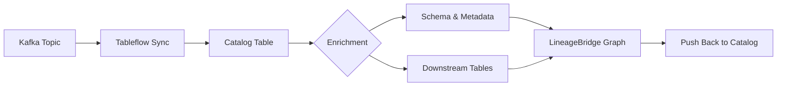

# Catalog Integration Overview

LineageBridge bridges Confluent stream lineage into external data catalogs, making your Kafka data flows visible in tools your teams already use. Each catalog provider implements a standard interface to build nodes, enrich metadata, push lineage, and generate deep links.

## Supported Catalogs

| Catalog | Provider | When to Use | Status |
|---------|----------|-------------|--------|
| **Databricks Unity Catalog** | `DatabricksUCProvider` | Lakehouse architectures with Databricks, teams using Delta Lake and downstream transformations | Production |
| **AWS Glue Data Catalog** | `GlueCatalogProvider` | AWS-centric data platforms with S3, Athena, Redshift Spectrum, or EMR | Production |
| **Google Data Lineage** | `GoogleLineageProvider` (+ `DataplexAssetRegistrar`) | Google Cloud platforms using BigQuery; Dataplex Catalog for Kafka schema visibility | Production |
| **AWS DataZone** | `AWSDataZoneProvider` | AWS data mesh / governance using DataZone domains; mirrors the Google integration for AWS | Production |

### Rich upstream chain (all catalogs)

Every push writes a JSON-encoded `lineage_bridge.upstream_chain` payload that walks the **full multi-hop pipeline** — source connectors → topics (with schema fields) → Flink/ksqlDB jobs (with SQL) → intermediate topics → sink. Visible in:

- **UC**: `SHOW TBLPROPERTIES my_catalog.schema.table` and the `chain_json` column of the optional bridge table
- **Glue**: `aws glue get-table` → `Parameters['lineage_bridge.upstream_chain']`
- **DataZone**: asset description + posted OpenLineage events

The flat `lineage_bridge.source_topics` / `source_connectors` props are still written for backwards compatibility.

## How Catalog Integration Works

Here's the journey your Kafka topics take to become catalog-aware tables:



Catalog integration happens during lineage extraction in two phases:

### Phase 4: Tableflow Mapping

The Tableflow client queries the Confluent Tableflow API to discover topic-to-table mappings. For each catalog integration configured in Tableflow:

1. **Build Node**: The provider creates a catalog table node (e.g., `UC_TABLE`, `GLUE_TABLE`, `GOOGLE_TABLE`)
2. **Build Edge**: A `MATERIALIZES` edge is created from the `TABLEFLOW_TABLE` node to the catalog table node
3. **Add to Graph**: The node and edge are added to the lineage graph

**Example**: Topic `orders.v1` in cluster `lkc-abc123` becomes:
- Unity Catalog: `confluent_tableflow.lkc-abc123.orders_v1`
- AWS Glue: `glue://lkc-abc123/orders.v1`
- BigQuery: `my-project.lkc_abc123.orders_v1`

### Phase 4b: Catalog Enrichment

After all tableflow nodes are built, each provider's `enrich()` method runs in parallel to backfill metadata:

- Fetch table schema, owner, storage location, etc. from the catalog's API
- Discover downstream derived tables (Databricks UC only)
- Merge enriched attributes into existing nodes

**Why this matters**: You see not just where data lands, but who owns it, how big it is, and what transformations consume it.

### Lineage Push (Optional)

After extraction completes, you can push lineage metadata back to the catalog via the UI or API:

- **Databricks UC**: Sets table properties (`lineage_bridge.*`), human-readable comment with the chain summary, and optionally a bridge table with a `chain_json` column
- **AWS Glue**: Updates table parameters (including the chain JSON) and description
- **Google Data Lineage**: Pushes OpenLineage events for the full chain (source connectors → Flink → BQ) and registers each Kafka topic as a Dataplex Catalog entry with its schema, so the BigQuery Lineage tab shows columns on upstream Kafka nodes
- **AWS DataZone**: Registers each Kafka topic as a custom DataZone asset with schema, then posts OpenLineage events via `post_lineage_event`

**Use case**: Your data governance team needs to see Kafka sources directly in the catalog UI without switching tools.

## Quick Start

Choose your catalog and jump right in:

=== "Databricks Unity Catalog"

    **What you'll achieve**: See Kafka topics as Unity Catalog tables, trace lineage through Delta transformations.

    ```bash
    # Set credentials
    export LINEAGE_BRIDGE_DATABRICKS_WORKSPACE_URL=https://myworkspace.cloud.databricks.com
    export LINEAGE_BRIDGE_DATABRICKS_TOKEN=dapi...
    
    # Extract lineage
    uv run lineage-bridge-extract
    ```

    **When to use**: You're building a lakehouse with Databricks, your analytics team lives in Unity Catalog, or you have Delta tables derived from Kafka topics.

    [Full Databricks Setup →](databricks-unity-catalog.md)

=== "AWS Glue"

    **What you'll achieve**: Enrich Glue tables with Kafka source metadata, see lineage in Athena.

    ```bash
    # Set region (credentials from ~/.aws or env vars)
    export LINEAGE_BRIDGE_AWS_REGION=us-east-1
    
    # Extract lineage
    uv run lineage-bridge-extract
    ```

    **When to use**: Your data platform is AWS-native, you query with Athena or Redshift Spectrum, or you have S3-based data lakes cataloged in Glue.

    [Full AWS Glue Setup →](aws-glue.md)

=== "Google Data Lineage"

    **What you'll achieve**: Push Kafka lineage to Google Data Lineage as native OpenLineage events.

    ```bash
    # Set project
    export LINEAGE_BRIDGE_GCP_PROJECT_ID=my-project
    
    # Authenticate (if needed)
    gcloud auth application-default login
    
    # Extract lineage
    uv run lineage-bridge-extract
    ```

    **When to use**: You're on Google Cloud with BigQuery, your governance team uses Dataplex, or you want vendor-neutral OpenLineage integration.

    [Full Google Setup →](google-data-lineage.md)

## Real-World Scenarios

### Scenario 1: Lakehouse with Downstream Transformations

**Your situation**: You're building a lakehouse on Databricks. Kafka topics land in Unity Catalog via Tableflow, then Databricks SQL transforms them into gold layer tables. Your data team needs to trace which Kafka topics feed their analytics dashboards.

**Solution**: **Databricks Unity Catalog**
- LineageBridge discovers the Tableflow tables
- Walks UC lineage API to find all downstream transformations
- Shows the complete flow: Kafka → Bronze table → Gold table → Dashboard
- Pushes source metadata to UC so analysts see Kafka sources without leaving Databricks

**Result**: Data team sees "Source: orders.v1 (Kafka)" directly in table properties.

### Scenario 2: AWS-Native Data Platform

**Your situation**: Your data platform runs entirely on AWS. Kafka topics sync to S3 via Tableflow, Athena queries the Glue catalog, and compliance needs to know which topics feed which reports.

**Solution**: **AWS Glue**
- LineageBridge enriches Glue tables with Kafka source metadata
- Pushes lineage as table parameters (visible in Athena's `SHOW TBLPROPERTIES`)
- Works seamlessly with Redshift Spectrum, EMR, and Lake Formation

**Result**: Compliance team queries Glue metadata to trace data sources: `lineage_bridge.source_topics = "orders.v1"`.

### Scenario 3: Multi-Cloud Lineage with OpenLineage

**Your situation**: You're on Google Cloud with BigQuery. Your data platform team is standardizing on OpenLineage for vendor-neutral lineage. You want Kafka lineage to appear alongside dbt and Airflow lineage in Dataplex.

**Solution**: **Google Data Lineage**
- LineageBridge translates your graph to OpenLineage events
- Pushes to Google Data Lineage API (no custom format needed)
- Integrates with other OpenLineage-compatible tools (dbt, Airflow, Dataflow)

**Result**: Governance team sees unified lineage from Kafka → BigQuery → dbt models in one UI.

## Feature Matrix

| Feature | Databricks UC | AWS Glue | Google Lineage | AWS DataZone |
|---------|--------------|----------|----------------|--------------|
| **Build Node** | UC_TABLE | GLUE_TABLE | GOOGLE_TABLE | (uses Kafka + Glue nodes from graph) |
| **Enrich Metadata** | Tables API | get_table | BigQuery API | n/a (asset registration only) |
| **Rich upstream chain** | TBLPROPERTIES + COMMENT + bridge `chain_json` | Parameters + Description | OpenLineage events to Data Lineage API | OpenLineage events to `post_lineage_event` |
| **Schema on Kafka nodes in catalog UI** | n/a (no external entry concept) | n/a (no lineage UI) | Dataplex Catalog entries with schema aspect | DataZone custom assets with schema form |
| **Discover Derived Tables** | Yes (lineage API) | No | No | No |
| **Deep Links** | Yes | Yes | Yes | n/a |
| **Authentication** | Token | boto3 / IAM | Application Default Credentials | boto3 / IAM |
| **Best For** | Lakehouse + transformations | AWS-native platforms | GCP with BigQuery + Dataplex | AWS data mesh / DataZone |

## Next Steps

- [Databricks Unity Catalog Setup](databricks-unity-catalog.md) - Configure UC integration
- [AWS Glue Setup](aws-glue.md) - Configure Glue integration
- [Google Data Lineage Setup](google-data-lineage.md) - Configure Google + Dataplex integration
- [AWS DataZone Setup](aws-datazone.md) - Configure DataZone domain + asset registration
- [Adding New Catalogs](adding-new-catalogs.md) - Developer guide for custom providers
