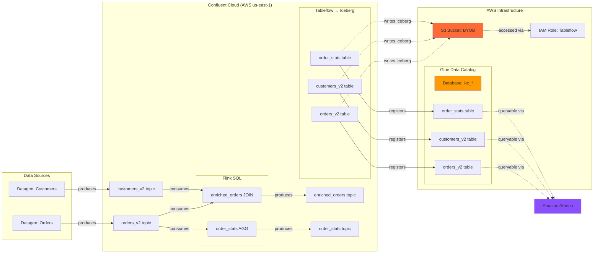

# AWS Glue Demo

This demo showcases LineageBridge's AWS Glue Data Catalog integration, demonstrating how Kafka topics are materialized as Iceberg tables and registered in AWS Glue. It's a simpler alternative to the Unity Catalog demo, staying entirely within the AWS ecosystem without requiring a separate Databricks workspace.

## Architecture

The demo provisions a streaming data pipeline with Confluent Cloud, AWS S3, and AWS Glue Data Catalog:



### Key Components

- **Datagen Sources** — Generate realistic orders and customers data with Avro schemas
- **Flink SQL Jobs** — Stream JOIN (enriched_orders) and windowed aggregation (order_stats)
- **Tableflow BYOB** — Materializes 3 topics as Iceberg tables in S3
- **AWS Glue Data Catalog** — Registers Iceberg tables in a dedicated Glue database (auto-created by Tableflow)
- **Amazon Athena** — Query Iceberg tables using standard SQL (serverless analytics)

### What's Different from Unity Catalog Demo

- **No Databricks** — Stays entirely within AWS ecosystem
- **No ksqlDB** — Simpler pipeline focusing on Kafka → Flink → Tableflow → Glue
- **No PostgreSQL sink** — Fewer external dependencies
- **Iceberg format** — Tables use Apache Iceberg instead of Delta Lake
- **Lower cost** — ~$211/month vs ~$711/month (no Databricks, no ksqlDB)

## Prerequisites

Before provisioning, ensure you have:

### CLI Tools

- **Terraform** >= 1.5
- **Confluent CLI** — logged in: `confluent login --save`
- **AWS CLI** — configured: `aws configure` or `aws sso login`

The demo's `make setup` command can auto-install these via Homebrew if you're on macOS.

### AWS Account & Permissions

You'll need an AWS account with sufficient permissions to create:

- IAM roles and policies
- S3 buckets
- Glue Data Catalog databases and tables
- Athena workgroups (optional, for queries)

Recommended: **AdministratorAccess** or **PowerUserAccess** policy.

### Credentials You'll Need

The setup script will prompt for these if not auto-detected:

- **Confluent Cloud API Key + Secret** — Cloud-scoped credentials (auto-created via CLI if missing)
- **AWS Account ID** — Auto-detected from `aws sts get-caller-identity`
- **AWS Region** — Defaults to `us-east-1`

## Provisioning

### Step 1: Credential Setup

Run the interactive setup wizard from the `infra/demos/glue` directory:

=== "Make"

    ```bash
    cd infra/demos/glue
    make setup
    ```

=== "Direct Script"

    ```bash
    cd infra/demos/glue
    bash scripts/setup-tfvars.sh
    ```

The script will:

1. Check for required CLI tools (install via Homebrew if missing)
2. Detect Confluent Cloud credentials from `.env`, environment variables, or create via `confluent api-key create --resource cloud`
3. Detect AWS account ID and region from `aws sts get-caller-identity`
4. Generate `terraform.tfvars` with all detected values

Example output:

```
══════════════════════════════════════════════════════════════════
  LineageBridge Glue Demo — Credential Setup
══════════════════════════════════════════════════════════════════

  All required CLIs found: confluent, aws

▸ Confluent Cloud credentials
  Using existing Cloud API key: abc-12345 (from .env)

▸ AWS credentials
  Account ID: 123456789012 (auto-detected)
  Region: us-east-1

✓ terraform.tfvars written successfully
```

### Step 2: Provision Infrastructure

Deploy all resources via Terraform:

=== "Make (Recommended)"

    ```bash
    make demo-up
    ```

=== "Terraform Direct"

    ```bash
    terraform init
    terraform apply -auto-approve
    ```

The `demo-up` target automatically runs `make setup` if `terraform.tfvars` is missing, then executes `scripts/provision-demo.sh`, which:

1. Runs `terraform init` and `terraform apply`
2. Creates a Tableflow API key via Confluent CLI (required for BYOB)
3. Re-runs `terraform apply` with Tableflow credentials to complete integration
4. Executes health checks waiting for Tableflow tables to appear in Glue

Provisioning takes **10-12 minutes**. Terraform will create approximately 30 resources:

- Confluent Cloud: 1 environment, 1 Kafka cluster, 1 service account, 4 API keys, 2 topics, 2 datagen connectors, 1 Flink compute pool, 2 Flink statements, 3 Tableflow topics, 1 provider integration, 1 catalog integration
- AWS: 1 S3 bucket, 1 IAM role (with S3 + Glue policies), 1 bucket policy

### Step 3: Verify Provisioning

Once Terraform completes, verify the environment:

=== "Confluent Cloud Console"

    1. Navigate to [Confluent Cloud Environments](https://confluent.cloud/environments)
    2. Open the environment named `lb-glue-{random}` (example: `lb-glue-a1b2c3d4`)
    3. Verify Kafka cluster is `RUNNING`
    4. Check **Topics**: `lineage_bridge.orders_v2`, `lineage_bridge.customers_v2`, `lineage_bridge.enriched_orders`, `lineage_bridge.order_stats`
    5. Inspect **Connectors**: `lb-glue-*-orders-datagen`, `lb-glue-*-customers-datagen` (all `RUNNING`)
    6. Open **Flink** SQL workspace: statements `lb-glue-*-enrich-orders` and `lb-glue-*-order-stats` should be `RUNNING`

=== "AWS Console"

    **S3 Bucket:**
    
    1. Open AWS Console → **S3**
    2. Find bucket `lb-glue-{random}-tableflow`
    3. Browse to see Iceberg table directories: `lineage_bridge_orders_v2/`, `lineage_bridge_customers_v2/`, `lineage_bridge_order_stats/`
    4. Within each directory, you'll see Iceberg metadata and data files
    
    **Glue Data Catalog:**
    
    1. Navigate to AWS Console → **Glue** → **Data Catalog** → **Databases**
    2. Find database `lkc_{cluster_id}` (example: `lkc_mjnq51`)
    3. Click on the database → **Tables**
    4. Verify 3 tables: `lineage_bridge_orders_v2`, `lineage_bridge_customers_v2`, `lineage_bridge_order_stats`
    5. Click on `lineage_bridge_orders_v2` → **Schema** tab to see Iceberg column definitions
    
    **IAM Role:**
    
    1. Navigate to **IAM** → **Roles** → `lb-glue-{random}-tableflow-role`
    2. Verify attached policies: `tableflow-s3-access`, `tableflow-glue-access`
    3. Check **Trust relationships** — should allow Confluent's Tableflow service principal to assume the role

### Step 4: Run LineageBridge Extraction

Extract lineage metadata from the live environment:

```bash
cd ../../..  # Return to project root
uv run lineage-bridge-extract
```

The extractor will:

1. Auto-configure from the Terraform outputs (stored in `.env` by `terraform output -raw demo_env_file`)
2. Execute the 5-phase extraction pipeline:
    - Phase 1: Kafka topics and consumer groups
    - Phase 2: Connectors, Flink (parallel)
    - Phase 3: Schema Registry and Stream Catalog enrichment (parallel)
    - Phase 4: Tableflow tables and AWS Glue integration
    - Phase 4b: AWS Glue catalog enrichment (fetch table metadata from Glue Data Catalog API)
    - Phase 5: Metrics (throughput for topics)

Expected output:

```
▸ Phase 1: Kafka Admin (lkc-mjnq51)
  ✓ 4 topics, 2 consumer groups

▸ Phase 2: Transformations (parallel)
  ✓ 2 connectors (2 source)
  ✓ 2 Flink statements

▸ Phase 3: Enrichment (parallel)
  ✓ 4 schemas from Schema Registry
  ✓ Stream Catalog: 0 tags, 0 business metadata

▸ Phase 4: Tableflow
  ✓ 3 Tableflow topics (ICEBERG)
  ✓ AWS Glue integration: lb-glue-a1b2c3d4-glue

▸ Phase 4b: Catalog Enrichment
  ✓ AWS Glue: 3 tables in database lkc_mjnq51

▸ Phase 5: Metrics
  ✓ Throughput: 4 topics

Graph Summary:
  Nodes: 22 (4 topics, 2 connectors, 2 Flink jobs, 3 Tableflow tables, 3 Glue tables, 4 schemas, 2 consumer groups)
  Edges: 28 (8 PRODUCES, 6 CONSUMES, 4 TRANSFORMS, 3 MATERIALIZES, 4 HAS_SCHEMA, 3 MEMBER_OF)
```

### Step 5: Launch the UI

Open the interactive lineage graph:

```bash
uv run streamlit run lineage_bridge/ui/app.py
```

Your browser will open to `http://localhost:8501`. The UI displays:

- **Hierarchical graph layout** — Data flows from Datagen sources through Kafka topics, Flink transformations, Tableflow, and into Glue tables
- **Interactive nodes** — Click any node to see metadata panel (schema, owner, throughput, Glue properties)
- **Deep links** — Nodes link directly to Confluent Cloud Console, AWS Glue Console, S3 bucket

## Expected Lineage Graph

You should see the following node types connected by lineage edges:

### Kafka Topics (4 nodes)

- `lineage_bridge.orders_v2` — Source topic from datagen
- `lineage_bridge.customers_v2` — Source topic from datagen
- `lineage_bridge.enriched_orders` — Derived topic from Flink JOIN
- `lineage_bridge.order_stats` — Derived topic from Flink windowed aggregation

### Connectors (2 nodes)

- `lb-glue-*-orders-datagen` — Datagen source (PRODUCES → orders_v2)
- `lb-glue-*-customers-datagen` — Datagen source (PRODUCES → customers_v2)

### Flink Jobs (2 nodes)

- `lb-glue-*-enrich-orders` — Stream JOIN (CONSUMES ← orders_v2, customers_v2 | PRODUCES → enriched_orders)
- `lb-glue-*-order-stats` — Windowed aggregation (CONSUMES ← orders_v2 | PRODUCES → order_stats)

### Tableflow Tables (3 nodes)

- `lineage_bridge.orders_v2 (ICEBERG)` — Tableflow materialization (MATERIALIZES → Glue table)
- `lineage_bridge.customers_v2 (ICEBERG)` — Tableflow materialization (MATERIALIZES → Glue table)
- `lineage_bridge.order_stats (ICEBERG)` — Tableflow materialization (MATERIALIZES → Glue table)

### AWS Glue Tables (3 nodes)

- `lkc_*.lineage_bridge_orders_v2` — Iceberg table registered via Tableflow
- `lkc_*.lineage_bridge_customers_v2` — Iceberg table registered via Tableflow
- `lkc_*.lineage_bridge_order_stats` — Iceberg table registered via Tableflow

### Schemas (4 nodes)

- `lineage_bridge.orders_v2-value` — Avro schema for orders
- `lineage_bridge.customers_v2-value` — Avro schema for customers
- `lineage_bridge.enriched_orders-value` — Avro schema for enriched orders
- `lineage_bridge.order_stats-value` — Avro schema for order stats (includes window_start, window_end)

## Querying with Amazon Athena

AWS Glue tables are queryable via Amazon Athena, AWS's serverless SQL query engine.

### Setup Athena Workgroup

1. Open AWS Console → **Athena**
2. If this is your first time using Athena, create a query result location:
    - Navigate to **Settings** tab
    - Set query result location: `s3://lb-glue-{random}-tableflow/athena-results/`
3. Return to **Query editor**

### Example Queries

Query the Glue-registered Iceberg tables:

```sql
-- Count rows in orders table
SELECT COUNT(*) AS total_orders
FROM lkc_mjnq51.lineage_bridge_orders_v2;

-- Count rows in customers table
SELECT COUNT(*) AS total_customers
FROM lkc_mjnq51.lineage_bridge_customers_v2;

-- View sample orders
SELECT *
FROM lkc_mjnq51.lineage_bridge_orders_v2
LIMIT 10;

-- Join orders and customers (replicates Flink enrichment)
SELECT
  o.order_id,
  c.name AS customer_name,
  c.country AS customer_country,
  o.product_name,
  o.price,
  o.order_status,
  o.created_at
FROM lkc_mjnq51.lineage_bridge_orders_v2 o
JOIN lkc_mjnq51.lineage_bridge_customers_v2 c
  ON o.customer_id = c.customer_id
WHERE o.price > 100
ORDER BY o.price DESC
LIMIT 20;

-- Aggregate order stats
SELECT
  order_status,
  SUM(order_count) AS total_orders,
  SUM(total_quantity) AS total_quantity
FROM lkc_mjnq51.lineage_bridge_order_stats
GROUP BY order_status;
```

### Iceberg Time Travel (Advanced)

Iceberg tables support time travel queries. List available snapshots:

```sql
-- View table history
SELECT * FROM lkc_mjnq51."lineage_bridge_orders_v2$snapshots";
```

Query data as of a specific snapshot:

```sql
-- Query historical data (replace snapshot_id with actual value from $snapshots)
SELECT COUNT(*) AS rows_in_snapshot
FROM lkc_mjnq51.lineage_bridge_orders_v2
FOR SYSTEM_VERSION AS OF 1234567890123456789;
```

## AWS Glue Integration Details

The demo showcases how LineageBridge enriches Glue catalog nodes with AWS-specific metadata.

### Glue Table Metadata

Click on a Glue table node (e.g., `lineage_bridge_orders_v2`) in the graph to see the metadata panel:

```json
{
  "node_id": "AWS:GLUE_TABLE:env-26wn6m:lkc_mjnq51.lineage_bridge_orders_v2",
  "node_type": "GLUE_TABLE",
  "qualified_name": "lkc_mjnq51.lineage_bridge_orders_v2",
  "display_name": "lineage_bridge_orders_v2",
  "database": "lkc_mjnq51",
  "table_type": "EXTERNAL_TABLE",
  "storage_format": "ICEBERG",
  "storage_location": "s3://lb-glue-a1b2c3d4-tableflow/lineage_bridge_orders_v2/",
  "owner": "arn:aws:iam::123456789012:role/lb-glue-a1b2c3d4-tableflow-role",
  "created_at": "2026-04-30T12:34:56.000Z",
  "updated_at": "2026-04-30T12:40:12.000Z",
  "columns": [
    {"name": "order_id", "type": "string"},
    {"name": "customer_id", "type": "string"},
    {"name": "product_name", "type": "string"},
    {"name": "quantity", "type": "bigint"},
    {"name": "price", "type": "double"},
    {"name": "order_status", "type": "string"},
    {"name": "created_at", "type": "string"}
  ],
  "parameters": {
    "table_type": "ICEBERG",
    "metadata_location": "s3://lb-glue-a1b2c3d4-tableflow/lineage_bridge_orders_v2/metadata/00001-abc123.metadata.json"
  },
  "url": "https://console.aws.amazon.com/glue/home?region=us-east-1#/v2/data-catalog/tables/view/lineage_bridge_orders_v2?database=lkc_mjnq51"
}
```

### Verifying Tableflow Registration

Check that Tableflow successfully registered tables in Glue:

```bash
# List Glue databases
aws glue get-databases --region us-east-1

# List tables in the cluster database
aws glue get-tables --database-name lkc_mjnq51 --region us-east-1

# Get specific table metadata
aws glue get-table \
  --database-name lkc_mjnq51 \
  --name lineage_bridge_orders_v2 \
  --region us-east-1
```

## Validation Queries

Run these queries to validate data flow through the pipeline.

### Check Kafka Topic Data

```bash
confluent kafka topic consume lineage_bridge.orders_v2 \
  --from-beginning --max-messages 5
```

### Verify Flink Transformations

```sql
-- Via Confluent Cloud Console → Flink SQL Workspace
SELECT * FROM lineage_bridge.enriched_orders LIMIT 10;
```

### Query Glue Tables via Athena

```sql
-- Via AWS Athena Query Editor
SELECT COUNT(*) FROM lkc_mjnq51.lineage_bridge_orders_v2;
```

### Inspect S3 Iceberg Files

```bash
# List Iceberg metadata files
aws s3 ls s3://lb-glue-{random}-tableflow/lineage_bridge_orders_v2/metadata/ --recursive

# Download Iceberg metadata (example)
aws s3 cp s3://lb-glue-{random}-tableflow/lineage_bridge_orders_v2/metadata/00001-*.metadata.json .
cat 00001-*.metadata.json | jq .
```

## Cost Breakdown

Estimated monthly costs for 24x7 operation:

| Resource | Details | Monthly Cost |
|----------|---------|--------------|
| **Confluent Kafka Cluster** | Basic, AWS us-east-1, single-zone | ~$80 |
| **Confluent Flink Compute Pool** | 5 CFUs (minimum) | ~$450 |
| **Confluent Tableflow BYOB** | 3 topics, Iceberg | ~$25 |
| **Datagen Connectors** | 2 source connectors | Included |
| **AWS S3 Storage** | ~15 GB Iceberg data | ~$5 |
| **AWS Glue Data Catalog** | 3 tables, minimal API calls | ~$1 |
| **Amazon Athena Queries** | Pay-per-query (manual testing) | ~$5 |
| **Total** | | **~$566/month** |

!!! tip "Pause Flink to Save ~80% Costs"

    Flink compute pools account for $450/month. When not actively using the demo, pause the Flink pool via Confluent Cloud Console to reduce costs to ~$116/month.

## Troubleshooting

### Tableflow Tables Not Appearing in Glue

**Symptom:** Terraform completes successfully, but Glue tables are missing.

**Diagnosis:**

```bash
# Check Tableflow topic status
curl -u "$CONFLUENT_TABLEFLOW_API_KEY:$CONFLUENT_TABLEFLOW_API_SECRET" \
  "https://api.confluent.cloud/tableflow/v1/topics?environment=$ENV_ID&kafka_cluster=$CLUSTER_ID" | jq .
```

**Fix:** Wait 3-5 minutes for Tableflow registration to propagate. Re-run:

```bash
bash scripts/wait-for-ready.sh
```

### IAM Role Permissions Errors

**Symptom:** Tableflow fails with `AccessDenied` errors when writing to S3 or accessing Glue.

**Diagnosis:** Verify IAM role policies:

```bash
aws iam get-role-policy \
  --role-name lb-glue-{random}-tableflow-role \
  --policy-name tableflow-s3-access

aws iam get-role-policy \
  --role-name lb-glue-{random}-tableflow-role \
  --policy-name tableflow-glue-access
```

**Fix:** Ensure policies include:

- S3: `s3:GetObject`, `s3:PutObject`, `s3:DeleteObject`, `s3:ListBucket`
- Glue: `glue:GetTable`, `glue:CreateTable`, `glue:UpdateTable`, `glue:GetDatabase`, `glue:CreateDatabase`

### Athena Query Errors

**Symptom:** Athena queries fail with `HIVE_METASTORE_ERROR` or `ICEBERG_INVALID_METADATA`.

**Diagnosis:** Check Glue table properties:

```bash
aws glue get-table \
  --database-name lkc_mjnq51 \
  --name lineage_bridge_orders_v2 \
  --region us-east-1 | jq .Table.Parameters
```

**Fix:** Verify `table_type=ICEBERG` and `metadata_location` points to a valid S3 path. If metadata is corrupted, wait for Tableflow to write a new snapshot (happens every few minutes with active data ingestion).

## Cleanup

Tear down all resources to stop incurring costs:

```bash
cd infra/demos/glue
make demo-down
```

This executes:

1. `terraform destroy -auto-approve` (destroys all Terraform-managed resources)

Expected duration: 4-6 minutes.

!!! warning "Orphaned Glue Metadata"

    Tableflow may create additional Glue databases or tables outside Terraform state. After teardown, verify no leftover resources:

    ```bash
    aws glue get-databases --region us-east-1 | jq '.DatabaseList[] | select(.Name | startswith("lkc_"))'
    ```

    If found, manually delete:

    ```bash
    aws glue delete-database --name lkc_mjnq51 --region us-east-1
    ```

## Next Steps

- **Query with AWS Glue DataBrew** — Use DataBrew for visual data profiling and transformations on Iceberg tables
- **Integrate with AWS Lake Formation** — Add fine-grained access control to Glue tables
- **Push lineage to AWS Glue** — Extend `lineage_bridge/catalogs/aws_glue.py` to implement `push_lineage()` using Glue's custom table properties
- **Productionize** — Replace Datagen with real connectors (e.g., S3 Source, DynamoDB CDC) and add RBAC policies
