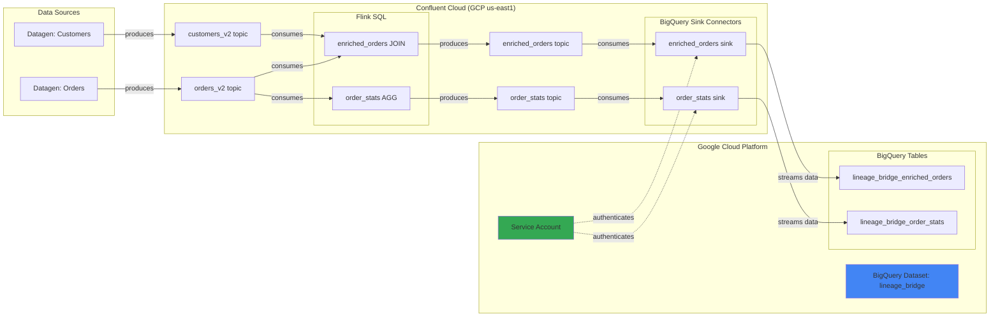

# BigQuery Demo

This is the simplest LineageBridge demo, showcasing a clean streaming data pipeline from Confluent Cloud (GCP) to Google BigQuery using the BigQuery Storage Sink Connector. It's ideal for evaluating LineageBridge quickly without the complexity of Tableflow or multi-cloud IAM configurations.

## Architecture

The demo provisions a streaming data pipeline entirely within GCP, with Confluent Cloud managing the Kafka cluster and Flink processing:



### Key Components

- **Datagen Sources** — Generate realistic orders and customers data with Avro schemas
- **Flink SQL Jobs** — Stream JOIN (enriched_orders) and windowed aggregation (order_stats)
- **BigQuery Sink Connectors** — Stream Kafka topic data directly to BigQuery tables using Storage Write API
- **BigQuery Dataset** — Dedicated dataset (`lineage_bridge`) containing auto-created tables
- **GCP Service Account** — Authenticates connectors with BigQuery (minimal permissions: BigQuery Data Editor)

### What's Different from Other Demos

- **No Tableflow** — Direct connector-to-BigQuery integration (simpler, but no Delta/Iceberg features)
- **No ksqlDB** — Focuses on Kafka → Flink → BigQuery path
- **GCP-only Kafka cluster** — Required for BigQuery connectors (AWS/Azure clusters not supported)
- **Auto-created tables** — BigQuery Sink Connector automatically creates tables from Avro schemas
- **Native BigQuery lineage** — BigQuery Data Lineage API can track upstream/downstream relationships (future LineageBridge feature)
- **Lowest cost** — ~$211/month (no Tableflow, no AWS resources)

## Prerequisites

Before provisioning, ensure you have:

### CLI Tools

- **Terraform** >= 1.5
- **Confluent CLI** — logged in: `confluent login --save`
- **gcloud CLI** — authenticated: `gcloud auth login` and `gcloud auth application-default login`

The demo's `make setup` command can auto-install these via Homebrew if you're on macOS.

### GCP Project & Permissions

You'll need a GCP project with sufficient permissions to create:

- BigQuery datasets and tables
- Service accounts and IAM bindings
- Enable BigQuery API

Recommended roles: **Project Editor** or **BigQuery Admin** + **Service Account Admin**.

### Enable Required APIs

```bash
gcloud services enable bigquery.googleapis.com
gcloud services enable bigquerystorage.googleapis.com
gcloud services enable iam.googleapis.com
```

### Credentials You'll Need

The setup script will prompt for these if not auto-detected:

- **Confluent Cloud API Key + Secret** — Cloud-scoped credentials (auto-created via CLI if missing)
- **GCP Project ID** — Your GCP project ID (example: `my-project-12345`)
- **GCP Region** — Defaults to `us-east1` (must match BigQuery dataset location)
- **BigQuery Dataset** — Defaults to `lineage_bridge`
- **GCP Service Account Key JSON** — Auto-created by the setup script

## Provisioning

### Step 1: Credential Setup

Run the interactive setup wizard from the `infra/demos/bigquery` directory:

=== "Make"

    ```bash
    cd infra/demos/bigquery
    make setup
    ```

=== "Direct Script"

    ```bash
    cd infra/demos/bigquery
    bash scripts/setup-tfvars.sh
    ```

The script will:

1. Check for required CLI tools (install via Homebrew if missing)
2. Detect Confluent Cloud credentials from `.env`, environment variables, or create via `confluent api-key create --resource cloud`
3. Prompt for GCP project ID and region
4. Create a GCP service account (`lineage-bridge-bq-demo@{project}.iam.gserviceaccount.com`)
5. Grant BigQuery Data Editor + Job User roles
6. Generate and download service account key JSON
7. Generate `terraform.tfvars` with all values

Example output:

```
══════════════════════════════════════════════════════════════════
  LineageBridge BigQuery Demo — Credential Setup
══════════════════════════════════════════════════════════════════

  All required CLIs found: confluent, gcloud

▸ Confluent Cloud credentials
  Using existing Cloud API key: abc-12345 (from .env)

▸ GCP credentials
  Project ID: my-project-12345
  Region: us-east1
  BigQuery Dataset: lineage_bridge

▸ Creating GCP service account...
  Service account created: lineage-bridge-bq-demo@my-project-12345.iam.gserviceaccount.com
  Granted roles: roles/bigquery.dataEditor, roles/bigquery.jobUser
  Key downloaded: /tmp/lineage-bridge-bq-sa-key-abc123.json

✓ terraform.tfvars written successfully
```

!!! warning "Service Account Key Security"

    The setup script stores the service account key JSON in `terraform.tfvars` as a sensitive value. Ensure this file is never committed to version control (it's already in `.gitignore`). After teardown, revoke the key via GCP Console → IAM & Admin → Service Accounts.

### Step 2: Provision Infrastructure

Deploy all resources via Terraform:

=== "Make (Recommended)"

    ```bash
    make demo-up
    ```

=== "Terraform Direct"

    ```bash
    terraform init
    terraform apply -auto-approve
    ```

Provisioning takes **8-10 minutes**. Terraform will create approximately 22 resources:

- Confluent Cloud: 1 environment, 1 Kafka cluster (GCP us-east1), 1 service account, 4 API keys, 2 topics, 2 datagen connectors, 1 Flink compute pool, 2 Flink statements, 2 BigQuery sink connectors
- GCP: 1 BigQuery dataset (created manually or via gcloud, not Terraform-managed)

### Step 3: Verify Provisioning

Once Terraform completes, verify the environment:

=== "Confluent Cloud Console"

    1. Navigate to [Confluent Cloud Environments](https://confluent.cloud/environments)
    2. Open the environment named `lb-bq-{random}` (example: `lb-bq-a1b2c3d4`)
    3. Verify Kafka cluster is `RUNNING` (cloud provider: GCP, region: us-east1)
    4. Check **Topics**: `lineage_bridge.orders_v2`, `lineage_bridge.customers_v2`, `lineage_bridge.enriched_orders`, `lineage_bridge.order_stats`
    5. Inspect **Connectors**: `lb-bq-*-orders-datagen`, `lb-bq-*-customers-datagen`, `lb-bq-*-bq-enriched`, `lb-bq-*-bq-stats` (all `RUNNING`)
    6. Open **Flink** SQL workspace: statements `lb-bq-*-enrich-orders` and `lb-bq-*-order-stats` should be `RUNNING`

=== "BigQuery Console"

    1. Open GCP Console → **BigQuery**
    2. Navigate to your project → **lineage_bridge** dataset
    3. Verify 2 tables: `lineage_bridge_enriched_orders`, `lineage_bridge_order_stats`
    4. Click on `lineage_bridge_enriched_orders` → **Schema** tab to see auto-created columns
    5. Click **Preview** tab to see streaming data (may take 1-2 minutes for first rows to appear)
    6. Check **Details** tab → Created by `lineage-bridge-bq-demo@{project}.iam.gserviceaccount.com`

=== "Service Account Validation"

    Verify the service account has correct permissions:
    
    ```bash
    gcloud projects get-iam-policy my-project-12345 \
      --flatten="bindings[].members" \
      --filter="bindings.members:serviceAccount:lineage-bridge-bq-demo@my-project-12345.iam.gserviceaccount.com"
    ```
    
    Expected roles: `roles/bigquery.dataEditor`, `roles/bigquery.jobUser`

### Step 4: Run LineageBridge Extraction

Extract lineage metadata from the live environment:

```bash
cd ../../..  # Return to project root
uv run lineage-bridge-extract
```

The extractor will:

1. Auto-configure from the Terraform outputs (stored in `.env` by `terraform output -raw demo_env_file`)
2. Execute the 5-phase extraction pipeline:
    - Phase 1: Kafka topics and consumer groups
    - Phase 2: Connectors, Flink (parallel)
    - Phase 3: Schema Registry and Stream Catalog enrichment (parallel)
    - Phase 4: Skip Tableflow (not used in this demo)
    - Phase 5: Metrics (throughput for topics)

!!! note "BigQuery Catalog Enrichment"

    The current LineageBridge version does not yet enrich BigQuery table metadata via the BigQuery API. Future releases will add a `BigQueryProvider` to fetch table schemas, lineage, and Data Catalog tags. For now, you'll see connector nodes representing the sink, but not separate BigQuery table nodes.

Expected output:

```
▸ Phase 1: Kafka Admin (lkc-xyz789)
  ✓ 4 topics, 4 consumer groups

▸ Phase 2: Transformations (parallel)
  ✓ 4 connectors (2 source, 2 sink)
  ✓ 2 Flink statements

▸ Phase 3: Enrichment (parallel)
  ✓ 4 schemas from Schema Registry
  ✓ Stream Catalog: 0 tags, 0 business metadata

▸ Phase 4: Tableflow
  (Skipped — no Tableflow topics in this demo)

▸ Phase 5: Metrics
  ✓ Throughput: 4 topics

Graph Summary:
  Nodes: 18 (4 topics, 4 connectors, 2 Flink jobs, 4 schemas, 4 consumer groups)
  Edges: 22 (8 PRODUCES, 6 CONSUMES, 4 TRANSFORMS, 4 HAS_SCHEMA)
```

### Step 5: Launch the UI

Open the interactive lineage graph:

```bash
uv run streamlit run lineage_bridge/ui/app.py
```

Your browser will open to `http://localhost:8501`. The UI displays:

- **Hierarchical graph layout** — Data flows from Datagen sources through Kafka topics, Flink transformations, and into BigQuery sink connectors
- **Interactive nodes** — Click any node to see metadata panel (schema, throughput, connector config)
- **Deep links** — Nodes link directly to Confluent Cloud Console and GCP BigQuery Console

## Expected Lineage Graph

You should see the following node types connected by lineage edges:

### Kafka Topics (4 nodes)

- `lineage_bridge.orders_v2` — Source topic from datagen
- `lineage_bridge.customers_v2` — Source topic from datagen
- `lineage_bridge.enriched_orders` — Derived topic from Flink JOIN
- `lineage_bridge.order_stats` — Derived topic from Flink windowed aggregation

### Connectors (4 nodes)

- `lb-bq-*-orders-datagen` — Datagen source (PRODUCES → orders_v2)
- `lb-bq-*-customers-datagen` — Datagen source (PRODUCES → customers_v2)
- `lb-bq-*-bq-enriched` — BigQuery sink (CONSUMES ← enriched_orders)
- `lb-bq-*-bq-stats` — BigQuery sink (CONSUMES ← order_stats)

### Flink Jobs (2 nodes)

- `lb-bq-*-enrich-orders` — Stream JOIN (CONSUMES ← orders_v2, customers_v2 | PRODUCES → enriched_orders)
- `lb-bq-*-order-stats` — Windowed aggregation (CONSUMES ← orders_v2 | PRODUCES → order_stats)

### Schemas (4 nodes)

- `lineage_bridge.orders_v2-value` — Avro schema for orders
- `lineage_bridge.customers_v2-value` — Avro schema for customers
- `lineage_bridge.enriched_orders-value` — Avro schema for enriched orders
- `lineage_bridge.order_stats-value` — Avro schema for order stats (includes window_start, window_end)

### Consumer Groups (4 nodes)

- Connector consumer groups (auto-generated by sink connectors)

## Querying BigQuery Tables

Use the BigQuery Console or `bq` CLI to query the streaming data.

### Example Queries

```sql
-- Count rows in enriched_orders table
SELECT COUNT(*) AS total_rows
FROM `my-project-12345.lineage_bridge.lineage_bridge_enriched_orders`;

-- View sample enriched orders
SELECT *
FROM `my-project-12345.lineage_bridge.lineage_bridge_enriched_orders`
ORDER BY created_at DESC
LIMIT 10;

-- Filter high-value orders
SELECT
  order_id,
  customer_name,
  customer_country,
  product_name,
  price,
  order_status
FROM `my-project-12345.lineage_bridge.lineage_bridge_enriched_orders`
WHERE price > 100
ORDER BY price DESC
LIMIT 20;

-- Aggregate order stats
SELECT
  order_status,
  SUM(order_count) AS total_orders,
  SUM(total_quantity) AS total_quantity
FROM `my-project-12345.lineage_bridge.lineage_bridge_order_stats`
GROUP BY order_status
ORDER BY total_orders DESC;

-- Join with customers (if you enable customers_v2 sink)
-- Note: This demo only sinks enriched_orders and order_stats by default
SELECT
  o.order_id,
  o.customer_name,
  COUNT(*) AS order_count,
  SUM(o.price) AS total_revenue
FROM `my-project-12345.lineage_bridge.lineage_bridge_enriched_orders` o
GROUP BY o.order_id, o.customer_name
ORDER BY total_revenue DESC
LIMIT 10;
```

### Check Table Metadata

```bash
# Describe table schema
bq show --schema --format=prettyjson \
  my-project-12345:lineage_bridge.lineage_bridge_enriched_orders

# Get table details
bq show my-project-12345:lineage_bridge.lineage_bridge_enriched_orders
```

### BigQuery Data Lineage (Future Feature)

BigQuery's Data Lineage API can track upstream/downstream relationships between BigQuery tables, views, and external sources. Future versions of LineageBridge will integrate with this API to:

1. Push Kafka topic → BigQuery table lineage metadata
2. Enrich BigQuery table nodes with native BigQuery lineage (e.g., if you create BigQuery views downstream)

Example of what the integration will look like:

```python
# Future implementation in lineage_bridge/catalogs/bigquery.py
async def push_lineage(self, graph: LineageGraph) -> None:
    """Push lineage metadata to BigQuery Data Lineage API."""
    for node in graph.nodes:
        if node.node_type == NodeType.CONNECTOR and "BigQuery" in node.display_name:
            # Extract target table from connector config
            target_table = self._extract_target_table(node)
            
            # Push lineage via Data Lineage API
            await self._create_lineage_event(
                source=self._kafka_topic_fqn(node.consumes_from),
                target=target_table,
                event_type="STREAM_INGESTION"
            )
```

## Validation Queries

Run these queries to validate data flow through the pipeline.

### Check Kafka Topic Data

```bash
confluent kafka topic consume lineage_bridge.orders_v2 \
  --from-beginning --max-messages 5
```

### Verify Flink Transformations

```sql
-- Via Confluent Cloud Console → Flink SQL Workspace
SELECT * FROM lineage_bridge.enriched_orders LIMIT 10;
```

### Query BigQuery Tables

```bash
# Via bq CLI
bq query --use_legacy_sql=false \
  'SELECT COUNT(*) FROM `my-project-12345.lineage_bridge.lineage_bridge_enriched_orders`'
```

### Monitor Connector Throughput

```bash
# Via Confluent Cloud Console → Connectors → lb-bq-*-bq-enriched → Metrics
# Or via Confluent CLI:
confluent connect cluster describe <connector-id>
```

## Cost Breakdown

Estimated monthly costs for 24x7 operation:

| Resource | Details | Monthly Cost |
|----------|---------|--------------|
| **Confluent Kafka Cluster** | Basic, GCP us-east1, single-zone | ~$80 |
| **Confluent Flink Compute Pool** | 5 CFUs (minimum) | ~$450 |
| **Datagen Connectors** | 2 source connectors | Included |
| **BigQuery Sink Connectors** | 2 sink connectors | Included |
| **BigQuery Storage** | ~5 GB data (continuously streaming) | ~$1 |
| **BigQuery Streaming Inserts** | ~100K rows/day via Storage Write API | ~$5 |
| **BigQuery Queries** | Pay-per-query (manual testing) | ~$5 |
| **GCP Service Account** | Free | $0 |
| **Total** | | **~$541/month** |

!!! tip "Pause Flink to Save ~83% Costs"

    Flink compute pools account for $450/month. When not actively using the demo, pause the Flink pool via Confluent Cloud Console to reduce costs to ~$91/month.

## Troubleshooting

### BigQuery Sink Connector Failing

**Symptom:** Connector status is `FAILED` with error `Access Denied: BigQuery BigQuery: Permission denied`.

**Diagnosis:** Service account lacks required BigQuery permissions.

**Fix:** Verify IAM roles:

```bash
gcloud projects get-iam-policy my-project-12345 \
  --flatten="bindings[].members" \
  --filter="bindings.members:serviceAccount:lineage-bridge-bq-demo@my-project-12345.iam.gserviceaccount.com"
```

Ensure roles include:
- `roles/bigquery.dataEditor`
- `roles/bigquery.jobUser`

If missing, grant roles:

```bash
gcloud projects add-iam-policy-binding my-project-12345 \
  --member="serviceAccount:lineage-bridge-bq-demo@my-project-12345.iam.gserviceaccount.com" \
  --role="roles/bigquery.dataEditor"

gcloud projects add-iam-policy-binding my-project-12345 \
  --member="serviceAccount:lineage-bridge-bq-demo@my-project-12345.iam.gserviceaccount.com" \
  --role="roles/bigquery.jobUser"
```

### BigQuery Tables Not Auto-Created

**Symptom:** Connector is `RUNNING`, but tables don't appear in BigQuery dataset.

**Diagnosis:** Check connector configuration — `auto.create.tables` must be `true`.

**Fix:** Verify connector config via Confluent Cloud Console or CLI:

```bash
confluent connect cluster describe <connector-id> --output json | jq '.config."auto.create.tables"'
```

If `false`, update connector config (requires recreation in this demo).

### Dataset Location Mismatch

**Symptom:** Connector fails with `Dataset location mismatch` error.

**Diagnosis:** BigQuery dataset region doesn't match Confluent Kafka cluster region.

**Fix:** Both must be in the same GCP region (e.g., `us-east1`). Recreate BigQuery dataset:

```bash
bq rm -r -f my-project-12345:lineage_bridge
bq mk --dataset --location=us-east1 my-project-12345:lineage_bridge
```

Then re-run connector (may require `terraform apply` to recreate connectors).

### Service Account Key Expired or Revoked

**Symptom:** Connector fails with `Invalid credentials` after some time.

**Diagnosis:** Service account key was manually revoked or expired.

**Fix:** Generate a new key and update `terraform.tfvars`:

```bash
gcloud iam service-accounts keys create /tmp/new-key.json \
  --iam-account=lineage-bridge-bq-demo@my-project-12345.iam.gserviceaccount.com

# Update terraform.tfvars with new key JSON
# Re-run: terraform apply
```

## Cleanup

Tear down all resources to stop incurring costs:

```bash
cd infra/demos/bigquery
make demo-down
```

This executes:

1. `terraform destroy -auto-approve` (destroys all Terraform-managed resources)
2. Optionally runs `scripts/cleanup-gcp-sa.sh` to revoke service account keys

Expected duration: 3-5 minutes.

!!! warning "Manual Cleanup Required"

    BigQuery dataset and tables are NOT Terraform-managed (they're created by the sink connector). After teardown, manually delete them:

    ```bash
    bq rm -r -f my-project-12345:lineage_bridge
    ```

    Also revoke the service account key via GCP Console → IAM & Admin → Service Accounts → lineage-bridge-bq-demo → Keys → Revoke.

## Next Steps

- **Enable BigQuery Data Catalog** — Tag tables with business metadata via Data Catalog
- **Create BigQuery views** — Build downstream analytics views on top of `lineage_bridge_enriched_orders` and track lineage via BigQuery's native lineage UI
- **Integrate with Looker** — Connect Looker to BigQuery tables and visualize streaming data
- **Push lineage to BigQuery** — Extend `lineage_bridge/catalogs/bigquery.py` to implement `push_lineage()` using BigQuery Data Lineage API
- **Productionize** — Replace Datagen with real connectors (e.g., Pub/Sub Source, Cloud Storage Source) and add IAM policies for production workloads
