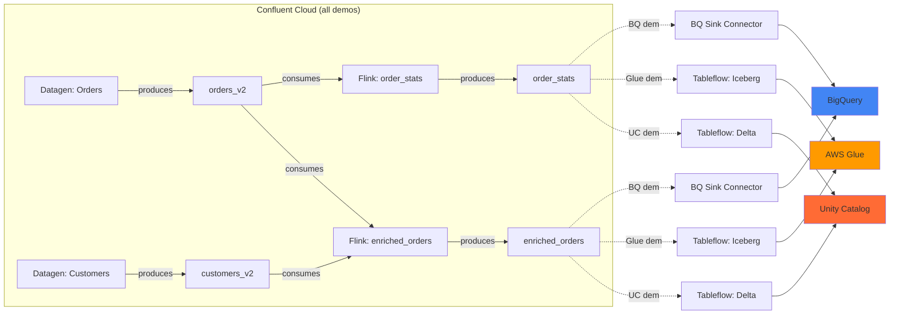

# Demo Environments

Welcome to the LineageBridge demo playground. We've built three production-grade demos that showcase end-to-end lineage extraction from Confluent Cloud to different data catalogs. Each demo provisions a complete Kafka environment with streaming transformations and catalog integrations, letting you see LineageBridge in action within minutes.

## Quick Start

Pick your preferred data catalog and spin up a live environment:

=== "Unity Catalog (Databricks)"

    ```bash
    cd infra/demos/uc
    make demo-up      # Provisions everything (~15 min)
    cd ../../..
    uv run lineage-bridge-extract
    uv run streamlit run lineage_bridge/ui/app.py
    ```

=== "AWS Glue"

    ```bash
    cd infra/demos/glue
    make demo-up      # Provisions everything (~12 min)
    cd ../../..
    uv run lineage-bridge-extract
    uv run streamlit run lineage_bridge/ui/app.py
    ```

=== "BigQuery"

    ```bash
    cd infra/demos/bigquery
    make demo-up      # Provisions everything (~10 min)
    cd ../../..
    uv run lineage-bridge-extract
    uv run streamlit run lineage_bridge/ui/app.py
    ```

Each command provisions a live Confluent Cloud environment with real streaming data, runs extraction, and launches the interactive lineage graph UI.

## Demo Comparison

Choose the demo that matches your data stack or evaluation criteria:

| Feature | Unity Catalog | AWS Glue | BigQuery |
|---------|--------------|----------|----------|
| **Catalog** | Databricks Unity Catalog | AWS Glue Data Catalog | Google BigQuery |
| **Cloud** | AWS (us-east-1) | AWS (us-east-1) | GCP (us-east1) |
| **Integration** | Tableflow → Delta Lake | Tableflow → Iceberg | BigQuery Sink Connector |
| **Topics** | orders_v2, customers_v2 | orders_v2, customers_v2 | orders_v2, customers_v2 |
| **Flink Jobs** | enriched_orders, order_stats | enriched_orders, order_stats | enriched_orders, order_stats |
| **ksqlDB** | high_value_orders stream | - | - |
| **Additional Sinks** | PostgreSQL RDS (enriched) | - | - |
| **Databricks Job** | customer_order_summary (Delta) | - | - |
| **Est. Monthly Cost** | ~$711 | ~$211 | ~$211 |
| **Terraform Resources** | ~55 | ~30 | ~22 |
| **Complexity** | High (richest lineage) | Medium | Low (simplest setup) |

### Lineage Depth

- **Unity Catalog**: Full multi-hop lineage from PostgreSQL sources through Kafka topics, Flink SQL transformations, ksqlDB streams, Tableflow tables, and Databricks Delta tables. Includes scheduled Databricks notebook jobs that create derived analytics tables.
- **AWS Glue**: Kafka → Flink → Tableflow (Iceberg) → Glue Data Catalog. Clean lineage showing how Confluent Tableflow materializes Kafka topics as Iceberg tables registered in AWS Glue.
- **BigQuery**: Kafka → Flink → BigQuery Sink Connector. Simplest path from streaming data to a cloud data warehouse with native BigQuery lineage metadata.

## Architecture Overview

All demos share a common Confluent Cloud foundation built via the `confluent-core` Terraform module:



### What Gets Provisioned

Each demo creates:

1. **Confluent Cloud Environment** — Isolated namespace with Stream Governance (Essentials package)
2. **Kafka Cluster** — Single-zone Basic cluster (AWS or GCP based on demo)
3. **Service Account + RBAC** — Service principal with CloudClusterAdmin + EnvironmentAdmin roles
4. **API Keys** — Kafka, Schema Registry, Flink, Tableflow (auto-rotated credentials)
5. **Source Connectors** — Two Datagen connectors producing orders and customers with realistic schemas
6. **Flink Compute Pool** — Serverless Flink runtime (5 CFUs) for SQL transformations
7. **Flink SQL Statements** — Streaming JOIN (enriched_orders) + windowed aggregation (order_stats)
8. **Catalog-Specific Resources** — Tableflow integrations, sink connectors, external storage, IAM roles

## Prerequisites

Before running any demo, ensure you have these tools and accounts configured:

### CLI Tools

All demos require:

- **Terraform** >= 1.5 ([Download](https://www.terraform.io/downloads))
- **Confluent CLI** ([Install](https://docs.confluent.io/confluent-cli/current/install.html)) — must be logged in: `confluent login --save`

Demo-specific tools:

=== "Unity Catalog"

    - **AWS CLI** ([Install](https://docs.aws.amazon.com/cli/latest/userguide/getting-started-install.html)) — `aws configure` or `aws sso login`
    - **Databricks CLI** ([Install](https://docs.databricks.com/dev-tools/cli/index.html)) — `databricks configure`

=== "AWS Glue"

    - **AWS CLI** ([Install](https://docs.aws.amazon.com/cli/latest/userguide/getting-started-install.html)) — `aws configure` or `aws sso login`

=== "BigQuery"

    - **gcloud CLI** ([Install](https://cloud.google.com/sdk/docs/install)) — `gcloud auth login` and `gcloud auth application-default login`

### Cloud Accounts

You'll need active accounts with sufficient permissions:

| Demo | Accounts Required | Key Permissions |
|------|-------------------|-----------------|
| Unity Catalog | Confluent Cloud, AWS, Databricks | Confluent: create environments/clusters. AWS: IAM roles, S3, RDS. Databricks: create catalogs, external locations, notebooks, jobs |
| AWS Glue | Confluent Cloud, AWS | Confluent: create environments/clusters. AWS: IAM roles, S3, Glue Data Catalog |
| BigQuery | Confluent Cloud, GCP | Confluent: create environments/clusters (GCP region). GCP: BigQuery datasets, service accounts |

### Credentials Setup

Each demo includes an interactive `make setup` command that auto-detects credentials from your environment and prompts for missing values. You can also manually create a `terraform.tfvars` file in the demo directory (see `terraform.tfvars.example` in each demo).

## Cost Estimates

Monthly costs assuming 24x7 operation with continuous data generation:

### Unity Catalog Demo (~$711/month)

- Confluent Cloud Kafka cluster (Basic, AWS): ~$80
- Confluent Flink compute pool (5 CFUs): ~$450
- Confluent ksqlDB cluster (4 CSUs): ~$32
- Confluent Tableflow BYOB (Delta): ~$25
- AWS RDS PostgreSQL (db.t4g.micro): ~$15
- AWS S3 storage (minimal data volume): ~$5
- Datagen source connectors (2): included
- Databricks workspace + compute (minimal): ~$100

### AWS Glue Demo (~$211/month)

- Confluent Cloud Kafka cluster (Basic, AWS): ~$80
- Confluent Flink compute pool (5 CFUs): ~$450
- Confluent Tableflow BYOB (Iceberg): ~$25
- AWS S3 storage (minimal data volume): ~$5
- AWS Glue Data Catalog (minimal API calls): ~$1
- Datagen source connectors (2): included

### BigQuery Demo (~$211/month)

- Confluent Cloud Kafka cluster (Basic, GCP): ~$80
- Confluent Flink compute pool (5 CFUs): ~$450
- BigQuery storage (minimal data volume): ~$1
- BigQuery streaming inserts (minimal): ~$5
- GCP service account: free
- Datagen source connectors (2): included

!!! tip "Cost Reduction Tips"

    - Run demos only when actively testing (use `make demo-down` to destroy resources)
    - Flink compute pools account for ~60% of costs — pause them when not in use via Confluent Cloud Console
    - Use spot/preemptible instances for Databricks jobs in the UC demo
    - All demos use Basic clusters and minimal compute to keep costs low

## Expected Lineage Graph

After running extraction, you'll see a directed graph with nodes representing:

- **Kafka Topics** — Source data streams (orders_v2, customers_v2, enriched_orders, order_stats, high_value_orders)
- **Connectors** — Datagen sources, PostgreSQL sink, BigQuery sink (depending on demo)
- **Flink Jobs** — SQL transformations (enriched_orders join, order_stats aggregation)
- **ksqlDB Queries** — Stream filtering (high_value_orders, UC demo only)
- **Tableflow Tables** — Delta or Iceberg tables (UC/Glue demos)
- **Catalog Tables** — Unity Catalog tables, Glue tables, or BigQuery tables
- **Schemas** — Avro schemas registered in Schema Registry
- **Consumer Groups** — Active consumer group subscriptions

Edges represent lineage relationships:

- **PRODUCES** — Data producers (connectors → topics, Flink → topics)
- **CONSUMES** — Data consumers (Flink/ksqlDB ← topics)
- **TRANSFORMS** — Derived data (Flink job transforms input topics)
- **MATERIALIZES** — Tables created from topics (Tableflow → catalog tables)
- **HAS_SCHEMA** — Schema associations (topics ↔ schemas)

## Validation Steps

After provisioning, validate your demo environment:

=== "Confluent Cloud Console"

    1. Navigate to **Environments** — you should see a new environment named `lb-{demo}-{random}`
    2. Open the Kafka cluster — verify topics: `lineage_bridge.orders_v2`, `lineage_bridge.customers_v2`, `lineage_bridge.enriched_orders`, `lineage_bridge.order_stats`
    3. Check **Connectors** — two Datagen connectors should be in `RUNNING` state
    4. Open **Flink** — two statements should be `RUNNING` (enriched_orders, order_stats)
    5. Inspect **Schema Registry** — schemas registered for all topics

=== "Catalog UI"

    **Unity Catalog:**
    
    Open Databricks workspace → Data Explorer → find catalog `lb_uc_{random}` → schema `lkc_{cluster}` → tables: `lineage_bridge_orders_v2`, `lineage_bridge_customers_v2`, `customer_order_summary`
    
    **AWS Glue:**
    
    AWS Console → Glue → Data Catalog → Databases → find `lkc_{cluster}` → Tables: `lineage_bridge_orders_v2`, `lineage_bridge_customers_v2`, `lineage_bridge_order_stats`
    
    **BigQuery:**
    
    GCP Console → BigQuery → `lineage_bridge` dataset → Tables: `lineage_bridge_enriched_orders`, `lineage_bridge_order_stats`

=== "LineageBridge UI"

    Run extraction and open the UI:
    
    ```bash
    uv run lineage-bridge-extract
    uv run streamlit run lineage_bridge/ui/app.py
    ```
    
    Verify graph rendering with node types filtered, hierarchical layout, and clickable nodes showing metadata panels.

## Teardown

Clean up resources to stop incurring costs:

```bash
cd infra/demos/{uc|glue|bigquery}
make demo-down
```

This destroys all Terraform-managed resources including Confluent Cloud clusters, cloud storage, IAM roles, and catalog integrations.

!!! warning "Orphaned Resources"

    Some catalog resources may be created dynamically by Tableflow or connectors outside Terraform state. The UC demo includes a pre-destroy cleanup script (`scripts/cleanup-catalog.sh`) that removes auto-created Databricks schemas. For Glue/BigQuery, manually verify no orphaned tables remain after teardown.

## Troubleshooting

### Terraform Apply Fails

**Symptom:** `Error: timeout while waiting for state to become 'RUNNING'`

**Cause:** Confluent Cloud resources (Flink pools, connectors, ksqlDB clusters) can take 5-15 minutes to provision.

**Fix:** Terraform automatically retries. If it fails after 30 minutes, check Confluent Cloud Console for resource state and re-run `terraform apply`.

### Datagen Connectors Not Producing Data

**Symptom:** Topics exist but have no data.

**Cause:** Datagen connectors may be paused or in `FAILED` state.

**Fix:**

```bash
# Via Confluent CLI
confluent kafka topic consume lineage_bridge.orders_v2 --from-beginning --max-messages 5

# If empty, restart connector via UI or CLI
confluent connect cluster list  # Find connector IDs
confluent connect cluster pause <connector-id>
confluent connect cluster resume <connector-id>
```

### Tableflow Tables Not Appearing in Catalog

**Symptom:** Kafka topics exist, Flink jobs running, but no tables in Unity Catalog / Glue / BigQuery.

**Cause:** Tableflow registration can take 3-5 minutes after topic creation.

**Fix:** Wait for the health check script (`scripts/wait-for-ready.sh`) to complete during provisioning. Manually verify:

```bash
# Check Tableflow topic status
curl -u "$CONFLUENT_TABLEFLOW_API_KEY:$CONFLUENT_TABLEFLOW_API_SECRET" \
  "https://api.confluent.cloud/tableflow/v1/topics?environment=$ENV_ID&kafka_cluster=$CLUSTER_ID"
```

### IAM Role Trust Relationship Errors (UC/Glue demos)

**Symptom:** `AssumeRole failed: AccessDenied`

**Cause:** IAM trust policy not fully propagated (AWS eventual consistency).

**Fix:** Terraform includes 30-60s sleep delays between trust policy updates. If errors persist, re-run `terraform apply` after 5 minutes.

## Next Steps

- **[Unity Catalog Demo Guide →](unity-catalog-demo.md)** — Full walkthrough for the UC demo with Databricks integration
- **[AWS Glue Demo Guide →](aws-glue-demo.md)** — Iceberg tables in AWS Glue Data Catalog
- **[BigQuery Demo Guide →](bigquery-demo.md)** — Streaming sink to BigQuery with Data Lineage API
- **[Production Deployment →](../deployment/production.md)** — Adapt these demos for your production environments
