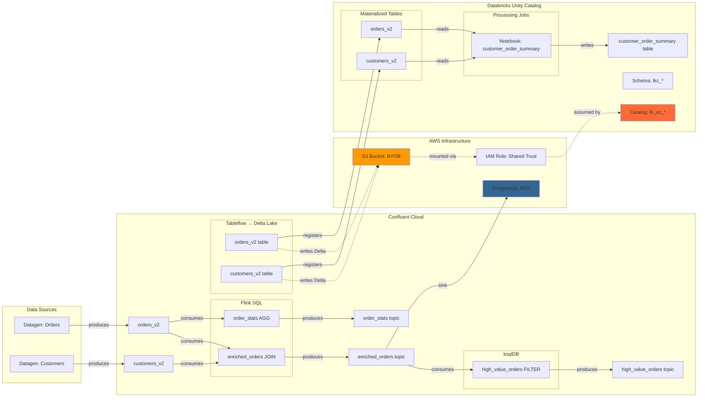

# Unity Catalog Demo

This is the flagship LineageBridge demo, showcasing the richest end-to-end lineage graph with multiple transformation layers and a Databricks Unity Catalog integration. You'll see how data flows from source systems through Kafka topics, Flink SQL joins, ksqlDB stream processing, Tableflow materialization, and finally into Unity Catalog Delta tables — all tracked and visualized by LineageBridge.

## Architecture

The demo provisions a complete data pipeline across Confluent Cloud, AWS, and Databricks:



### Key Components

- **Datagen Sources** — Continuously generate realistic orders and customers data with Avro schemas
- **Flink SQL Jobs** — Stream JOIN (enriched_orders) and windowed aggregation (order_stats)
- **ksqlDB Cluster** — Filters high-value orders (price > $50) into a derived stream
- **PostgreSQL RDS** — Receives enriched_orders via PostgreSQL Sink Connector (demonstrates cross-system lineage)
- **Tableflow BYOB** — Materializes orders_v2 and customers_v2 as Delta Lake tables in S3
- **Unity Catalog Integration** — Registers Tableflow tables in a dedicated UC catalog with full lineage metadata
- **Databricks Notebook Job** — Scheduled job reading UC tables and producing customer_order_summary analytics table

## Prerequisites

Before provisioning, ensure you have:

### CLI Tools

- **Terraform** >= 1.5
- **Confluent CLI** — logged in: `confluent login --save`
- **AWS CLI** — configured: `aws configure` or `aws sso login`
- **Databricks CLI** — configured: `databricks configure`

The demo's `make setup` command can auto-install these via Homebrew if you're on macOS.

### Cloud Accounts & Permissions

| Account | Required Permissions |
|---------|---------------------|
| **Confluent Cloud** | Create environments, clusters, service accounts, connectors, Flink pools, ksqlDB clusters, Tableflow topics |
| **AWS** | Create IAM roles, S3 buckets, RDS instances, security groups. Recommended: AdministratorAccess or PowerUserAccess |
| **Databricks** | Account admin access to create catalogs, external locations, storage credentials, notebooks, jobs. Service principal with CREATE CATALOG privilege |

### Credentials You'll Need

The setup script will prompt for these if not auto-detected:

- **Confluent Cloud API Key + Secret** — Cloud-scoped credentials (auto-created via CLI if missing)
- **AWS Account ID** — Auto-detected from `aws sts get-caller-identity`
- **AWS Region** — Defaults to `us-east-1`
- **Databricks Workspace URL** — Example: `https://adb-1234567890.12.azuredatabricks.net` or `https://dbc-abc123.cloud.databricks.com`
- **Databricks Personal Access Token** — For Terraform provider authentication
- **Databricks Service Principal Client ID + Secret** — For Unity Catalog catalog/schema permissions (OAuth M2M credentials)

!!! tip "Databricks Service Principal"

    Create a service principal via Databricks Account Console → User Management → Service Principals → Add Service Principal. Generate OAuth secrets and grant it `CREATE CATALOG` privilege on the metastore.

## Provisioning

### Step 1: Credential Setup

Run the interactive setup wizard from the `infra/demos/uc` directory:

=== "Make"

    ```bash
    cd infra/demos/uc
    make setup
    ```

=== "Direct Script"

    ```bash
    cd infra/demos/uc
    bash scripts/setup-tfvars.sh
    ```

The script will:

1. Check for required CLI tools (install via Homebrew if missing)
2. Detect Confluent Cloud credentials from `.env`, environment variables, or create via `confluent api-key create --resource cloud`
3. Detect AWS account ID and region from `aws sts get-caller-identity`
4. Prompt for Databricks workspace URL, token, and service principal credentials
5. Generate `terraform.tfvars` with all detected/provided values

Example output:

```
══════════════════════════════════════════════════════════════════
  LineageBridge UC Demo — Credential Setup
══════════════════════════════════════════════════════════════════

  All required CLIs found: confluent, aws, databricks

▸ Confluent Cloud credentials
  Using existing Cloud API key: abc-12345 (from .env)

▸ AWS credentials
  Account ID: 123456789012 (auto-detected)
  Region: us-east-1

▸ Databricks workspace
  Workspace URL: https://dbc-abc123.cloud.databricks.com
  Personal Access Token: ********************************
  Service Principal Client ID: sp-12345678-abcd-1234-abcd-1234567890ab
  Service Principal Client Secret: ********************************

✓ terraform.tfvars written successfully
```

### Step 2: Provision Infrastructure

Deploy all resources via Terraform:

=== "Make (Recommended)"

    ```bash
    make demo-up
    ```

=== "Terraform Direct"

    ```bash
    terraform init
    terraform apply -auto-approve
    ```

The `demo-up` target automatically runs `make setup` if `terraform.tfvars` is missing, then executes `scripts/provision-demo.sh`, which:

1. Runs `terraform init` and `terraform apply`
2. Creates a Tableflow API key via Confluent CLI (required for BYOB)
3. Re-runs `terraform apply` with Tableflow credentials to complete integration
4. Executes health checks waiting for Tableflow tables to appear in Unity Catalog

Provisioning takes **12-15 minutes**. Terraform will create approximately 55 resources:

- Confluent Cloud: 1 environment, 1 Kafka cluster, 1 service account, 5 API keys, 2 topics, 2 datagen connectors, 1 Flink compute pool, 2 Flink statements, 1 ksqlDB cluster, 2 ksqlDB queries, 2 Tableflow topics, 1 provider integration, 1 catalog integration
- AWS: 1 S3 bucket, 1 IAM role, 1 RDS PostgreSQL instance, 1 security group, 1 DB subnet group
- Databricks: 1 storage credential, 1 external location, 1 catalog, 1 schema, 1 notebook, 1 job, 5 grants

### Step 3: Verify Provisioning

Once Terraform completes, verify the environment:

=== "Confluent Cloud Console"

    1. Navigate to [Confluent Cloud Environments](https://confluent.cloud/environments)
    2. Open the environment named `lb-uc-{random}` (example: `lb-uc-a1b2c3d4`)
    3. Verify Kafka cluster is `RUNNING`
    4. Check **Topics**: `lineage_bridge.orders_v2`, `lineage_bridge.customers_v2`, `lineage_bridge.enriched_orders`, `lineage_bridge.order_stats`, `lineage_bridge.high_value_orders`
    5. Inspect **Connectors**: `lb-uc-*-orders-datagen`, `lb-uc-*-customers-datagen`, `lb-uc-*-postgres-sink` (all `RUNNING`)
    6. Open **Flink** SQL workspace: statements `lb-uc-*-enrich-orders` and `lb-uc-*-order-stats` should be `RUNNING`
    7. Check **ksqlDB** cluster: `lb-uc-*-ksqldb` with queries `ORDERS_STREAM` and `HIGH_VALUE_ORDERS`

=== "Databricks Workspace"

    1. Log in to your Databricks workspace
    2. Navigate to **Data Explorer** (left sidebar)
    3. Find catalog `lb_uc_{random}` (example: `lb_uc_a1b2c3d4`)
    4. Open schema `lkc_{cluster_id}` (example: `lkc_mjnq51`)
    5. Verify tables: `lineage_bridge_orders_v2`, `lineage_bridge_customers_v2`, `customer_order_summary`
    6. Click on `lineage_bridge_orders_v2` → **Sample Data** tab to see materialized rows
    7. Check **Workflows** → find job `lb-uc-*-customer-order-summary` (should run every 5 minutes)

=== "AWS Console"

    1. Open AWS Console → **S3**
    2. Find bucket `lb-uc-{random}-tableflow`
    3. Browse to `lb_uc_{random}/lkc_{cluster}/` — you should see Delta Lake directories: `lineage_bridge_orders_v2/`, `lineage_bridge_customers_v2/`
    4. Navigate to **RDS** → Databases → `lb-uc-{random}-postgres` (status: Available)
    5. Check **IAM** → Roles → `lb-uc-{random}-tableflow-role` — verify trust policy includes both Databricks and Confluent principals

### Step 4: Run LineageBridge Extraction

Extract lineage metadata from the live environment:

```bash
cd ../../..  # Return to project root
uv run lineage-bridge-extract
```

The extractor will:

1. Auto-configure from the Terraform outputs (stored in `.env` by `terraform output -raw demo_env_file`)
2. Execute the 5-phase extraction pipeline:
    - Phase 1: Kafka topics and consumer groups
    - Phase 2: Connectors, Flink, ksqlDB (parallel)
    - Phase 3: Schema Registry and Stream Catalog enrichment (parallel)
    - Phase 4: Tableflow tables and Unity Catalog integration
    - Phase 4b: Databricks catalog enrichment (fetch table metadata, lineage, jobs)
    - Phase 5: Metrics (throughput for topics)

Expected output:

```
▸ Phase 1: Kafka Admin (lkc-mjnq51)
  ✓ 5 topics, 3 consumer groups

▸ Phase 2: Transformations (parallel)
  ✓ 3 connectors (2 source, 1 sink)
  ✓ 2 Flink statements
  ✓ 1 ksqlDB cluster, 2 queries

▸ Phase 3: Enrichment (parallel)
  ✓ 5 schemas from Schema Registry
  ✓ Stream Catalog: 0 tags, 0 business metadata

▸ Phase 4: Tableflow
  ✓ 2 Tableflow topics (DELTA)
  ✓ Unity Catalog integration: lb-uc-a1b2c3d4-uc

▸ Phase 4b: Catalog Enrichment
  ✓ Databricks UC: 2 tables, 1 derived table (customer_order_summary), 1 notebook job

▸ Phase 5: Metrics
  ✓ Throughput: 5 topics

Graph Summary:
  Nodes: 34 (5 topics, 3 connectors, 2 Flink jobs, 2 ksqlDB queries, 2 Tableflow tables, 3 UC tables, 5 schemas, 3 consumer groups, 1 notebook)
  Edges: 47 (16 PRODUCES, 12 CONSUMES, 6 TRANSFORMS, 2 MATERIALIZES, 5 HAS_SCHEMA, 6 MEMBER_OF)
```

### Step 5: Launch the UI

Open the interactive lineage graph:

```bash
uv run streamlit run lineage_bridge/ui/app.py
```

Your browser will open to `http://localhost:8501`. The UI displays:

- **Hierarchical graph layout** — Sugiyama layering with data flowing left-to-right
- **Interactive nodes** — Click any node to see metadata panel (schema, owner, throughput, catalog properties)
- **Filtering controls** — Toggle node types, search by name, filter by environment/cluster
- **Deep links** — Nodes link directly to Confluent Cloud Console, Databricks workspace, AWS console

## Expected Lineage Graph

You should see the following node types connected by lineage edges:

### Kafka Topics (5 nodes)

- `lineage_bridge.orders_v2` — Source topic from datagen
- `lineage_bridge.customers_v2` — Source topic from datagen
- `lineage_bridge.enriched_orders` — Derived topic from Flink JOIN
- `lineage_bridge.order_stats` — Derived topic from Flink windowed aggregation
- `lineage_bridge.high_value_orders` — Derived topic from ksqlDB FILTER

### Connectors (3 nodes)

- `lb-uc-*-orders-datagen` — Datagen source (PRODUCES → orders_v2)
- `lb-uc-*-customers-datagen` — Datagen source (PRODUCES → customers_v2)
- `lb-uc-*-postgres-sink` — PostgreSQL sink (CONSUMES ← enriched_orders)

### Flink Jobs (2 nodes)

- `lb-uc-*-enrich-orders` — Stream JOIN (CONSUMES ← orders_v2, customers_v2 | PRODUCES → enriched_orders)
- `lb-uc-*-order-stats` — Windowed aggregation (CONSUMES ← orders_v2 | PRODUCES → order_stats)

### ksqlDB Queries (2 nodes)

- `ORDERS_STREAM` — Base stream over orders_v2
- `HIGH_VALUE_ORDERS` — Filtered stream (CONSUMES ← orders_v2 | PRODUCES → high_value_orders)

### Tableflow Tables (2 nodes)

- `lineage_bridge.orders_v2 (DELTA)` — Tableflow materialization (MATERIALIZES → UC table)
- `lineage_bridge.customers_v2 (DELTA)` — Tableflow materialization (MATERIALIZES → UC table)

### Unity Catalog Tables (3 nodes)

- `lb_uc_*.lkc_*.lineage_bridge_orders_v2` — Delta table registered via Tableflow
- `lb_uc_*.lkc_*.lineage_bridge_customers_v2` — Delta table registered via Tableflow
- `lb_uc_*.lkc_*.customer_order_summary` — Derived table created by Databricks notebook job (CONSUMES ← orders_v2, customers_v2 UC tables)

### Schemas (5 nodes)

- `lineage_bridge.orders_v2-value` — Avro schema for orders
- `lineage_bridge.customers_v2-value` — Avro schema for customers
- `lineage_bridge.enriched_orders-value` — Avro schema for enriched orders
- `lineage_bridge.order_stats-value` — Avro schema for order stats (includes window_start, window_end)
- `lineage_bridge.high_value_orders-value` — Avro schema for high-value orders

### Consumer Groups (3 nodes)

- Connector consumer groups (auto-generated by sink connector)
- Flink consumer groups (if Flink uses legacy consumer API)

### External Datasets (1 node, if audit log enabled)

- PostgreSQL table `lineage_bridge.enriched_orders` — Sink target (discovered via connector metadata)

## Databricks Integration Details

The demo showcases how LineageBridge enriches catalog nodes with Databricks-specific metadata.

### Unity Catalog Tables

Click on a UC table node (e.g., `lineage_bridge_orders_v2`) in the graph to see the metadata panel:

```json
{
  "node_id": "DATABRICKS:UC_TABLE:env-26wn6m:lb_uc_a1b2c3d4.lkc_mjnq51.lineage_bridge_orders_v2",
  "node_type": "UC_TABLE",
  "qualified_name": "lb_uc_a1b2c3d4.lkc_mjnq51.lineage_bridge_orders_v2",
  "display_name": "lineage_bridge_orders_v2",
  "catalog": "lb_uc_a1b2c3d4",
  "schema": "lkc_mjnq51",
  "table_type": "EXTERNAL",
  "data_source_format": "DELTA",
  "storage_location": "s3://lb-uc-a1b2c3d4-tableflow/lb_uc_a1b2c3d4/lkc_mjnq51/lineage_bridge_orders_v2/",
  "owner": "sp-12345678-abcd-1234-abcd-1234567890ab",
  "created_at": "2026-04-30T12:34:56.000Z",
  "updated_at": "2026-04-30T12:40:12.000Z",
  "columns": [
    {"name": "order_id", "type": "STRING"},
    {"name": "customer_id", "type": "STRING"},
    {"name": "product_name", "type": "STRING"},
    {"name": "quantity", "type": "BIGINT"},
    {"name": "price", "type": "DOUBLE"},
    {"name": "order_status", "type": "STRING"},
    {"name": "created_at", "type": "STRING"}
  ],
  "url": "https://dbc-abc123.cloud.databricks.com/explore/data/lb_uc_a1b2c3d4/lkc_mjnq51/lineage_bridge_orders_v2"
}
```

### Databricks Notebook Jobs

The demo includes a scheduled Databricks notebook job (`customer_order_summary`) that:

1. Reads `lineage_bridge_orders_v2` and `lineage_bridge_customers_v2` UC tables
2. Performs a join and aggregation (customer-level order summary)
3. Writes results to a new UC table: `customer_order_summary`

LineageBridge detects this job via the Databricks Jobs API and creates:

- **Notebook node** — Represents the processing logic
- **CONSUMES edges** — From notebook to source UC tables (orders_v2, customers_v2)
- **PRODUCES edge** — From notebook to derived UC table (customer_order_summary)

Query the derived table in Databricks SQL:

```sql
USE CATALOG lb_uc_a1b2c3d4;
USE SCHEMA lkc_mjnq51;

SELECT * FROM customer_order_summary
ORDER BY total_revenue DESC
LIMIT 10;
```

Expected output:

| customer_name | customer_country | total_orders | total_quantity | total_revenue | avg_order_value | last_order_at |
|---------------|------------------|--------------|----------------|---------------|-----------------|---------------|
| Alice Johnson | USA              | 42           | 120            | 3150.50       | 75.01           | 2026-04-30... |
| Bob Smith     | Canada           | 38           | 95             | 2840.00       | 74.74           | 2026-04-30... |
| ...           | ...              | ...          | ...            | ...           | ...             | ...           |

### Verifying Lineage Metadata in Unity Catalog

Unity Catalog's native lineage feature (available in Databricks workspace UI) should also show upstream lineage from the Tableflow integration. Verify:

1. Open Databricks workspace → **Data Explorer**
2. Navigate to `lb_uc_a1b2c3d4.lkc_mjnq51.lineage_bridge_orders_v2`
3. Click **Lineage** tab
4. You should see upstream reference to the Confluent Kafka topic via Tableflow metadata (if Databricks has indexed the external table properties)

!!! note "Lineage Push (Future Feature)"

    LineageBridge will soon support **pushing lineage back to Unity Catalog** via the `push_lineage()` method in the Databricks UC provider. This will write custom lineage metadata as table properties or via Databricks' OpenLineage integration.

## Validation Queries

Run these queries to validate data flow through the pipeline.

### Check Kafka Topic Data

```bash
confluent kafka topic consume lineage_bridge.orders_v2 \
  --from-beginning --max-messages 5
```

### Verify Flink Transformations

```sql
-- Via Confluent Cloud Console → Flink SQL Workspace
SELECT * FROM lineage_bridge.enriched_orders LIMIT 10;
```

### Query Unity Catalog Tables

```sql
-- Via Databricks SQL Editor
USE CATALOG lb_uc_a1b2c3d4;
USE SCHEMA lkc_mjnq51;

-- Count rows in materialized tables
SELECT COUNT(*) AS orders_count FROM lineage_bridge_orders_v2;
SELECT COUNT(*) AS customers_count FROM lineage_bridge_customers_v2;

-- Join materialized tables (mimics Flink enrichment)
SELECT
  o.order_id,
  c.name AS customer_name,
  o.product_name,
  o.price,
  o.order_status
FROM lineage_bridge_orders_v2 o
JOIN lineage_bridge_customers_v2 c ON o.customer_id = c.customer_id
WHERE o.price > 100
LIMIT 10;
```

### Verify PostgreSQL Sink

```bash
# Connect to RDS (get endpoint from terraform output)
psql -h $(terraform output -raw postgres_endpoint) \
     -U lineage_bridge \
     -d lineage_bridge

-- Inside psql:
SELECT COUNT(*) FROM enriched_orders;
SELECT * FROM enriched_orders WHERE price > 100 LIMIT 5;
```

## Troubleshooting

### Tableflow Tables Not Appearing in Unity Catalog

**Symptom:** Terraform completes successfully, but Unity Catalog tables are missing.

**Diagnosis:**

```bash
# Check Tableflow topic status
curl -u "$CONFLUENT_TABLEFLOW_API_KEY:$CONFLUENT_TABLEFLOW_API_SECRET" \
  "https://api.confluent.cloud/tableflow/v1/topics?environment=$ENV_ID&kafka_cluster=$CLUSTER_ID" | jq .
```

**Fix:** Wait 3-5 minutes for Tableflow registration to propagate. Re-run:

```bash
bash scripts/wait-for-ready.sh
```

### Databricks Job Failing

**Symptom:** `customer_order_summary` job runs show errors in Databricks workflow UI.

**Diagnosis:** Check job run logs in Databricks → Workflows → `lb-uc-*-customer-order-summary` → Latest Run.

**Common causes:**

- **Tableflow tables not ready:** Job tries to read tables before Tableflow materializes them. Wait for health check to pass, then manually trigger job.
- **Permissions:** Service principal lacks `SELECT` on source tables. Verify grants:

```sql
SHOW GRANTS ON TABLE lb_uc_a1b2c3d4.lkc_mjnq51.lineage_bridge_orders_v2;
```

### IAM Role Trust Policy Conflicts

**Symptom:** `AssumeRole failed: AccessDenied` during Terraform apply, or Databricks storage credential validation fails.

**Diagnosis:** The IAM role must trust three principals:
1. Databricks (for storage credential access)
2. Confluent (for Tableflow writes)  
3. **Itself** (for Databricks validation — the role must be able to assume itself)

**Fix:** Terraform includes 60s delay after phase 1 and automatically adds all three trust relationships. If errors persist, manually verify the trust policy includes the role's own ARN:

```bash
aws iam get-role --role-name lb-uc-{random}-tableflow-role | jq .Role.AssumeRolePolicyDocument
```

**Expected trust policy structure:**
```json
{
  "Statement": [
    {
      "Effect": "Allow",
      "Principal": {"AWS": "arn:aws:iam::414351767826:role/unity-catalog-prod-UCMasterRole-*"},
      "Action": "sts:AssumeRole",
      "Condition": {"StringEquals": {"sts:ExternalId": "your-databricks-external-id"}}
    },
    {
      "Effect": "Allow",
      "Principal": {"AWS": "arn:aws:iam::*:role/confluent-*"},
      "Action": "sts:AssumeRole",
      "Condition": {"StringEquals": {"sts:ExternalId": "your-confluent-external-id"}}
    },
    {
      "Effect": "Allow",
      "Principal": {"AWS": "arn:aws:iam::123456789012:role/lb-uc-*-tableflow-role"},
      "Action": "sts:AssumeRole"
    }
  ]
}
```

The third statement (self-assuming) is critical for Databricks storage credential validation to succeed.

### ksqlDB Queries Not Running

**Symptom:** ksqlDB cluster is `RUNNING`, but queries don't appear or topics aren't created.

**Diagnosis:** The `null_resource.ksqldb_high_value_orders` uses `curl` to submit ksqlDB statements via REST API. Check Terraform logs for curl errors.

**Fix:** Manually submit queries via Confluent Cloud Console → ksqlDB editor:

```sql
CREATE STREAM IF NOT EXISTS orders_stream (
  order_id STRING,
  customer_id STRING,
  product_name STRING,
  quantity INT,
  price DOUBLE,
  order_status STRING,
  created_at STRING
) WITH (
  KAFKA_TOPIC='lineage_bridge.orders_v2',
  VALUE_FORMAT='AVRO'
);

CREATE STREAM IF NOT EXISTS high_value_orders
WITH (KAFKA_TOPIC='lineage_bridge.high_value_orders', VALUE_FORMAT='AVRO') AS
SELECT order_id, customer_id, product_name, quantity, price, order_status
FROM orders_stream
WHERE price > 50.0
EMIT CHANGES;
```

## Cost Breakdown

Estimated monthly costs for 24x7 operation:

| Resource | Details | Monthly Cost |
|----------|---------|--------------|
| **Confluent Kafka Cluster** | Basic, AWS us-east-1, single-zone | ~$80 |
| **Confluent Flink Compute Pool** | 5 CFUs (minimum) | ~$450 |
| **Confluent ksqlDB Cluster** | 4 CSUs | ~$32 |
| **Confluent Tableflow BYOB** | 2 topics, Delta Lake | ~$25 |
| **Datagen Connectors** | 2 source connectors | Included |
| **AWS S3 Storage** | ~10 GB Delta Lake data | ~$5 |
| **AWS RDS PostgreSQL** | db.t4g.micro, 20 GB storage | ~$15 |
| **Databricks Workspace** | E2 workspace + minimal compute | ~$100 |
| **Databricks Job Runs** | 5-minute intervals, <1 DBU/run | ~$4 |
| **Total** | | **~$711/month** |

!!! tip "Pause Flink to Save ~60% Costs"

    Flink compute pools account for $450/month. When not actively using the demo, pause the Flink pool via Confluent Cloud Console to reduce costs to ~$260/month.

## Cleanup

Tear down all resources to stop incurring costs:

```bash
cd infra/demos/uc
make demo-down
```

This executes:

1. Pre-destroy catalog cleanup: `scripts/cleanup-catalog.sh` (removes auto-created Databricks schemas)
2. `terraform destroy -auto-approve` (destroys all Terraform-managed resources)

Expected duration: 5-8 minutes.

!!! warning "Orphaned Tableflow Metadata"

    Tableflow may create internal metadata tables in Unity Catalog that Terraform doesn't track. If you see leftover schemas after teardown, manually drop them:

    ```sql
    DROP SCHEMA IF EXISTS lb_uc_a1b2c3d4.lkc_mjnq51 CASCADE;
    DROP CATALOG IF EXISTS lb_uc_a1b2c3d4;
    ```

## Next Steps

- **Customize the pipeline** — Edit Flink SQL in `main.tf` to add your own transformations
- **Add more Tableflow topics** — Enable Tableflow for `enriched_orders` and `order_stats` topics
- **Push lineage to Unity Catalog** — Extend `lineage_bridge/catalogs/databricks_uc.py` to implement `push_lineage()`
- **Productionize** — Adapt this demo for your environment by replacing Datagen with real connectors and adding RBAC policies
