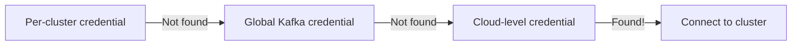

# Configuration

Let's get your credentials set up. LineageBridge uses environment variables for all the sensitive stuff—API keys, tokens, secrets. This keeps your credentials out of code and version control.

## How Configuration Works

We keep it simple with a few principles:

- **Credentials only** - We only store API keys and secrets, not runtime settings
- **Environment variables** - Everything uses the `LINEAGE_BRIDGE_` prefix
- **.env file support** - Drop your credentials in a `.env` file and we'll load them automatically
- **Smart fallbacks** - If you don't provide service-specific keys, we fall back to your cloud-level credentials

## Quick Setup (Start Here!)

### Step 1: Create Your .env File

Copy our example to get started:

```bash
cp .env.example .env
```

### Step 2: Add Your Confluent Cloud Credentials

Open `.env` in your favorite editor and add your credentials:

```bash
# This is all you need to get started
LINEAGE_BRIDGE_CONFLUENT_CLOUD_API_KEY=your-cloud-api-key
LINEAGE_BRIDGE_CONFLUENT_CLOUD_API_SECRET=your-cloud-api-secret
```

That's it! LineageBridge will use these cloud-level credentials for everything. You can add more specific credentials later if needed.

!!! warning "Keep Your Secrets Safe"
    Never commit `.env` files to git. We've already added them to `.gitignore`, but double-check before committing.

## Confluent Cloud Credentials

### Cloud-Level API Key (Required)

You need one cloud-level API key to get started. This lets LineageBridge discover your environments, clusters, and services. You'll need **OrgAdmin** or **EnvironmentAdmin** permissions.

```env
LINEAGE_BRIDGE_CONFLUENT_CLOUD_API_KEY=ABC123DEF456
LINEAGE_BRIDGE_CONFLUENT_CLOUD_API_SECRET=xyz789secretABC...
```

**Here's how to create one:**

1. Log in to [Confluent Cloud](https://confluent.cloud)
2. Go to **Administration → API Keys**
3. Click **+ Add key**
4. Select **Cloud resource** as the scope
5. Choose **My account** (or create a service account for production)
6. **Copy the key and secret immediately**—Confluent won't show them again!

### Service-Scoped Credentials (Optional)

Want more granular control? You can provide dedicated API keys for each Confluent service. If you don't, we'll just use your cloud API key as a fallback—works great for most cases.

=== "Kafka Clusters"

    Global Kafka credentials (applies to all clusters unless you override per-cluster):

    ```env
    LINEAGE_BRIDGE_KAFKA_API_KEY=kafka-key
    LINEAGE_BRIDGE_KAFKA_API_SECRET=kafka-secret
    ```

=== "Schema Registry"

    ```env
    LINEAGE_BRIDGE_SCHEMA_REGISTRY_ENDPOINT=https://psrc-xxxxx.us-east-1.aws.confluent.cloud
    LINEAGE_BRIDGE_SCHEMA_REGISTRY_API_KEY=sr-key
    LINEAGE_BRIDGE_SCHEMA_REGISTRY_API_SECRET=sr-secret
    ```

    !!! tip "Auto-Discovery"
        We auto-discover the Schema Registry endpoint, so you usually don't need to set this. Only needed if you have multiple Schema Registry clusters.

=== "ksqlDB"

    ```env
    LINEAGE_BRIDGE_KSQLDB_API_KEY=ksql-key
    LINEAGE_BRIDGE_KSQLDB_API_SECRET=ksql-secret
    ```

    We auto-discover ksqlDB endpoints from your clusters.

=== "Flink SQL"

    ```env
    LINEAGE_BRIDGE_FLINK_API_KEY=flink-key
    LINEAGE_BRIDGE_FLINK_API_SECRET=flink-secret
    ```

=== "Tableflow"

    ```env
    LINEAGE_BRIDGE_TABLEFLOW_API_KEY=tableflow-key
    LINEAGE_BRIDGE_TABLEFLOW_API_SECRET=tableflow-secret
    ```

### Per-Cluster Credentials (Advanced)

Got different API keys for each Kafka cluster? No problem. You can provide them as a JSON map:

```env
LINEAGE_BRIDGE_CLUSTER_CREDENTIALS={"lkc-abc123":{"api_key":"key1","api_secret":"secret1"},"lkc-def456":{"api_key":"key2","api_secret":"secret2"}}
```

**Here's that same config formatted for readability (don't actually put newlines in your .env):**

```json
{
  "lkc-abc123": {
    "api_key": "cluster1-key",
    "api_secret": "cluster1-secret"
  },
  "lkc-def456": {
    "api_key": "cluster2-key",
    "api_secret": "cluster2-secret"
  }
}
```

!!! tip "Easier in the UI"
    You can also add per-cluster credentials in the Streamlit UI sidebar instead of wrestling with JSON in your .env file.

### How Credential Fallbacks Work

When LineageBridge needs to talk to a Kafka cluster, it looks for credentials in this order:



1. **Per-cluster credential** - from the `CLUSTER_CREDENTIALS` JSON map
2. **Global Kafka credential** - from `KAFKA_API_KEY` / `KAFKA_API_SECRET`
3. **Cloud-level credential** - from `CONFLUENT_CLOUD_API_KEY` (the ultimate fallback)

## Data Catalog Credentials

Want to connect lineage to your data catalog? Here's how to set up each one.

### Databricks Unity Catalog

To hook up Databricks UC:

```env
LINEAGE_BRIDGE_DATABRICKS_WORKSPACE_URL=https://myworkspace.cloud.databricks.com
LINEAGE_BRIDGE_DATABRICKS_TOKEN=dapi123456789abcdef
LINEAGE_BRIDGE_DATABRICKS_WAREHOUSE_ID=abc123def456
```

**Where to find these:**

=== "Workspace URL"
    
    This is your Databricks workspace URL. It looks like:
    
    ```
    https://dbc-12345678-abcd.cloud.databricks.com
    ```
    
    Just copy it from your browser when you're logged into Databricks.

=== "Token"
    
    Create a personal access token:
    
    1. In Databricks, go to **User Settings** (click your email in top right)
    2. Click **Developer** → **Access Tokens**
    3. Click **Generate new token**
    4. Copy it immediately—you won't see it again!

    !!! warning "Production Tip"
        For production, use a service principal token instead of your personal token. That way the integration doesn't break when you leave the company.

=== "Warehouse ID"
    
    Find your SQL Warehouse ID:
    
    1. Go to **SQL Warehouses** in Databricks
    2. Click on the warehouse you want to use
    3. Go to **Connection Details**
    4. Copy the **Server Hostname** - the ID is in there (format: `abc123def456`)

### AWS Glue

For AWS Glue, we use the standard AWS credential chain—same as any other AWS tool:

```env
LINEAGE_BRIDGE_AWS_REGION=us-east-1
```

**You'll need these AWS permissions:**

- `glue:GetDatabase`
- `glue:GetTable`
- `glue:UpdateTable`

**Set up your AWS credentials using one of these methods:**

=== "Environment Variables"
    
    ```env
    AWS_ACCESS_KEY_ID=your-access-key
    AWS_SECRET_ACCESS_KEY=your-secret-key
    AWS_REGION=us-east-1
    ```

=== "AWS CLI"
    
    The easiest way if you have the AWS CLI installed:
    
    ```bash
    aws configure
    ```
    
    Follow the prompts to enter your credentials.

=== "IAM Role"
    
    If you're running on EC2, ECS, or Lambda, use an IAM role. No credentials needed—AWS handles it automatically.

### Google Data Lineage

For Google Cloud Data Lineage:

```env
LINEAGE_BRIDGE_GCP_PROJECT_ID=my-gcp-project
LINEAGE_BRIDGE_GCP_LOCATION=us-central1
```

**Authentication works via Google's Application Default Credentials (ADC):**

=== "User Account"
    
    Authenticate with your Google account:
    
    ```bash
    gcloud auth application-default login
    ```
    
    Your browser will open and ask you to log in.

=== "Service Account"
    
    For production, use a service account key:
    
    ```bash
    export GOOGLE_APPLICATION_CREDENTIALS=/path/to/service-account-key.json
    ```

**Make sure these APIs are enabled in your GCP project:**

- Data Lineage API
- BigQuery API (if you're using BigQuery connectors)

## REST API Configuration

If you plan to run the LineageBridge REST API:

```env
LINEAGE_BRIDGE_API_KEY=your-api-key-here
LINEAGE_BRIDGE_API_HOST=0.0.0.0
LINEAGE_BRIDGE_API_PORT=8000
```

- **API_KEY**: Optional authentication key. If unset, the API runs without authentication.
- **API_HOST**: Bind address (default: `0.0.0.0` for all interfaces)
- **API_PORT**: Port number (default: `8000`)

!!! warning "Production Deployment"
    Always set `API_KEY` in production to protect your lineage data.

## Logging

Control log verbosity:

```env
LINEAGE_BRIDGE_LOG_LEVEL=INFO
```

**Valid levels:**

- `DEBUG` - Verbose output including API requests and responses
- `INFO` - Standard output (default)
- `WARNING` - Warnings and errors only
- `ERROR` - Errors only

## Complete .env Example

Here's what a fully-configured .env looks like with all the bells and whistles:

=== "Minimal (Start Here)"

    ```env
    # ============================================================================
    # LineageBridge - Minimal Configuration
    # ============================================================================
    
    # This is all you need to get started
    LINEAGE_BRIDGE_CONFLUENT_CLOUD_API_KEY=ABC123DEF456
    LINEAGE_BRIDGE_CONFLUENT_CLOUD_API_SECRET=verylongsecretstring123
    
    # Optional: control log verbosity
    LINEAGE_BRIDGE_LOG_LEVEL=INFO
    ```

=== "With Databricks"

    ```env
    # ============================================================================
    # LineageBridge - With Databricks Unity Catalog
    # ============================================================================
    
    # Confluent Cloud (required)
    LINEAGE_BRIDGE_CONFLUENT_CLOUD_API_KEY=ABC123DEF456
    LINEAGE_BRIDGE_CONFLUENT_CLOUD_API_SECRET=verylongsecretstring123
    
    # Databricks Unity Catalog
    LINEAGE_BRIDGE_DATABRICKS_WORKSPACE_URL=https://dbc-a1b2c3d4-5678.cloud.databricks.com
    LINEAGE_BRIDGE_DATABRICKS_TOKEN=dapi123456789abcdef
    LINEAGE_BRIDGE_DATABRICKS_WAREHOUSE_ID=abc123def456
    
    # Logging
    LINEAGE_BRIDGE_LOG_LEVEL=INFO
    ```

=== "Full Configuration"

    ```env
    # ============================================================================
    # LineageBridge - Full Configuration
    # ============================================================================
    
    # ── Confluent Cloud (required) ──────────────────────────────────────────
    LINEAGE_BRIDGE_CONFLUENT_CLOUD_API_KEY=ABC123DEF456
    LINEAGE_BRIDGE_CONFLUENT_CLOUD_API_SECRET=verylongsecretstring123
    
    # ── Confluent Services (optional - falls back to cloud key) ─────────────
    LINEAGE_BRIDGE_KAFKA_API_KEY=kafka-cluster-key
    LINEAGE_BRIDGE_KAFKA_API_SECRET=kafka-cluster-secret
    
    LINEAGE_BRIDGE_SCHEMA_REGISTRY_ENDPOINT=https://psrc-xxxxx.us-east-1.aws.confluent.cloud
    LINEAGE_BRIDGE_SCHEMA_REGISTRY_API_KEY=sr-key
    LINEAGE_BRIDGE_SCHEMA_REGISTRY_API_SECRET=sr-secret
    
    LINEAGE_BRIDGE_KSQLDB_API_KEY=ksql-key
    LINEAGE_BRIDGE_KSQLDB_API_SECRET=ksql-secret
    
    LINEAGE_BRIDGE_FLINK_API_KEY=flink-key
    LINEAGE_BRIDGE_FLINK_API_SECRET=flink-secret
    
    LINEAGE_BRIDGE_TABLEFLOW_API_KEY=tableflow-key
    LINEAGE_BRIDGE_TABLEFLOW_API_SECRET=tableflow-secret
    
    # ── Per-Cluster Credentials (optional) ──────────────────────────────────
    # LINEAGE_BRIDGE_CLUSTER_CREDENTIALS={"lkc-abc123":{"api_key":"key1","api_secret":"secret1"}}
    
    # ── Databricks Unity Catalog (optional) ─────────────────────────────────
    LINEAGE_BRIDGE_DATABRICKS_WORKSPACE_URL=https://myworkspace.cloud.databricks.com
    LINEAGE_BRIDGE_DATABRICKS_TOKEN=dapi123456789abcdef
    LINEAGE_BRIDGE_DATABRICKS_WAREHOUSE_ID=abc123def456
    
    # ── AWS Glue (optional) ──────────────────────────────────────────────────
    LINEAGE_BRIDGE_AWS_REGION=us-east-1
    
    # ── Google Cloud (optional) ──────────────────────────────────────────────
    LINEAGE_BRIDGE_GCP_PROJECT_ID=my-gcp-project
    LINEAGE_BRIDGE_GCP_LOCATION=us-central1
    
    # ── REST API (optional) ──────────────────────────────────────────────────
    LINEAGE_BRIDGE_API_KEY=my-secure-api-key
    LINEAGE_BRIDGE_API_HOST=0.0.0.0
    LINEAGE_BRIDGE_API_PORT=8000
    
    # ── Logging ──────────────────────────────────────────────────────────────
    LINEAGE_BRIDGE_LOG_LEVEL=INFO
    ```

## Environment-Specific Configuration

For multiple environments (dev, staging, prod), use different `.env` files:

```bash
# Development
.env

# Staging
.env.staging

# Production
.env.production
```

Load a specific env file:

```bash
# Copy to .env before running
cp .env.production .env
make ui
```

Or use dotenv directly:

```python
from dotenv import load_dotenv
load_dotenv(".env.production")
```

## Security Best Practices

Here are some tips to keep your credentials safe:

### Never Commit Credentials

Make sure `.env` is in your `.gitignore` (we've already done this, but always verify):

```gitignore
.env
.env.*
!.env.example
```

!!! danger "Common Mistake"
    Don't accidentally commit `.env.production` or `.env.local`—the wildcard `.env.*` protects you.

### Use Least Privilege

Give API keys only the permissions they actually need:

- Use read-only keys for LineageBridge (we don't modify your data)
- Don't use OrgAdmin keys if EnvironmentAdmin will do
- Scope keys to specific environments when possible

### Rotate Credentials Regularly

Change your API keys and tokens periodically, especially:

- After someone leaves the team
- If credentials might have been exposed (chat logs, screenshots, etc.)
- Every 90 days as good security hygiene

### Use Service Accounts in Production

For production deployments, use machine accounts instead of personal credentials:

=== "Confluent Cloud"
    
    Use **service accounts** instead of your personal API keys:
    
    1. In Confluent Cloud, go to **Accounts & access**
    2. Create a service account (e.g., `lineage-bridge-prod`)
    3. Generate API keys for that service account
    4. Use those keys in your production `.env`

=== "Databricks"
    
    Use **service principals** instead of personal access tokens:
    
    1. Create a service principal in Databricks
    2. Grant it the necessary permissions
    3. Generate a token for the service principal
    4. Use that token in your `.env`

=== "AWS"
    
    Use **IAM roles** instead of access keys when running on AWS infrastructure (EC2, ECS, Lambda):
    
    - Attach an IAM role to your compute resource
    - Grant the role `glue:*` permissions
    - No credentials needed in `.env`!

### Encrypt Secrets at Rest (Production)

For production deployments, consider using a secrets manager:

- **AWS Secrets Manager** - Great if you're on AWS
- **HashiCorp Vault** - Works everywhere
- **Kubernetes Secrets** - If you're running on K8s (enable encryption at rest)

Then load secrets at runtime instead of using `.env` files.

## Next Steps

Now that your credentials are configured:

- **[Quickstart →](quickstart.md)** - Extract your first lineage graph
- **[Credential Management →](../how-to/credential-management.md)** - Advanced credential management patterns

## Storage Backend

LineageBridge persists graphs / extraction tasks / OpenLineage events / watchers via a pluggable storage layer. Pick a backend with `LINEAGE_BRIDGE_STORAGE__BACKEND` (note the double underscore — it's the `pydantic-settings` nested-config delimiter):

```bash
# Default — process-local, lost on restart. Fine for the UI demo and tests.
LINEAGE_BRIDGE_STORAGE__BACKEND=memory

# JSON files under LINEAGE_BRIDGE_STORAGE__PATH (default: ~/.lineage_bridge/storage).
# Each graph is one file; events.jsonl is append-only. Cross-process safe via flock.
LINEAGE_BRIDGE_STORAGE__BACKEND=file
LINEAGE_BRIDGE_STORAGE__PATH=~/.lineage_bridge/storage

# Single-file SQLite at {path}/storage.db. WAL mode, durable across restarts.
# Recommended for the watcher (the watcher's daemon-mode state lives here so
# the UI sees it after a restart).
LINEAGE_BRIDGE_STORAGE__BACKEND=sqlite
LINEAGE_BRIDGE_STORAGE__PATH=~/.lineage_bridge/storage
```

## REST API Endpoint (UI ↔ API)

When the Streamlit UI talks to the FastAPI process (e.g. for the watcher controls), it resolves the URL from `LINEAGE_BRIDGE_API_URL`. Default is `http://127.0.0.1:8000`. Set it when the API runs in a separate container:

```bash
LINEAGE_BRIDGE_API_URL=https://lineage-bridge-api.internal.example.com
```

## Troubleshooting

### Credential Not Found Errors

If you see "Cloud API key not configured":

1. Verify `.env` exists in the project root
2. Check variable names use the `LINEAGE_BRIDGE_` prefix
3. Ensure no extra spaces around `=` in `.env`
4. Try explicitly loading: `export $(cat .env | xargs)`

### Authentication Failures

If you get 401 Unauthorized errors:

1. Verify credentials are valid in Confluent Cloud UI
2. Check the API key has appropriate permissions
3. Ensure you're using the correct credential type (cloud vs. cluster-scoped)

### Schema Registry Issues

If Schema Registry extraction fails:

1. Ensure the endpoint URL is correct
2. Verify the API key has Schema Registry access
3. Try omitting the endpoint to use auto-discovery

For more help, see [Credential Issues](../troubleshooting/credential-issues.md).
