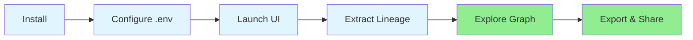
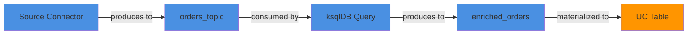

# Quickstart Guide

Let's get your first lineage graph running in about 5 minutes! We'll extract lineage from Confluent Cloud and visualize it in an interactive graph.

## What You'll Build

By the end of this guide, you'll have:

- An interactive lineage graph showing topics, connectors, and transformations
- A running Streamlit UI for exploring your data flows
- Hands-on understanding of how LineageBridge works

Here's the journey:



## Prerequisites

Before we start, make sure you have:

- [x] Python 3.11+ installed (check with `python --version`)
- [x] A Confluent Cloud account with at least one Kafka cluster
- [x] Cloud-level API credentials (OrgAdmin or EnvironmentAdmin role)

!!! tip "No Confluent Cloud Account?"
    Sign up for a free trial at [confluent.cloud](https://confluent.cloud). The free tier includes a Basic cluster—perfect for testing LineageBridge.

## Step 1: Install LineageBridge

Pick your favorite installation method and let's get started:

=== "uv (Recommended)"

    We use uv for development—it's super fast:

    ```bash
    # Install uv if you don't have it
    curl -LsSf https://astral.sh/uv/install.sh | sh
    
    # Clone and install LineageBridge
    git clone https://github.com/takabayashi/lineage-bridge.git
    cd lineage-bridge
    uv pip install -e .
    ```

=== "pip"

    Standard pip works great too:

    ```bash
    git clone https://github.com/takabayashi/lineage-bridge.git
    cd lineage-bridge
    pip install -e .
    ```

=== "Make"

    Fastest setup—one command does it all:

    ```bash
    git clone https://github.com/takabayashi/lineage-bridge.git
    cd lineage-bridge
    make install
    ```

**Test that it worked:**

```bash
lineage-bridge-extract --help
```

If you see the help message, you're good to go!

## Step 2: Configure Credentials

### Create Your .env File

Copy the example configuration:

```bash
cp .env.example .env
```

### Add Your Confluent Cloud Credentials

Open `.env` in your favorite editor and add your API credentials:

```env
# This is all you need to get started
LINEAGE_BRIDGE_CONFLUENT_CLOUD_API_KEY=your-cloud-api-key
LINEAGE_BRIDGE_CONFLUENT_CLOUD_API_SECRET=your-cloud-api-secret
```

!!! question "How Do I Get These Keys?"
    1. Log in to [Confluent Cloud](https://confluent.cloud)
    2. Go to **Administration → API Keys**
    3. Click **+ Add key**
    4. Select **Cloud resource** scope
    5. **Copy the key and secret immediately**—Confluent won't show them again!

### Optional: Add Data Catalog Credentials

Want to connect lineage to your data catalog? Add the appropriate credentials:

=== "Databricks UC"

    ```env
    LINEAGE_BRIDGE_DATABRICKS_WORKSPACE_URL=https://your-workspace.databricks.com
    LINEAGE_BRIDGE_DATABRICKS_TOKEN=dapi123456789abcdef
    LINEAGE_BRIDGE_DATABRICKS_WAREHOUSE_ID=abc123def456
    ```
    
    See the [Configuration Guide](configuration.md#databricks-unity-catalog) for details on getting these values.

=== "AWS Glue"

    ```env
    LINEAGE_BRIDGE_AWS_REGION=us-east-1
    ```
    
    Also set up AWS credentials via `aws configure` or environment variables.

=== "Google Data Lineage"

    ```env
    LINEAGE_BRIDGE_GCP_PROJECT_ID=my-gcp-project
    LINEAGE_BRIDGE_GCP_LOCATION=us-central1
    ```
    
    Then authenticate: `gcloud auth application-default login`

## Step 3: Launch the UI

Time to fire up the Streamlit interface:

=== "Make (Easiest)"

    ```bash
    make ui
    ```

=== "uv"

    ```bash
    uv run streamlit run lineage_bridge/ui/app.py
    ```

=== "Direct"

    ```bash
    streamlit run lineage_bridge/ui/app.py
    ```

Your browser should automatically open to [http://localhost:8501](http://localhost:8501).

!!! success "What You'll See"
    On first launch, you'll see the LineageBridge welcome screen showing your connection status. If everything's green, you're ready to extract!

## Step 4: Extract Lineage

Now for the fun part—let's extract your lineage!

### Select Your Environment and Cluster

Look at the sidebar:

1. Find the **Environment** dropdown and select your Confluent Cloud environment
2. Select a **Cluster** from the dropdown that appears
3. All done—you're ready to extract!

### What Gets Extracted?

The sidebar shows all available extractors (all enabled by default):

| Extractor | What It Does |
|-----------|--------------|
| **Kafka Topics & Consumer Groups** | Core topic inventory and consumption patterns |
| **Connect** | Source and sink connectors (where data enters/exits Kafka) |
| **ksqlDB** | Persistent queries and stream transformations |
| **Flink** | Flink SQL jobs and transformations |
| **Schema Registry** | Schema definitions and associations |
| **Stream Catalog** | Tags and business metadata |
| **Tableflow** | Topic-to-table mappings (links to data catalogs) |
| **Metrics** | Throughput and lag metrics (slowest, usually skip for first run) |

For your first run, keep them all enabled to see the full picture.

### Run the Extraction

1. Click the big **Extract Lineage** button at the bottom of the sidebar
2. Watch the progress indicators—each extractor reports its status
3. Wait for it to complete (typically 10-30 seconds for a small cluster)

!!! tip "What's Happening Behind the Scenes"
    LineageBridge is calling Confluent Cloud APIs to discover topics, connectors, schemas, and transformations. Then it stitches everything together into a graph showing how data flows through your system.

### View Your Graph

Once extraction completes, you'll see:



- An **interactive graph visualization** in the main panel
- **Node colors** showing different systems (Confluent = blue, Databricks = orange, AWS = yellow)
- **Edges** showing data flow relationships (who produces to whom)

### Explore the Graph

Try these interactions:

- **Drag nodes** around to rearrange the layout
- **Scroll** to zoom in and out
- **Click a node** to see full details in the right panel
- **Shift+drag** to select multiple nodes
- **Search** by name in the sidebar search box

## Step 5: Inspect Lineage Details

Click on any node to see its full details in the right panel.

### Kafka Topic

Click a topic to see:

=== "Overview"
    
    - **Type**: KAFKA_TOPIC
    - **Cluster**: Which cluster it lives in
    - **Environment**: Confluent Cloud environment ID

=== "Attributes"
    
    - Partition count
    - Replication factor
    - Retention policy
    - Cleanup policy

=== "Lineage"
    
    - **Incoming Edges**: What produces to this topic (connectors, Flink jobs, applications)
    - **Outgoing Edges**: What consumes from this topic (consumer groups, ksqlDB, connectors)

=== "Deep Link"
    
    Click **View in Confluent Cloud** to open this topic in the Confluent Cloud UI.

### Connector

Click a connector to see:

- **Type**: CONNECTOR (source or sink)
- **Class**: The connector plugin (e.g., `PostgresSource`, `S3Sink`)
- **Status**: Running, paused, or failed
- **Configuration**: All connector settings
- **Connected Topics**: Which topics it reads from or writes to

### Transformation (ksqlDB or Flink)

Click a transformation to see:

- **SQL Statement**: The actual query creating the transformation
- **Input Topics**: Where the data comes from
- **Output Topics**: Where the transformed data goes
- **Type**: Whether it's a ksqlDB persistent query or Flink SQL statement

## Step 6: Export and Share

### Export Your Graph

Want to save or share your lineage? Easy:

1. Click the **Export Graph** button in the sidebar
2. The graph saves as `lineage_graph.json` in your project directory
3. Share this file with teammates or load it later for offline viewing

The JSON export includes:

- All nodes with full metadata
- All edges showing relationships
- Extraction timestamp
- Source environment and cluster info

### Jump to Confluent Cloud

Every node includes a deep link to its resource in Confluent Cloud:

1. Click any node in the graph
2. In the detail panel, find the **View in Confluent Cloud** link
3. Click it—your browser opens directly to that resource

This is super handy when you spot something interesting in the lineage and want to dig deeper in the Confluent UI.

## Next Steps

Congratulations! You've extracted and visualized your first lineage graph. Here's what to explore next:

### Learn More About the UI

- **[Streamlit UI Guide →](../user-guide/streamlit-ui.md)** - Full UI features and controls
- **[Graph Visualization →](../user-guide/graph-visualization.md)** - Advanced graph interactions
- **[Change Detection →](../user-guide/change-detection.md)** - Auto-refresh on changes

### Use CLI Tools

Try the command-line extraction:

```bash
# Extract and save to JSON
uv run lineage-bridge-extract

# Run the change-detection watcher
uv run lineage-bridge-watch
```

See **[CLI Tools Guide →](../user-guide/cli-tools.md)** for details.

### Integrate with Data Catalogs

Connect your lineage to external catalogs:

- **[Databricks Unity Catalog →](../catalog-integration/databricks-unity-catalog.md)**
- **[AWS Glue →](../catalog-integration/aws-glue.md)**
- **[Google Data Lineage →](../catalog-integration/google-data-lineage.md)**

### Automate with Docker

Deploy LineageBridge as a service:

```bash
# Run UI in Docker
make docker-ui

# Run extraction in Docker
make docker-extract

# Run watcher in Docker
make docker-watch
```

See **[Docker Deployment →](../how-to/docker-deployment.md)** for details.

### Explore the REST API

LineageBridge includes a REST API for programmatic access:

```bash
# Start the API server
make api
```

Then visit [http://localhost:8000/docs](http://localhost:8000/docs) for interactive API documentation.

See **[API Reference →](../api-reference/index.md)** for details.

## Common Scenarios

### Scenario 1: Multi-Cluster Lineage

If you have multiple clusters:

1. Extract lineage from the first cluster (select in UI)
2. Change the cluster dropdown to the next cluster
3. Click **Extract Lineage** again
4. The graph now shows combined lineage from both clusters

### Scenario 2: Focus on a Specific Topic

To explore lineage for a single topic:

1. Use the **Search** box in the sidebar
2. Type the topic name (e.g., `orders`)
3. Click the topic in search results
4. The graph highlights the topic and its neighbors
5. Click the topic to see full details

### Scenario 3: Finding Data Flow Paths

To trace data from source to destination:

1. Find your source connector in the graph
2. Follow the edges to see which topic it writes to
3. From that topic, see what consumes (ksqlDB, Flink, or sink connector)
4. Continue following edges to trace the full pipeline

## Troubleshooting

Running into issues? Here are the most common problems and how to fix them.

### No Graph Appears

If extraction completes but you see a blank graph:

1. Check the extraction log in the sidebar—look for red error messages
2. Verify you selected the correct environment and cluster
3. Make sure your API key has read permissions (not write-only)
4. Try extracting with just the **Kafka Topics** extractor first

### Authentication Errors

Getting "401 Unauthorized" errors?

1. Double-check your API key and secret in `.env` (no typos!)
2. Verify the key hasn't expired (check in Confluent Cloud)
3. Make sure you're using a **cloud-level** key, not a cluster-scoped key
4. Test the credentials in Confluent Cloud UI first

### Empty Graph

Graph loads but has zero nodes?

1. Verify your cluster actually has topics (check in Confluent Cloud UI)
2. Try running just the **Kafka Topics** extractor to isolate the issue
3. Check the logs for API errors or permissions issues
4. Make sure you selected the right environment and cluster

### Extraction is Slow

Taking forever to extract?

1. Disable the **Metrics** extractor—it's by far the slowest
2. Extract one cluster at a time instead of multiple
3. For large clusters (100+ topics), extraction can take a few minutes—this is normal
4. Check your internet connection speed

### Common Mistakes

!!! warning "Wrong API Key Scope"
    The most common mistake: using a cluster-scoped API key instead of a cloud-level key. LineageBridge needs cloud-level access to discover environments and services.

!!! warning "Missing .env File"
    Make sure your `.env` file is in the project root directory (same level as `pyproject.toml`), not in a subdirectory.

### Still Stuck?

Check the full [Troubleshooting Guide](../troubleshooting/index.md) or open an issue on GitHub with:

- Your error messages (redact API keys!)
- LineageBridge version (`python -c "from lineage_bridge import __version__; print(__version__)"`)
- What you were trying to do when it failed

## What's Next?

You've completed the quickstart! You now have a working LineageBridge installation and understand the basics of extraction and visualization.

To go deeper:

- **[User Guide](../user-guide/index.md)** - Comprehensive feature documentation
- **[Architecture](../architecture/index.md)** - How LineageBridge works under the hood
- **[How-To Guides](../how-to/index.md)** - Recipes for common tasks
- **[Contributing](../contributing/index.md)** - Help improve LineageBridge

## Get Help

If you run into issues:

- Check the [Troubleshooting Guide](../troubleshooting/index.md)
- Search [GitHub Issues](https://github.com/takabayashi/lineage-bridge/issues)
- Open a new issue with your error logs and configuration (redact secrets!)

Happy lineage mapping!
