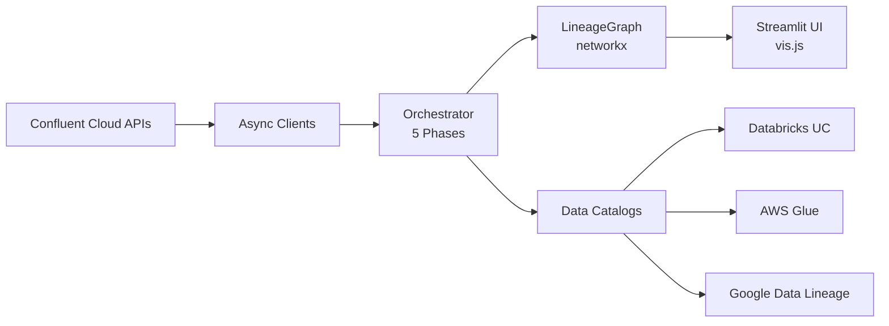

# LineageBridge

[](https://github.com/takabayashi/lineage-bridge/blob/main/LICENSE)
[](https://www.python.org/downloads/)
[](https://github.com/takabayashi/lineage-bridge/releases)

**Extract stream lineage from Confluent Cloud, bridge it to data catalogs, and visualize it as an interactive graph.**

LineageBridge fills a gap: Confluent Cloud has rich stream processing lineage (connectors, Flink jobs, ksqlDB queries, consumer groups) but no way to export it as a queryable graph or bridge it into external data catalogs. LineageBridge extracts this lineage using only public APIs, connects it to Databricks Unity Catalog, AWS Glue, and Google Data Lineage via Tableflow, and renders everything in an interactive UI.

## Architecture



## Key Features

- **Complete Lineage Extraction**: Kafka topics, connectors, Flink, ksqlDB, consumer groups, schemas
- **Multi-Catalog Integration**: Databricks Unity Catalog, AWS Glue, Google Data Lineage
- **OpenLineage API**: REST API with 25 endpoints for programmatic access
- **Interactive Visualization**: Directed graph with drag, zoom, search, and export
- **Change Detection**: Real-time watcher with auto-extraction
- **Demo Infrastructure**: 3 Terraform-based demos (UC, Glue, BigQuery)

## Quick Start

Get running in 5 minutes:

```bash
# Install
git clone https://github.com/takabayashi/lineage-bridge.git
cd lineage-bridge
uv pip install -e .

# Configure
cp .env.example .env
# Edit .env with your Confluent Cloud API key

# Run
uv run streamlit run lineage_bridge/ui/app.py
```

Visit **[Getting Started →](getting-started/quickstart.md)** for detailed instructions.

## What's New in v0.4.0

- ✨ **Multi-Demo Infrastructure**: 3 independent catalog demos (UC, Glue, BigQuery)
- 🌐 **Google Data Lineage Provider**: BigQuery integration with OpenLineage events
- 🚀 **OpenLineage API**: 25 REST endpoints for programmatic lineage access
- 📊 **487 New Tests**: Comprehensive API test coverage (623 tests total, 68% coverage)

[View Full Changelog →](reference/changelog.md)

## Documentation

- **[Getting Started](getting-started/index.md)** - Installation, configuration, quickstart
- **[User Guide](user-guide/index.md)** - CLI tools, UI, graph visualization
- **[Catalog Integration](catalog-integration/index.md)** - UC, Glue, Google Data Lineage
- **[API Reference](api-reference/index.md)** - REST API with interactive explorer
- **[Demos](demos/index.md)** - Deploy full-stack demos for each catalog
- **[Architecture](architecture/index.md)** - Deep dive into internals
- **[Troubleshooting](troubleshooting/index.md)** - Common issues and solutions

## Community

- **[GitHub](https://github.com/takabayashi/lineage-bridge)** - Star the project, report issues
- **[Contributing](contributing/index.md)** - Development setup, testing, PR guidelines
- **[License](https://github.com/takabayashi/lineage-bridge/blob/main/LICENSE)** - Apache 2.0
