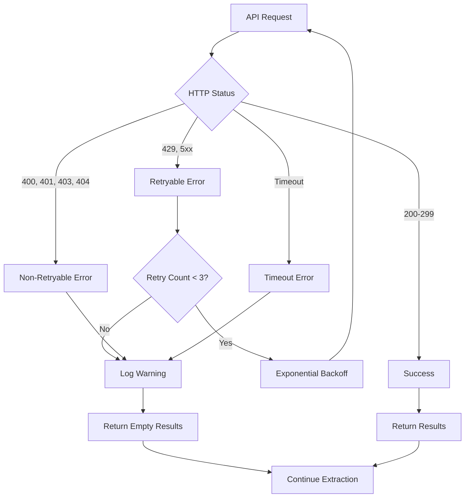

# API Errors

Common HTTP status codes and how LineageBridge handles them.

## Error Handling Strategy

LineageBridge uses a fail-safe extraction strategy:

1. **Retryable errors** (429, 500, 502, 503, 504) - Automatic retry with exponential backoff
2. **Non-retryable errors** (400, 401, 403, 404) - Log warning, return empty results, continue extraction
3. **Timeout errors** - Log warning, return empty results, continue extraction

**This ensures partial extraction succeeds even if some APIs fail.**

## 400 Bad Request

### Description

The request was malformed or contained invalid parameters.

### Common Causes

1. Invalid environment ID or cluster ID
2. Malformed query parameters
3. Invalid JSON payload

### LineageBridge Behavior

Logs warning and returns empty results:

```
Extractor 'KafkaAdmin' got 400 Bad Request.
The API key may not have access to this environment,
or the API parameters are invalid.
```

### Solutions

1. **Verify environment ID**:
   ```bash
   confluent environment list
   ```

2. **Verify cluster ID**:
   ```bash
   confluent kafka cluster list --environment env-abc123
   ```

3. **Check API key scope**:
   ```bash
   confluent api-key list
   ```

4. **Enable debug logging**:
   ```bash
   # .env
   LINEAGE_BRIDGE_LOG_LEVEL=DEBUG
   ```

## 401 Unauthorized

### Description

The API key or token is missing, invalid, or expired.

### Common Causes

1. Missing credentials in `.env`
2. Expired API key or token
3. Wrong API key type (Cloud vs cluster-scoped)

### LineageBridge Behavior

Logs helpful error message:

```
Extractor 'KafkaAdmin:lkc-xyz789' got 401 Unauthorized.
This likely means a cluster-scoped API key is needed.
Set LINEAGE_BRIDGE_KAFKA_API_KEY in .env.
```

### Solutions

See [Credential Issues: 401 Unauthorized](credential-issues.md#401-unauthorized).

## 403 Forbidden

### Description

The API key lacks required permissions.

### Common Causes

1. Insufficient RBAC roles
2. API key scoped to wrong resource
3. Organization-level restrictions

### LineageBridge Behavior

Logs warning:

```
Extractor 'Connect' got 403 Forbidden. The API key lacks required permissions.
```

### Solutions

See [Credential Issues: 403 Forbidden](credential-issues.md#403-forbidden).

## 404 Not Found

### Description

The requested resource does not exist.

### Common Causes

1. Wrong environment ID or cluster ID
2. Resource was deleted
3. Wrong API endpoint URL

### LineageBridge Behavior

Logs warning and continues:

```
Extractor 'SchemaRegistry' got 404 Not Found.
Schema Registry may not be enabled in this environment.
```

### Solutions

1. **Verify the resource exists**:
   ```bash
   confluent kafka cluster describe lkc-xyz789
   ```

2. **Check Schema Registry status**:
   ```bash
   confluent schema-registry cluster describe
   ```

3. **Manually set SR endpoint**:
   ```bash
   # .env
   LINEAGE_BRIDGE_SCHEMA_REGISTRY_ENDPOINT=https://psrc-abc123.us-east-1.aws.confluent.cloud
   ```

## 429 Too Many Requests

### Description

Rate limit exceeded. The client is sending too many requests.

### Common Causes

1. Excessive API calls in short time window
2. Multiple concurrent extractions
3. Organization-wide rate limit hit

### LineageBridge Behavior

**Automatic retry with exponential backoff**:
- Retry 1: Wait 1 second
- Retry 2: Wait 2 seconds
- Retry 3: Wait 4 seconds
- Respects `Retry-After` header if present

Log message:

```
Retryable status 429 for GET /kafka/v3/clusters (attempt 1/4)
Sleeping 1.0s before retry
```

### Solutions

1. **Wait for rate limit to reset** - Automatic with retries
2. **Reduce concurrent extractors** - Disable unused extractors in UI
3. **Increase retry backoff** - Not currently configurable
4. **Use caching** - Enable graph caching:
   ```bash
   # .env
   LINEAGE_BRIDGE_CACHE_ENABLED=true
   ```

### Rate Limit Details

Confluent Cloud API rate limits (approximate):
- **Cloud API**: 1000 requests/hour per API key
- **Kafka REST**: 1000 requests/hour per cluster
- **Schema Registry**: 1000 requests/hour per cluster

## 500 Internal Server Error

### Description

The API server encountered an unexpected condition.

### Common Causes

1. Transient server error
2. Backend service outage
3. Malformed data in upstream system

### LineageBridge Behavior

**Automatic retry with exponential backoff** (same as 429).

Log message:

```
Retryable status 500 for GET /connect/v1/environments/env-abc123/clusters (attempt 1/4)
```

### Solutions

1. **Wait for automatic retry** - LineageBridge retries up to 3 times
2. **Check Confluent Cloud status** - [https://status.confluent.cloud](https://status.confluent.cloud)
3. **Try again later** - If retries fail, wait a few minutes and re-run extraction
4. **Report persistent errors** - If error persists >1 hour, contact Confluent support

## 502 Bad Gateway

### Description

The API gateway received an invalid response from upstream.

### Common Causes

1. Backend service restart or deployment
2. Network issues between gateway and backend
3. Timeout in upstream service

### LineageBridge Behavior

**Automatic retry** (same as 500).

### Solutions

Same as 500 Internal Server Error.

## 503 Service Unavailable

### Description

The API server is temporarily unable to handle requests.

### Common Causes

1. Planned maintenance
2. Overloaded backend
3. Resource exhaustion

### LineageBridge Behavior

**Automatic retry** (same as 500).

Log message:

```
Retryable status 503 for POST /ksqldb/v2/clusters/lksqlc-abc/ksql (attempt 2/4)
Sleeping 2.0s before retry
```

### Solutions

1. **Check maintenance windows** - Confluent Cloud status page
2. **Retry with backoff** - Automatic
3. **Reduce load** - Disable heavy extractors (metrics, stream catalog)

## 504 Gateway Timeout

### Description

The API gateway timed out waiting for upstream response.

### Common Causes

1. Long-running query in backend
2. Database query timeout
3. Network latency

### LineageBridge Behavior

**Automatic retry** (same as 500).

### Solutions

1. **Reduce query scope** - Filter by specific cluster:
   ```bash
   uv run lineage-bridge-extract --env env-abc123 --cluster lkc-xyz789
   ```

2. **Increase timeout** - Not currently configurable (30s per request, 120s per extractor)

3. **Split extraction** - Extract clusters separately and merge graphs

## Timeout Errors (Client-Side)

### Description

LineageBridge timed out waiting for API response.

### Timeouts

- **Per-request timeout**: 30 seconds (httpx client)
- **Per-extractor timeout**: 120 seconds (orchestrator)

### Common Causes

1. Slow network connection
2. Large response payload (1000s of resources)
3. Overloaded API server

### LineageBridge Behavior

Logs warning and continues:

```
Extractor 'KafkaAdmin:lkc-xyz789' timed out after 120s
```

### Solutions

1. **Check network connectivity**:
   ```bash
   ping api.confluent.cloud
   curl -I https://api.confluent.cloud
   ```

2. **Reduce extraction scope**:
   ```bash
   uv run lineage-bridge-extract --env env-abc123 --cluster lkc-xyz789
   ```

3. **Disable slow extractors**:
   - Metrics (optional, can be slow for large clusters)
   - Stream Catalog (optional)

4. **Extract in stages**:
   ```bash
   # Extract without enrichment
   uv run lineage-bridge-extract --env env-abc123 --no-enrich
   
   # Enrich separately
   uv run lineage-bridge-extract --enrich-only
   ```

## Retry Configuration

### Default Policy

```python
_MAX_RETRIES = 3
_BACKOFF_BASE = 1.0  # seconds
_RETRYABLE_STATUS_CODES = {429, 500, 502, 503, 504}
```

Backoff delay: `1.0 * (2 ** attempt)` seconds (1s, 2s, 4s)

### Customization

Retry configuration is not currently exposed via environment variables. To customize:

1. Edit `lineage_bridge/clients/base.py`:
   ```python
   _MAX_RETRIES = 5  # Increase retries
   _BACKOFF_BASE = 2.0  # Slower backoff
   ```

2. Or create a custom client class extending `ConfluentClient`.

## Error Recovery Workflow



## Debugging API Errors

### Enable Debug Logging

```bash
# .env
LINEAGE_BRIDGE_LOG_LEVEL=DEBUG
```

This logs all HTTP requests and responses:

```
DEBUG Request GET /kafka/v3/clusters params={'environment': 'env-abc123'} attempt=1
DEBUG Response 200 GET /kafka/v3/clusters (0.234s)
```

### Inspect Raw Responses

Use `curl` to test API endpoints directly:

```bash
# Cloud API
curl -u "$LINEAGE_BRIDGE_CONFLUENT_CLOUD_API_KEY:$LINEAGE_BRIDGE_CONFLUENT_CLOUD_API_SECRET" \
  "https://api.confluent.cloud/org/v2/environments"

# Kafka REST API
curl -u "$LINEAGE_BRIDGE_KAFKA_API_KEY:$LINEAGE_BRIDGE_KAFKA_API_SECRET" \
  "https://pkc-abc123.us-east-1.aws.confluent.cloud:443/kafka/v3/clusters/lkc-xyz789/topics"
```

### Check API Status

- Confluent Cloud: [https://status.confluent.cloud](https://status.confluent.cloud)
- Databricks: [https://status.databricks.com](https://status.databricks.com)
- AWS: [https://status.aws.amazon.com](https://status.aws.amazon.com)
- Google Cloud: [https://status.cloud.google.com](https://status.cloud.google.com)

## Next Steps

- [Credential Issues](credential-issues.md) - 401/403 error solutions
- [Extraction Failures](extraction-failures.md) - Missing data debugging
- [Performance](performance.md) - Timeout and slowness optimization
